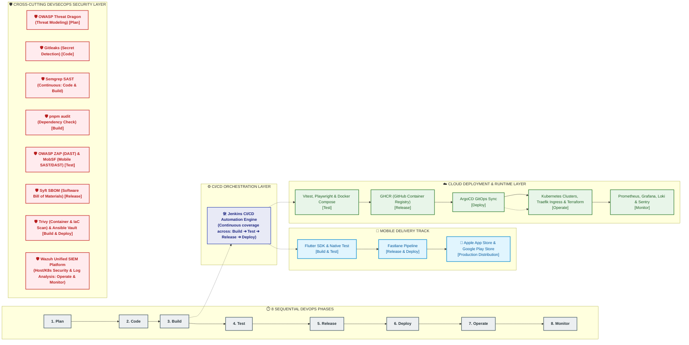

# 🌐 System Overview: Subscription Track (Full-Stack Monorepo)

> **Document Purpose:** เอกสารสรุปภาพรวมทางเทคนิคระดับสถาปัตยกรรม (Architecture & System Overview) สำหรับนักพัฒนาและ AI Agent เพื่อให้เข้าใจบริบท โครงสร้างทั้ง 3 ส่วน (Frontend, Backend, Deploy & Infra), เครื่องมือ, ไลบรารี และสถานะปัจจุบันของระบบได้ทันที

---

## 📌 1. ภาพรวมระบบและความสามารถหลัก (Core Capabilities)

**Subscription Track** คือระบบตรวจจับ วิเคราะห์ และบริหารจัดการค่าบริการสมาชิกรายเดือน/รายปี (Subscription Tracker & Analytics System) มุ่งเน้นการแก้ปัญหา "Subscription Creep" (การมีค่าบริการรายเดือนงอกเงยจนกระทบความมั่นคงทางการเงิน)

### ✨ ความสามารถหลักของระบบ (Current Features)
1. **Dashboard สรุปภาพรวมการเงินและรอบบิล:**
   - รวมยอดค่าบริการสมาชิกทั้งหมด แปลงคำนวณเป็นยอดต่อเดือน (Monthly Expense) และยอดประมาณการรายปี (Annual Projection) แบบเรียลไทม์
   - แสดงไทม์ไลน์รอบบิลถัดไป (Upcoming Renewals) พร้อมการแจ้งเตือนรายการใกล้ถึงกำหนดชำระ
2. **คำนวณ Subscription Creep Score:**
   - อัลกอริทึมชี้วัดสัดส่วนค่าบริการเทียบกับรายได้สุทธิของผู้ใช้ (`(totalMonthlyExpenses / monthlyIncome) * 100`)
   - จัดหมวดหมู่ความเสี่ยง 3 ระดับ: **Safe (ปลอดภัย < 10%)**, **Moderate (ปานกลาง 10-20%)**, และ **High Risk (เสี่ยงสูง > 20%)**
3. **ระบบจำลองการประหยัด (Savings Simulation):**
   - ผู้ใช้สามารถเลือกติ๊กตัดบริการที่ไม่จำเป็นหรือไม่ได้ใช้งาน (Unused / Occasional)
   - คำนวณยอดเงินสดที่จะประหยัดได้คืนมาทันทีทั้งรายเดือนและยอดสะสมรายปี
   - บันทึกประวัติการขอยกเลิก (Cancellation Log) พร้อมเหตุผล
4. **คลัง Preset Packages ยอดนิยม:**
   - ฐานข้อมูลบริการยอดนิยมในไทย (Netflix, Spotify, YouTube Premium, Disney+ Hotstar, iCloud+, Apple One, ChatGPT Plus, GitHub Copilot ฯลฯ) พร้อมราคา สีประจำแบรนด์ และรอบบิล
5. **ระบบจัดการบัตรและการผูกบัญชี (Linked Cards & Auto-import):**
   - จำลองการผูกบัตรเครดิต/เดบิต (Mock Bank Cards: KBank, SCB, TTb, KTC)
   - นำเข้า (Auto-import) บริการที่ผูกกับบัตรอัตโนมัติ และตรวจจับยอดเรียกเก็บ
6. **ระบบความปลอดภัยและการยืนยันตัวตน:**
   - ระบบ **Security PIN 6 หลัก** ยืนยันสิทธิ์ก่อนแก้ไข ลบ หรือยกเลิกบริการ
   - ระบบ **JWT Authentication & Password Hashing** (ฝั่ง Backend)
7. **Responsive & Adaptive Shell:**
   - ปรับการแสดงผลอัตโนมัติตามขนาดหน้าจอ: โทรศัพท์มือถือ (Bottom Navigation Bar) และ แท็บเล็ต/เดสก์ท็อป (Navigation Rail ด้านข้าง)

---

## 🏛️ 2. โครงสร้าง Monorepo และความรับผิดชอบทั้ง 3 ส่วน

```text
subscription_track/
├── apps/
│   ├── mobile/         📱 ส่วนที่ 1: Frontend Mobile & Web Client (Flutter)
│   └── server/         🖥️ ส่วนที่ 2: Backend REST API & Workers (NestJS)
├── infra/              🐳 ส่วนที่ 3: Infrastructure Configurations (Nginx, Postgres, Redis, Monitoring)
├── doc/                📚 เอกสารสเปก, PRD, สถาปัตยกรรม, และการแบ่งงาน
├── scripts/            ⚙️ สคริปต์อัตโนมัติระดับ Monorepo
├── docker-compose.yml  🚀 ตัวจัดการ Container รันเครื่องแม่ข่ายและฐานข้อมูล
└── SYSTEM_OVERVIEW.md  📄 เอกสารภาพรวมระบบฉบับนี้
```

---

## 📱 ส่วนที่ 1: Frontend (`apps/mobile/`)

- **เทคโนโลยีหลัก:** Flutter (Stable Channel), Dart 3.x
- **สถาปัตยกรรม:** **Feature-First Clean Architecture**
  - แบ่งโครงสร้างโค้ดตามฟีเจอร์ (`lib/features/<feature_name>/`)
  - แต่ละฟีเจอร์แยก Layer เคร่งครัด: `domain` -> `data` -> `application` -> `presentation`
- **การจัดการสถานะ (State Management):** **Riverpod (Riverpod 3 / Riverpod Annotation)** ทำงานร่วมกับ Code Generation (`build_runner`)
- **การจัดเส้นทาง (Navigation):** **GoRouter** แบบ Declarative Routing
- **สถานะปัจจุบัน:**
  - UI ครบทุก Flow ทั้ง 5 แท็บหลัก
  - ใช้ `InMemorySubscriptionRepository` เป็น Data Source ในระดับ MVP Client ทำให้รันแบบ Standalone ได้ทันที
  - มีชุดทดสอบ Unit Tests และ Widget Tests ผ่านครบ **43/43 tests passing**

### แผนผังหน้าจอและแท็บหลัก (Screens & Tabs)
| แท็บ / หน้าจอ | ที่ตั้งโค้ด | หน้าที่และความสามารถ |
|---|---|---|
| **Dashboard** | `lib/features/dashboard/presentation/dashboard_tab.dart` | กราฟสรุปยอดรวม, การ์ด Creep Score, ลิสต์รายการรอบบิลเร็วๆ นี้ |
| **Subscriptions** | `lib/features/subscriptions/presentation/subscriptions_tab.dart` | รายการสมาชิกทั้งหมด, ระบบค้นหา/ฟิลเตอร์, ปุ่มเพิ่ม/แก้ไขบริการ |
| **Savings** | `lib/features/savings/presentation/savings_tab.dart` | เครื่องมือจำลองการตัดลดค่าใช้จ่าย และตารางบันทึกเงินที่ประหยัดได้ |
| **Settings** | `lib/features/settings/presentation/settings_tab.dart` | ตั้งค่าความปลอดภัย, เปลี่ยน PIN 6 หลัก, สลับภาษา/การแจ้งเตือน |
| **Profile** | `lib/features/profile/presentation/profile_tab.dart` | โปรไฟล์ผู้ใช้, กำหนดรายได้ต่อเดือน (Monthly Income) เพื่อคำนวณ Creep Score |
| **Flow เสริม** | `splash/`, `onboarding/`, `auth/` | Splash screen, แนะนำฟีเจอร์แรกเริ่ม, และระบบ Login/PIN Prompt |

---

## 🖥️ ส่วนที่ 2: Backend (`apps/server/`)

- **เทคโนโลยีหลัก:** Node.js (v24 LTS), TypeScript, NestJS 12
- **สถาปัตยกรรม:** **Modular Monolith** (`src/main.ts` สำหรับ HTTP API และ `src/worker.ts` สำหรับ Background Worker)
- **ฐานข้อมูลและ ORM:** PostgreSQL 16/17 ร่วมกับ **Prisma ORM (^6.4.1)**
- **การรักษาความปลอดภัย:** Passport.js + JWT Strategy, Password Hashing (`bcrypt`), PIN Hashing, Global Auth Guard พร้อม Decorator `@Public()`
- **เอกสาร API:** **Swagger UI** ในตัว เข้าถึงได้ผ่าน `/docs` และ OpenAPI JSON ผ่าน `/docs-json`
- **สถานะปัจจุบัน:** โครงสร้างโมดูลครบถ้วน มี Data Models พร้อมสคริปต์ Seeding ข้อมูล Presets และ Mock Cards ครอบคลุม Unit Tests ด้วย **Vitest**

### โมดูลในระบบ Backend (Backend Modules)
| โมดูล | ที่ตั้งโค้ด (`apps/server/src/`) | หน้าที่หลัก |
|---|---|---|
| **AuthModule** | `auth/` | สมัครสมาชิก, เข้าสู่ระบบ, ออก JWT Access Token, ตรวจสอบความถูกต้องของ PIN |
| **UsersModule** | `users/` | จัดการข้อมูลส่วนตัว, ดึงโปรไฟล์, อัปเดตรายได้สุทธิต่อเดือน (`monthly_income`) |
| **SubscriptionsModule** | `subscriptions/` | จัดการ CRUD บริการสมาชิก, กำหนด Usage Status, คำนวณวันต่ออายุรอบถัดไป |
| **PaymentCardsModule** | `payment-cards/` | ผูกบัตรเครดิต/เดบิต, จำลองการดึง Mock Bank Cards เพื่อทำ Auto-import |
| **CreepScoreModule** | `creep-score/` | คำนวณดัชนี Subscription Creep Score พร้อมระดับความเสี่ยง (Safe, Moderate, High) |
| **SavingsModule** | `savings/` | เครื่องมือคำนวณการตัดลดค่าบริการ และบันทึกประวัติการยกเลิก (`SavingsCancellationLog`) |
| **NotificationsModule** | `notifications/` | แจ้งเตือนรอบบิลใกล้ถึงกำหนด, แจ้งเตือนบริการที่ไม่ได้ใช้งาน (Unused Subscriptions) |
| **AdminPackagesModule** | `admin/packages/` | จัดการแคตตาล็อกเทมเพลตบริการส่วนกลาง (Subscription Presets) สำหรับผู้ดูแลระบบ |
| **PrismaModule** | `prisma/` | Singleton Client สำหรับเชื่อมต่อและทำ Transaction ฐานข้อมูล PostgreSQL |

### โครงสร้างโมเดลฐานข้อมูล (Prisma Schema Entities)
- `User`: บัญชีผู้ใช้งาน, รหัสผ่านแฮช, PIN แฮช, รายได้รายเดือน
- `PaymentCard`: บัตรการชำระเงินที่ผู้ใช้ผูกไว้ (Debit / Credit, Balance, ยี่ห้อบัตร)
- `SubscriptionPreset`: แคตตาล็อกบริการสำเร็จรูป (Netflix, Spotify ฯลฯ)
- `MockBankCard` & `MockBankCardSubscription`: ข้อมูลจำลองสำหรับทดสอบระบบ Auto-import จากธนาคาร
- `UserSubscription`: ข้อมูลบริการที่ผู้ใช้สมัครใช้งานจริง (ราคา, รอบบิล, วันต่ออายุ, สถานะการใช้งาน)
- `SavingsCancellationLog`: บันทึกประวัติการยกเลิกบริการและยอดเงินที่ประหยัดได้
- `Notification`: ข้อมูลการแจ้งเตือนต่างๆ ของผู้ใช้

---

## 🐳 ส่วนที่ 3: Deploy, Infrastructure & DevOps Lifecycle

ระบบใช้แนวคิด **Continuous Delivery & End-to-End DevSecOps** ครอบคลุมวงจรชีวิตการส่งมอบซอฟต์แวร์ 8 ขั้นตอนต่อเนื่อง (8 Sequential Phases):
$$\text{1. Plan} \rightarrow \text{2. Code} \rightarrow \text{3. Build} \rightarrow \text{4. Test} \rightarrow \text{5. Release} \rightarrow \text{6. Deploy} \rightarrow \text{7. Operate} \rightarrow \text{8. Monitor}$$

### 🧭 ผังวงจรชีวิต DevOps & DevSecOps Architecture (8 Phases & Layered Toolchain)



### 📋 สรุปความรับผิดชอบของแต่ละ Layer และเครื่องมือ
1. **CI/CD Orchestration Layer:**
   - **`Jenkins`**: รับหน้าที่เป็นแกนกลางออร์เคสเตรชันอัตโนมัติต่อเนื่องยาว 4 เฟส ตั้งแต่ **Build ➔ Test ➔ Release ➔ Deploy**
2. **Mobile Delivery Track:**
   - **`Flutter SDK & Test`**: คอมไพล์และทดสอบ Unit/Widget Test ในเฟส **Build & Test**
   - **`Fastlane`**: จัดการเรื่อง Code Signing, Version Bump, Build Artifacts ครอบคลุม **Release & Deploy**
   - **`App Stores`**: ส่งมอบไฟล์ `.ipa` และ `.aab` เข้าสู่ **Apple App Store & Google Play Store** โดยตรง
3. **Cloud Deployment & Runtime Layer:**
   - **`Vitest, Playwright & Docker Compose`** *(Test)*: ทดสอบ Backend Unit/Integration Tests และ E2E Web Tests บนสภาพแวดล้อม Compose
   - **`GHCR (GitHub Container Registry)`** *(Release)*: จัดเก็บและกำหนดเวอร์ชัน Docker Image แท็ก Production
   - **`ArgoCD`** *(Deploy)*: ทำ Declarative GitOps ดึง Manifest จาก Git เพื่อ Deploy สู่ Production แบบ Automated Sync
   - **`Kubernetes Clusters, Traefik & Terraform`** *(Operate)*: คลัสเตอร์รันแอปพลิเคชัน, Traefik ทำหน้าที่เป็น Modern Ingress Controller/Reverse Proxy และจัดการ Cloud Infrastructure ด้วย Terraform
   - **`Prometheus, Grafana, Loki & Sentry`** *(Monitor)*: สังเกตการณ์ระบบแบบ Full Observability (Metrics: Prometheus/Grafana, Logs: Loki, Application Error Tracking: Sentry)
4. **Cross-Cutting Security Layer (DevSecOps):**
   - **`OWASP Threat Dragon`** *(Plan)*: ออกแบบและวิเคราะห์โมเดลภัยคุกคามตั้งแต่ขั้นวางแผน
   - **`Gitleaks`** *(Code)*: ตรวจจับและป้องกัน Secret/Token/Private Key หลุดเข้า Git Repository
   - **`Semgrep`** *(Code & Build)*: ทำ Static Application Security Testing (SAST) วิเคราะห์ช่องโหว่ซอร์สโค้ดแบบครอบคลุมต่อเนื่อง
   - **`pnpm audit`** *(Build)*: สแกนช่องโหว่ของ Dependencies (CVE Audit) ฝั่ง Node.js/Backend
   - **`OWASP ZAP & MobSF`** *(Test)*: ทำ DAST สแกน Web API Security (ZAP) และตรวจจับความปลอดภัยของ Mobile App Binary (MobSF)
   - **`Syft SBOM`** *(Release)*: สร้าง Software Bill of Materials (SBOM) ตรวจสอบความโปร่งใสของแพ็กเกจก่อนเผยแพร่
   - **`Trivy & Ansible Vault`** *(Build & Deploy)*: สแกน Container Image & IaC Misconfigurations (Trivy) ร่วมกับการเข้ารหัสลับค่าคอนฟิก (Ansible Vault)
   - **`Wazuh`** *(Operate & Monitor)*: แพลตฟอร์มความมั่นคงปลอดภัยแบบรวมศูนย์ (XDR & SIEM) ตรวจจับการบุกรุกของ Host/Container ใน Operate และวิเคราะห์ Log Security ใน Monitor

---

## 🛠️ 4. สรุปเครื่องมือและไลบรารีทั้งหมด (Tooling & Library Matrix)

### 📱 ฝั่ง Mobile (Flutter / Dart)
| กลุ่ม | เครื่องมือ / ไลบรารี | ประโยชน์และความสำคัญ |
|---|---|---|
| **Runtime & SDK** | Flutter 3.x (Stable), Dart 3.x | เฟรมเวิร์กสร้าง Cross-platform Client |
| **Version Manager** | **FVM (Flutter Version Management)** | ล็อกเวอร์ชัน Flutter SDK ให้ตรงกันทั้งทีมผ่านไฟล์ `.fvmrc` |
| **State Management** | `flutter_riverpod` (^3.3.2), `riverpod_annotation` (^4.0.3) | จัดการ Application State และ Dependency Injection |
| **Routing** | `go_router` (^14.2.0) | ระบบนำทางแบบ Declarative URL-based Routing |
| **Data & Code Gen** | `freezed`, `freezed_annotation`, `json_serializable`, `build_runner` | สร้าง Data Class แบบ Immutable และแปลง JSON อัตโนมัติ |
| **Functional Tools** | `fpdart` (^1.1.1) | การจัดการผลลัพธ์และข้อผิดพลาดสไตล์ Functional (`Either`, `Option`) |
| **UI & Assets** | `flutter_launcher_icons`, `flutter_native_splash` | จัดการ Splash Screen และ App Icons ตามมาตรฐานระบบปฏิบัติการ |
| **Testing & Quality** | `flutter_test`, `flutter_lints` (^5.0.0), `logger` (^2.5.0) | ทดสอบ Widget/Unit tests และตรวจจับโค้ดตามมาตรฐาน Linter |

### 🖥️ ฝั่ง Backend (NestJS / TypeScript)
| กลุ่ม | เครื่องมือ / ไลบรารี | ประโยชน์และความสำคัญ |
|---|---|---|
| **Core Framework** | NestJS 12, `@nestjs/common`, `@nestjs/core`, `@nestjs/platform-express` | โครงสร้างสถาปัตยกรรมระดับองค์กร (Modular Monolith) |
| **Runtime & Language** | Node.js (22-24 LTS), TypeScript (~6.0) | ภาษาและสภาพแวดล้อมรันเซิร์ฟเวอร์ความเร็วสูง |
| **Package Manager** | **pnpm** (10.2.1) + Corepack | ตัวจัดการแพ็กเกจที่รวดเร็วและประหยัดเนื้อที่ Disk |
| **Database & ORM** | **Prisma ORM** (^6.4.1), `@prisma/client` | การเชื่อมต่อฐานข้อมูล Type-safe Data Access และ Migration |
| **Authentication** | `@nestjs/jwt`, `@nestjs/passport`, `passport`, `passport-jwt`, `bcrypt`, `bcryptjs` | ระบบยืนยันตัวตนด้วย Access Token, การเข้ารหัส Password & PIN |
| **Validation** | `class-validator`, `class-transformer`, `zod` | ตรวจสอบ Data Transfer Object (DTO) และ Environment Variables |
| **API Docs** | `@nestjs/swagger` (^12.0.1) | สร้าง Swagger UI และ OpenAPI 3.0 Documentation อัตโนมัติ |
| **Testing & Quality** | **Vitest** (5.0.1), `@vitest/coverage-v8`, ESLint, Prettier | รัน Unit Tests ความเร็วสูง และตรวจสอบ Format มาตรฐานโค้ด |

### 🐳 ฝั่ง Deploy, Infrastructure & DevSecOps
| กลุ่ม / เลเยอร์ | เครื่องมือ / ไลบรารี | เฟสที่ใช้งาน | ประโยชน์และความสำคัญ |
|---|---|---|---|
| **CI/CD Orchestration** | **Jenkins** | Build, Test, Release, Deploy | เครื่องมือ Pipeline Orchestrator ควบคุมการสร้าง ทดสอบ และส่งมอบระบบอัตโนมัติ |
| **Mobile Delivery** | **Flutter SDK & Test** | Build, Test | คอมไพล์และทดสอบโค้ดแอปพลิเคชันมือถือ |
| **Mobile Delivery** | **Fastlane** | Release, Deploy | จัดการ Code Signing และส่งมอบแอปเข้าสู่ App Store & Play Store |
| **Testing & Verification** | **Vitest, Playwright, Docker Compose** | Test | ชุดทดสอบ Unit/Integration API และ E2E UI บนสภาพแวดล้อมจำลอง |
| **Container Registry** | **GHCR** (GitHub Container Registry) | Release | คลังจัดเก็บ Production Docker Images อย่างปลอดภัย |
| **GitOps Delivery** | **ArgoCD** | Deploy | ตรวจจับการเปลี่ยนแปลงของ Manifest และ Sync ขึ้น K8s อัตโนมัติ |
| **Cloud Runtime & IaC** | **Kubernetes, Traefik, Terraform** | Operate | คลัสเตอร์จัดการ Container, Ingress Routing และเครื่องมือจัดการ Cloud Infra แบบโค้ด |
| **Database Engine** | **PostgreSQL 16 Alpine** | Operate | ฐานข้อมูลหลักของระบบ พร้อมระบบสำรองและ Persistent Volume |
| **Monitoring & Observability** | **Prometheus, Grafana, Loki, Sentry** | Monitor | ระบบมอนิเตอร์ระดับองค์กร (Metrics, Dashboards, Log Aggregation, Error Tracking) |
| **Threat Modeling** | **OWASP Threat Dragon** | Plan | ออกแบบและประเมินความเสี่ยงภัยคุกคามสถาปัตยกรรมระบบ |
| **Secret Detection** | **Gitleaks** | Code | สแกนป้องกัน Secret, Token, และ Private Key หลุดสู่ซอร์สโค้ด |
| **SAST** | **Semgrep** | Code, Build | สแกนช่องโหว่ความปลอดภัยระดับ Source Code เชิงลึกแบบต่อเนื่อง |
| **Dependency Audit** | **pnpm audit** | Build | ตรวจสอบช่องโหว่ Known Vulnerabilities ของไลบรารีภายนอก |
| **DAST & Mobile Sec** | **OWASP ZAP & MobSF** | Test | ทดสอบเจาะระบบ Web API แบบ Dynamic และสแกนช่องโหว่ไฟล์ Mobile App |
| **Software Supply Chain** | **Syft SBOM** | Release | สร้างเอกสารแสดงรายการส่วนประกอบซอฟต์แวร์ทั้งหมด (Software Bill of Materials) |
| **Image/IaC Scan & Secrets** | **Trivy & Ansible Vault** | Build, Deploy | สแกนช่องโหว่ Docker Image & IaC Code ร่วมกับการเข้ารหัส Sensitive Config |
| **XDR / SIEM Platform** | **Wazuh** | Operate, Monitor | แพลตฟอร์มตรวจจับและตอบสนองภัยคุกคามระดับ Host/Container และวิเคราะห์ Log |

---

## 🚀 5. คำสั่งการทำงานสำหรับนักพัฒนาและ AI Agent (Cheat Sheet)

### การรัน Backend + Database (Docker Compose)
```bash
# 1. คัดลอก Environment file สำหรับ Server
cp apps/server/.env.example apps/server/.env

# 2. เริ่มต้น Container สำหรับ API และ PostgreSQL
docker compose --env-file apps/server/.env up --build

# Swagger UI จะพร้อมใช้งานที่: http://localhost:8080/docs
# PostgreSQL Database พร้อมเชื่อมต่อที่: localhost:5432
```

### การตรวจสอบคุณภาพ Backend (Verification)
```bash
cd apps/server
pnpm install
pnpm verify      # ตรวจสอบ Build, Vitest Tests, ESLint, Prettier, และ Security Audit
```

### การรัน Frontend (Flutter Mobile / Web)
> **หมายเหตุ:** แนะนำเปิด Terminal แยกจาก Docker เพื่อความสะดวกในการใช้ Interactive Hot-reload
```bash
cd apps/mobile

# 1. ตั้งค่าและดึง Dependencies ด้วย FVM
fvm use stable --force
fvm flutter pub get

# 2. ตรวจสอบคุณภาพโค้ดและชุดทดสอบ
fvm dart analyze
fvm flutter test

# 3. สั่งรันบน Web Browser หรือ Device
fvm flutter run -d chrome
# หรือรันผ่าน Web Server:
fvm flutter run -d web-server --web-port 8080
```
