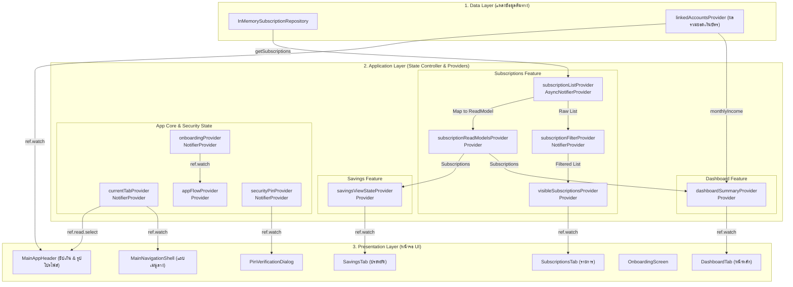

# 📘 คู่มือสถาปัตยกรรมและการทำงานของ Riverpod State Management
**สำหรับโปรเจกต์ Subscription Track (ฉบับอธิบายเจาะลึกและเข้าใจง่ายสำหรับผู้เริ่มต้น)**

---

## 💡 1. Riverpod คืออะไร? (อธิบายแบบเห็นภาพง่ายที่สุด)

ลองจินตนาการว่าแอปพลิเคชันของเราคือ **"ร้านค้าออนไลน์"**:

```text
┌──────────────────────────────────────────────────────────┐
│                     PRODUCER LAYER                       │
│  [ Data Source / Database / State Notifier Controller ]  │
└────────────────────────────┬─────────────────────────────┘
                             │ (ส่งข่าวสาร/อัปเดตข้อมูล)
                             ▼
┌──────────────────────────────────────────────────────────┐
│                    RIVERPOD PROVIDER                     │
│               "กล่องกระจายข่าวสารศูนย์กลาง"                 │
└────────────────────────────┬─────────────────────────────┘
                             │
            ┌────────────────┴────────────────┐
            │                                 │
            ▼                                 ▼
   ref.watch(...)                    ref.read(...)
"เฝ้าดูหน้าจอเมื่อเปลี่ยน"         "สะกิดเรียกคำสั่งครั้งเดียว"
            │                                 │
            ▼                                 ▼
   [ UI Display / Widget ]            [ User Event Handler ]
```

1. **Provider (`Provider` / `NotifierProvider` / `AsyncNotifierProvider`)**:  
   เปรียบเสมือน **"กล่องกระจายข่าวสาร"** ที่วางไว้กลางห้อง ไม่ว่า UI หน้าไหนก็สามารถเดินมาดูข้อมูลในกล่องนี้ได้โดยไม่ต้องส่งค่าผ่านตัวแปรจากหน้าหนึ่งไปอีกหน้าหนึ่ง
2. **Notifier / Controller**:  
   เปรียบเสมือน **"ผู้ดูแลกล่อง"** มีหน้าที่คอยอัปเดต เปลี่ยนแปลง หรือแก้ไขข้อมูลในกล่องเมื่อผู้ใช้กดปุ่มทำรายการ
3. **`ref.watch(provider)`**:  
   เปรียบเหมือน **"สายตาที่เฝ้ามองกล่อง"** หากข้อมูลในกล่องเปลี่ยนแม้แต่นิดเดียว UI ตรงจุดนั้นจะวาดตัวเองใหม่ (Re-render) เพื่อแสดงผลค่าใหม่ทันที
4. **`ref.read(provider.notifier).doSomething()`**:  
   เปรียบเหมือน **"มือที่ยื่นไปสะกิดผู้ดูแล"** เพื่อสั่งให้ทำคำสั่งบางอย่าง เช่น เพิ่มรายการ, ลบรายการ, สลับโหมดธีม โดยไม่จำเป็นต้องเฝ้ามองตลอดเวลา

---

## 🗺️ 2. ภาพรวมสถาปัตยกรรมข้อมูล (System Architecture Flowchart)

แผนภาพ Mermaid แสดงการไหลของข้อมูลจาก Data Source สู่ State Control และส่งต่อไปยัง UI ของโมดูลที่คุณรับผิดชอบ:



---

## 🧩 3. เจาะลึกรายโมดูลที่คุณรับผิดชอบ

---

### 🏛️ โมดูล 1: App Core & Routing (`apps/mobile/lib/` & `apps/mobile/lib/app/`)
*(ส่วนที่คุณร่วมพัฒนา)*

#### 📄 ไฟล์ในส่วนนี้:
1. **[`apps/mobile/lib/main.dart`](../../apps/mobile/lib/main.dart)**
   * **หน้าที่**: จุดเริ่มต้นของแอปพลิเคชัน ต้องมี `ProviderScope` ครอบ `App()` ไว้เสมอ
   * **โค้ด**:
     ```dart
     void main() {
       runApp(const ProviderScope(child: App()));
     }
     ```

2. **[`apps/mobile/lib/app/application/current_tab_controller.dart`](../../apps/mobile/lib/app/application/current_tab_controller.dart)**
   * **หน้าที่**: เก็บ State ของแท็บปัจจุบัน (Index 0 = หน้าแรก, 1 = รายการ, 2 = ประหยัด, 3 = ตั้งค่า, 4 = โปรไฟล์)
   * **การใช้งานใน UI**:
     - `ref.watch(currentTabProvider)` ➔ ใช้เปลี่ยนหน้าใน NavigationShell
     - `ref.read(currentTabProvider.notifier).select(4)` ➔ พาย้ายไปหน้าโปรไฟล์เมื่อกดรูปบน Header

3. **[`apps/mobile/lib/app/application/app_flow_provider.dart`](../../apps/mobile/lib/app/application/app_flow_provider.dart)**
   * **หน้าที่**: รวมข้อมูลจาก `onboardingProvider` และ `authProvider` เพื่อสรุปว่าแอปอยู่ในสถานะใด (`isInitializing`, `isOnboardingCompleted`, `isAuthenticated`)

4. **[`apps/mobile/lib/app/routing/app_router.dart`](../../apps/mobile/lib/app/routing/app_router.dart)**
   * **หน้าที่**: กำหนดเส้นทาง URL Path (`/dashboard`, `/login`, `/onboarding`) ด้วย `GoRouter` ร่วมกับ `_RouterRefreshNotifier`

5. **[`apps/mobile/lib/app/presentation/main_navigation_shell.dart`](../../apps/mobile/lib/app/presentation/main_navigation_shell.dart)**
   * **หน้าที่**: เป็นโครงหน้าจอหลัก (Scaffold + Header + IndexedStack + NavigationBar) ที่สลับหน้าตาม `currentTabProvider`

6. **[`apps/mobile/lib/app/presentation/widgets/main_app_header.dart`](../../apps/mobile/lib/app/presentation/widgets/main_app_header.dart)**
   * **หน้าที่**: แถบด้านบนของแอป อ่านยอดเงินจาก `userIncomeProvider` มาแสดงผล และมีปุ่มรูปโปรไฟล์กดไปหน้าตั้งค่า

---

### 🛡️ โมดูล 2: ระบบความปลอดภัยส่วนกลาง Security & PIN (`apps/mobile/lib/core/`)

#### 📄 ไฟล์ในส่วนนี้:
* **[`apps/mobile/lib/core/security/pin_provider.dart`](../../apps/mobile/lib/core/security/pin_provider.dart)**

#### ⚙️ การทำงานของระบบ PIN:
```text
State: String ( default: '111111' )
  ├── updatePin(newPin): ตรวจสอบว่าเป็นตัวเลข 6 หลักแล้วอัปเดต state
  └── verifyPin(inputPin): คืนค่า true หากกดรหัสตรงกับ state
```

#### 💻 ตัวอย่างโค้ด:
```dart
final securityPinProvider = NotifierProvider<SecurityPinNotifier, String>(
  SecurityPinNotifier.new,
);

class SecurityPinNotifier extends Notifier<String> {
  @override
  String build() => '111111'; // รหัส PIN เริ่มต้น

  void updatePin(String newPin) {
    if (newPin.length == 6 && RegExp(r'^\d+$').hasMatch(newPin)) {
      state = newPin;
    }
  }

  bool verifyPin(String pin) => state == pin;
}
```

---

### 📦 โมดูล 4: ฟีเจอร์จัดการสมัครสมาชิก Subscriptions (`apps/mobile/lib/features/subscriptions/`)

โมดูลนี้เป็น **Source of Truth หลัก** สำหรับเก็บรายการค่าบริการสมาร์ทโฟน/สตรีมมิ่งทั้งหมด

#### 📄 ไฟล์หลักใน Application Layer:
1. **`subscriptionListProvider`** ([`subscription_list_controller.dart`](../../apps/mobile/lib/features/subscriptions/application/subscription_list_controller.dart))
   * **ชนิด**: `AsyncNotifierProvider`
   * **หน้าที่**: โหลดข้อมูลจาก Repository และมีเมธอดทำ CRUD:
     - `addSubscription(item)` ➔ เพิ่มรายการ
     - `updateSubscription(item)` ➔ แก้ไขรายการ
     - `deleteSubscription(id)` ➔ ลบรายการ
     - `toggleSelection(id)` ➔ ติ๊กเลือกบริการเพื่อจำลองยกเลิก
2. **`visibleSubscriptionsProvider`** ([`subscription_filter_controller.dart`](../../apps/mobile/lib/features/subscriptions/application/subscription_filter_controller.dart))
   * **ชนิด**: `Provider` (Derived State)
   * **หน้าที่**: กรองรายการ Subscription ที่จะแสดงผลบนหน้าจอตามคำค้นหา (`query`) และหมวดหมู่ที่เลือก (`category`)
3. **`subscriptionReadModelsProvider`** ([`subscription_read_model.dart`](../../apps/mobile/lib/features/subscriptions/application/subscription_read_model.dart))
   * **ชนิด**: `Provider` (Public Read Boundary)
   * **หน้าที่**: แปลงข้อมูลเป็น Read Model ให้ Dashboard และ Savings อ่านไปใช้ได้โดยไม่เกิดปัญหา Tight Coupling

---

### 📊 โมดูล 5: ฟีเจอร์หน้าแรก Dashboard (`apps/mobile/lib/features/dashboard/`)

โมดูลนี้ทำหน้าที่นำข้อมูลจาก **Subscriptions** และ **Profile Income** มารวบรวมและคำนวณสถิติสำคัญ

#### 📄 ไฟล์หลักใน Application Layer:
* **`dashboardSummaryProvider`** ([`dashboard_summary_provider.dart`](../../apps/mobile/lib/features/dashboard/application/dashboard_summary_provider.dart))

#### 🧮 สูตรการคำนวณที่เกิดขึ้นใน Provider:
```text
1. monthlyTotal       = ผลรวมราคา Subscription ทุกรายการ
2. creepScore         = (monthlyTotal / monthlyIncome) * 100
3. unusedCount        = จำนวนรายการที่มี usageStatus == 'unused'
4. upcomingRenewals   = รายการที่เรียงลำดับวันตัดเงินใกล้ที่สุดไปไกลที่สุด
```

#### 💻 ตัวอย่างการใช้งานใน UI (`dashboard_tab.dart`):
```dart
final summaryAsync = ref.watch(dashboardSummaryProvider);

summaryAsync.when(
  data: (summary) => Text('Creep Risk: ${summary.creepScore.toStringAsFixed(1)}%'),
  loading: () => const CircularProgressIndicator(),
  error: (err, stack) => Text('เกิดข้อผิดพลาด: $err'),
);
```

---

### 💰 โมดูล 6: ฟีเจอร์จำลองประหยัดเงิน Savings (`apps/mobile/lib/features/savings/`)

โมดูลนี้ทำหน้าที่คำนวณยอดเงินที่จะประหยัดได้ต่อปี หากผู้ใช้ยกเลิกรายการที่เลือกไว้

#### 📄 ไฟล์หลักใน Application Layer:
* **`savingsViewStateProvider`** ([`savings_provider.dart`](../../apps/mobile/lib/features/savings/application/savings_provider.dart))

#### 🧮 การคำนวณ ยอดประหยัดเงินรวมต่อปี (`yearlySavings`):
$$\text{yearlySavings} = \sum (\text{monthlyPrice of selected items}) \times 12$$

```dart
final savingsViewStateProvider = Provider<AsyncValue<SavingsViewState>>((ref) {
  return ref
      .watch(subscriptionReadModelsProvider)
      .whenData(SavingsViewState.from);
});
```

---

### 🚀 โมดูล 10: ฟีเจอร์แนะนำการใช้งาน Onboarding (`apps/mobile/lib/features/onboarding/`)

#### 📄 ไฟล์หลักใน Application Layer:
* **`onboardingProvider`** ([`onboarding_controller.dart`](../../apps/mobile/lib/features/onboarding/application/onboarding_controller.dart))

```dart
final onboardingProvider = NotifierProvider<OnboardingController, bool>(
  OnboardingController.new,
);

final class OnboardingController extends Notifier<bool> {
  @override
  bool build() => false; // ค่าเริ่มต้น: ยังไม่เคยผ่าน Onboarding

  void setCompleted(bool value) => state = value;
}
```
* **หน้าที่**: จดจำสถานะว่าผู้ใช้งานเคยผ่านหน้า Onboarding หรือยัง หากผ่านแล้ว (`state = true`) ตัว `appFlowProvider` จะส่งผู้ใช้ไปหน้า Login หรือ Dashboard ต่อไป

---

## 🎓 4. สรุป Cheat Sheet การเลือกใช้ Riverpod สำหรับนักพัฒนา

| โจทย์ที่ต้องการทำ | ประเภท Provider ที่ควรใช้ | ตัวอย่างไฟล์ในโปรเจกต์ |
| ----------------- | ----------------------- | ---------------------- |
| ข้อมูลอ่านได้อย่างเดียว คำนวณจาก State อื่น | `Provider<T>` | `dashboardSummaryProvider`, `visibleSubscriptionsProvider` |
| State แบบ Synch (เปลี่ยนค่าง่ายๆ เช่น boolean, int, string) | `NotifierProvider<Controller, T>` | `currentTabProvider`, `securityPinProvider`, `onboardingProvider` |
| State ที่ต้องโหลดจาก Database/API (มีสถานะ Loading / Error / Data) | `AsyncNotifierProvider<Controller, T>` | `subscriptionListProvider` |
| ต้องการฟังความเปลี่ยนแปลงของ State ใน UI | `ref.watch(provider)` | `final tab = ref.watch(currentTabProvider);` |
| ต้องการสั่งงาน action เมื่อผู้ใช้กดปุ่ม | `ref.read(provider.notifier).method()` | `ref.read(currentTabProvider.notifier).select(1);` |
