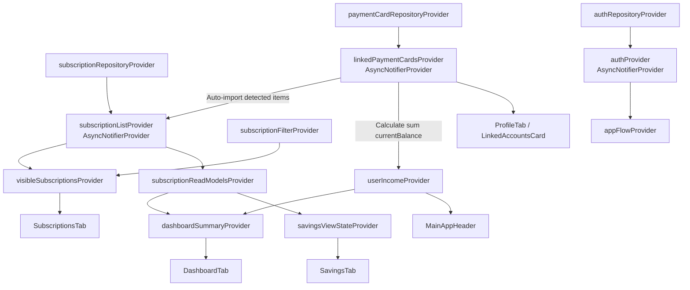

# 📘 เอกสารอ้างอิง Riverpod Providers & Feature Modules Inventory

เอกสารนี้รวบรวม **รายการ Riverpod Providers ทั้งหมดในโปรเจกต์ Subscription Track** โดยแบ่งตามสถาปัตยกรรม **Feature-First Clean Architecture** รายละเอียดของแต่ละไฟล์ หน้าที่ ความรับผิดชอบ และการเชื่อมโยงข้อมูลระหว่างโมดูลต่างๆ

---

## 📊 1. ตารางสรุปภาพรวม Providers ทั้งหมดในระบบ (Providers Summary Matrix)

| โมดูล (Feature) | ชื่อ Provider | ชนิด (Type) | ไฟล์ต้นทาง (File Location) | หน้าที่และความรับผิดชอบหลัก |
| --------------- | ------------- | ----------- | -------------------------- | --------------------------- |
| **App Core** | `themeModeProvider` | `NotifierProvider` | [`lib/app/application/theme_mode_controller.dart`](file:///c:/Work/Project/shareproject/subscription_track/lib/app/application/theme_mode_controller.dart) | จัดการโหมดธีมของแอป (Light / Dark) |
| **App Core** | `currentTabProvider` | `NotifierProvider` | [`lib/app/application/current_tab_controller.dart`](file:///c:/Work/Project/shareproject/subscription_track/lib/app/application/current_tab_controller.dart) | ควบคุม Index แถบเมนูหลัก (Tab 0-4) |
| **App Core** | `mockAuthBypassProvider` | `NotifierProvider` | [`lib/app/application/app_flow_provider.dart`](file:///c:/Work/Project/shareproject/subscription_track/lib/app/application/app_flow_provider.dart) | สวิตช์เปิด/ปิดการข้าม Auth สำหรับ Dev/Test |
| **App Core** | `appFlowProvider` | `Provider` | [`lib/app/application/app_flow_provider.dart`](file:///c:/Work/Project/shareproject/subscription_track/lib/app/application/app_flow_provider.dart) | สรุปสถานะแอป (Initializing / Onboarding / Authenticated) |
| **App Core** | `appRouterProvider` | `Provider` | [`lib/app/routing/app_router.dart`](file:///c:/Work/Project/shareproject/subscription_track/lib/app/routing/app_router.dart) | สร้างอินสแตนซ์ `GoRouter` สำหรับควบคุมทิศทางการเปลี่ยนหน้า |
| **Security Core** | `securityPinProvider` | `NotifierProvider` | [`lib/core/security/pin_provider.dart`](file:///c:/Work/Project/shareproject/subscription_track/lib/core/security/pin_provider.dart) | จัดการและตรวจสอบรหัส PIN ความปลอดภัย 6 หลัก |
| **Auth** | `authRepositoryProvider` | `Provider` | [`lib/features/auth/application/auth_provider.dart`](file:///c:/Work/Project/shareproject/subscription_track/lib/features/auth/application/auth_provider.dart) | ให้บริการ Data Source สำหรับเข้าสู่ระบบ |
| **Auth** | `authProvider` | `AsyncNotifierProvider` | [`lib/features/auth/application/auth_provider.dart`](file:///c:/Work/Project/shareproject/subscription_track/lib/features/auth/application/auth_provider.dart) | เก็บและควบคุม State ของผู้ใช้งานปัจจุบัน (`User?`) |
| **Subscriptions** | `subscriptionRepositoryProvider` | `Provider` | [`lib/features/subscriptions/application/subscription_list_controller.dart`](file:///c:/Work/Project/shareproject/subscription_track/lib/features/subscriptions/application/subscription_list_controller.dart) | ให้บริการ Repository ของ Subscription |
| **Subscriptions** | `subscriptionListProvider` | `AsyncNotifierProvider` | [`lib/features/subscriptions/application/subscription_list_controller.dart`](file:///c:/Work/Project/shareproject/subscription_track/lib/features/subscriptions/application/subscription_list_controller.dart) | **Source of Truth** รายการ Subscription ทั้งหมด (CRUD + Auto-import) |
| **Subscriptions** | `subscriptionByIdProvider` | `FutureProvider.family` | [`lib/features/subscriptions/application/subscription_list_controller.dart`](file:///c:/Work/Project/shareproject/subscription_track/lib/features/subscriptions/application/subscription_list_controller.dart) | ค้นหา Subscription ตาม ID |
| **Subscriptions** | `subscriptionFilterProvider` | `NotifierProvider` | [`lib/features/subscriptions/application/subscription_filter_controller.dart`](file:///c:/Work/Project/shareproject/subscription_track/lib/features/subscriptions/application/subscription_filter_controller.dart) | ถือ State การค้นหาคำและหมวดหมู่การกรอง |
| **Subscriptions** | `visibleSubscriptionsProvider` | `Provider` | [`lib/features/subscriptions/application/subscription_filter_controller.dart`](file:///c:/Work/Project/shareproject/subscription_track/lib/features/subscriptions/application/subscription_filter_controller.dart) | คำนวณรายการ Subscription ที่ผ่านการกรองแล้ว |
| **Subscriptions** | `subscriptionReadModelsProvider` | `Provider` | [`lib/features/subscriptions/application/subscription_read_model.dart`](file:///c:/Work/Project/shareproject/subscription_track/lib/features/subscriptions/application/subscription_read_model.dart) | **Public Boundary** แปลงข้อมูลส่งให้ Dashboard/Savings |
| **Subscriptions** | `subscriptionCommandsProvider` | `Provider` | [`lib/features/subscriptions/application/subscription_read_model.dart`](file:///c:/Work/Project/shareproject/subscription_track/lib/features/subscriptions/application/subscription_read_model.dart) | **Public Command Boundary** รับคำสั่งสั่งงานจากโมดูลอื่น |
| **Dashboard** | `dashboardSummaryProvider` | `Provider` | [`lib/features/dashboard/application/dashboard_summary_provider.dart`](file:///c:/Work/Project/shareproject/subscription_track/lib/features/dashboard/application/dashboard_summary_provider.dart) | คำนวณ Creep Risk %, ยอดจ่ายรวม, บริการไม่ได้ใช้ |
| **Savings** | `savingsViewStateProvider` | `Provider` | [`lib/features/savings/application/savings_provider.dart`](file:///c:/Work/Project/shareproject/subscription_track/lib/features/savings/application/savings_provider.dart) | คำนวณยอดเงินประหยัดรวมต่อปีสำหรับการจำลองยกเลิก |
| **Savings** | `savingsActionsProvider` | `Provider` | [`lib/features/savings/application/savings_provider.dart`](file:///c:/Work/Project/shareproject/subscription_track/lib/features/savings/application/savings_provider.dart) | รวบรวม Actions หน้า Savings ส่งต่อสั่งงาน Subscriptions |
| **Profile** | `paymentCardRepositoryProvider` | `Provider` | [`lib/features/profile/application/payment_card_linking_controller.dart`](file:///c:/Work/Project/shareproject/subscription_track/lib/features/profile/application/payment_card_linking_controller.dart) | ให้บริการ Repository ของบัตรชำระเงิน |
| **Profile** | `linkedPaymentCardsProvider` | `AsyncNotifierProvider` | [`lib/features/profile/application/payment_card_linking_controller.dart`](file:///c:/Work/Project/shareproject/subscription_track/lib/features/profile/application/payment_card_linking_controller.dart) | จัดการรายการบัตรที่เชื่อมต่อแล้ว + Auto-import Subscriptions |
| **Profile** | `availablePaymentCardsProvider` | `FutureProvider` | [`lib/features/profile/application/payment_card_linking_controller.dart`](file:///c:/Work/Project/shareproject/subscription_track/lib/features/profile/application/payment_card_linking_controller.dart) | ค้นหารายการบัตรจำลองที่พร้อมให้ผูกเพิ่ม |
| **Profile** | `userIncomeProvider` | `NotifierProvider` | [`lib/features/profile/application/user_income_controller.dart`](file:///c:/Work/Project/shareproject/subscription_track/lib/features/profile/application/user_income_controller.dart) | คำนวณรายได้/ยอดเงินรวมอัตโนมัติจากบัตรที่เชื่อมต่อ |
| **Profile** | `personalInfoProvider` | `NotifierProvider` | [`lib/features/profile/application/personal_info_controller.dart`](file:///c:/Work/Project/shareproject/subscription_track/lib/features/profile/application/personal_info_controller.dart) | จัดการข้อมูลส่วนตัว (ชื่อ, นามสกุล, เบอร์โทร, วันเกิด) |
| **Settings** | `notificationReminderProvider` | `NotifierProvider` | [`lib/features/settings/application/notification_reminder_controller.dart`](file:///c:/Work/Project/shareproject/subscription_track/lib/features/settings/application/notification_reminder_controller.dart) | ถือ State เปิด/ปิดการตั้งค่าแจ้งเตือนเตือนล่วงหน้า |
| **Notifications** | `notificationCenterProvider` | `AsyncNotifierProvider` | [`lib/features/notifications/application/notification_center_controller.dart`](file:///c:/Work/Project/shareproject/subscription_track/lib/features/notifications/application/notification_center_controller.dart) | จัดการรายการแจ้งเตือน (อ่านแล้ว, ล้างรายการ) |
| **Onboarding** | `onboardingProvider` | `NotifierProvider` | [`lib/features/onboarding/application/onboarding_controller.dart`](file:///c:/Work/Project/shareproject/subscription_track/lib/features/onboarding/application/onboarding_controller.dart) | จดจำสถานะว่าผ่านสไลด์แนะนำแอปแล้วหรือยัง |

---

## 🕸️ 2. แผนผังความสัมพันธ์ระหว่าง Providers (Cross-Feature Dependency Graph)



---

## 🧩 3. เจาะลึกรายฟีเจอร์และไฟล์ที่ใช้งาน Riverpod

---

### 🌐 1) App Core & Navigation Layer (`lib/app/`)

#### 📁 [`lib/app/application/theme_mode_controller.dart`](file:///c:/Work/Project/shareproject/subscription_track/lib/app/application/theme_mode_controller.dart)
- **Providers**: `themeModeProvider` (`NotifierProvider<ThemeModeController, ThemeMode>`)
- **การทำงาน**: สลับและเก็บความต้องการเรื่องโหมดธีมของผู้ใช้ (System / Light / Dark)
- **การนำไปใช้ใน UI**: [`lib/app/app.dart`](file:///c:/Work/Project/shareproject/subscription_track/lib/app/app.dart) ใช้ `ref.watch(themeModeProvider)` เพื่อเปลี่ยน `ThemeData` ของทั้งแอป

#### 📁 [`lib/app/application/current_tab_controller.dart`](file:///c:/Work/Project/shareproject/subscription_track/lib/app/application/current_tab_controller.dart)
- **Providers**: `currentTabProvider` (`NotifierProvider<CurrentTabController, int>`)
- **การทำงาน**: เก็บ Index แท็บปัจจุบันที่เปิดอยู่ (0: Dashboard, 1: Subscriptions, 2: Savings, 3: Settings, 4: Profile)
- **การนำไปใช้ใน UI**: [`lib/app/presentation/main_navigation_shell.dart`](file:///c:/Work/Project/shareproject/subscription_track/lib/app/presentation/main_navigation_shell.dart) อ่าน `ref.watch(currentTabProvider)` เพื่อเปลี่ยนหน้าใน `IndexedStack`

#### 📁 [`lib/app/application/app_flow_provider.dart`](file:///c:/Work/Project/shareproject/subscription_track/lib/app/application/app_flow_provider.dart)
- **Providers**: 
  - `mockAuthBypassProvider` (`NotifierProvider<MockAuthBypassController, bool>`)
  - `appFlowProvider` (`Provider<AppFlowState>`)
- **การทำงาน**: รวมสถานะข้ามฟีเจอร์ (`authProvider` และ `onboardingProvider`) เพื่อประเมินสถานะของแอปในจุดเดียว
- **การนำไปใช้ใน UI**: [`lib/app/routing/app_router.dart`](file:///c:/Work/Project/shareproject/subscription_track/lib/app/routing/app_router.dart) ใช้ `ref.listen` ฟัง `appFlowProvider` เพื่อแจ้งเตือน `_RouterRefreshNotifier` ทำการประเมิน Redirect เส้นทาง

---

### 🛡️ 2) Security Core (`lib/core/security/`)

#### 📁 [`lib/core/security/pin_provider.dart`](file:///c:/Work/Project/shareproject/subscription_track/lib/core/security/pin_provider.dart)
- **Providers**: `securityPinProvider` (`NotifierProvider<SecurityPinNotifier, String>`)
- **การทำงาน**: เก็บและยืนยันรหัส PIN ความปลอดภัย 6 หลัก มีเมธอด `updatePin()` และ `verifyPin()`
- **การนำไปใช้ใน UI**: 
  - [`lib/core/widgets/pin_verification_dialog.dart`](file:///c:/Work/Project/shareproject/subscription_track/lib/core/widgets/pin_verification_dialog.dart): เรียก `ref.read(securityPinProvider.notifier).verifyPin(input)` เพื่อตรวจสอบสิทธิ์
  - [`lib/core/widgets/change_pin_dialog.dart`](file:///c:/Work/Project/shareproject/subscription_track/lib/core/widgets/change_pin_dialog.dart): สั่งอัปเดตรหัส PIN ใหม่

---

### 🔐 3) Auth & Identity (`lib/features/auth/`)

#### 📁 [`lib/features/auth/application/auth_provider.dart`](file:///c:/Work/Project/shareproject/subscription_track/lib/features/auth/application/auth_provider.dart)
- **Providers**: 
  - `authRepositoryProvider` (`Provider<AuthRepository>`)
  - `authProvider` (`AsyncNotifierProvider<AuthNotifier, User?>`)
- **การทำงาน**: ควบคุมคำสั่งเข้าสู่ระบบด้วย Google/Apple และการออกจากระบบ (`logout()`)
- **การนำไปใช้ใน UI**: [`lib/features/auth/presentation/login_screen.dart`](file:///c:/Work/Project/shareproject/subscription_track/lib/features/auth/presentation/login_screen.dart) ฟังการเปลี่ยนแปลงผ่าน `ref.listen` เมื่อล็อกอินสำเร็จจะย้ายหน้าไปยัง Dashboard

---

### 📦 4) Subscriptions Feature (`lib/features/subscriptions/`)

#### 📁 [`lib/features/subscriptions/application/subscription_list_controller.dart`](file:///c:/Work/Project/shareproject/subscription_track/lib/features/subscriptions/application/subscription_list_controller.dart)
- **Providers**: 
  - `subscriptionRepositoryProvider` (`Provider<SubscriptionRepository>`)
  - `subscriptionListProvider` (`AsyncNotifierProvider<SubscriptionListController, List<Subscription>>`)
  - `subscriptionByIdProvider` (`FutureProvider.family<Subscription, String>`)
- **การทำงาน**: **Source of Truth** บริหารจัดการรายการสมัครสมาชิก (เพิ่ม, แก้ไข, ลบ, ติ๊กเลือกจำลอง, Auto-import จากบัตร)
- **การนำไปใช้ใน UI**: [`lib/features/subscriptions/presentation/subscriptions_tab.dart`](file:///c:/Work/Project/shareproject/subscription_track/lib/features/subscriptions/presentation/subscriptions_tab.dart)

#### 📁 [`lib/features/subscriptions/application/subscription_filter_controller.dart`](file:///c:/Work/Project/shareproject/subscription_track/lib/features/subscriptions/application/subscription_filter_controller.dart)
- **Providers**: 
  - `subscriptionFilterProvider` (`NotifierProvider<SubscriptionFilterController, SubscriptionFilterState>`)
  - `visibleSubscriptionsProvider` (`Provider<AsyncValue<List<Subscription>>>`)
- **การทำงาน**: กรองรายการ Subscription ตามคำค้นหาและหมวดหมู่ (Streaming, AI, Cloud, Creative)

#### 📁 [`lib/features/subscriptions/application/subscription_read_model.dart`](file:///c:/Work/Project/shareproject/subscription_track/lib/features/subscriptions/application/subscription_read_model.dart)
- **Providers**: 
  - `subscriptionReadModelsProvider` (`Provider<AsyncValue<List<SubscriptionReadModel>>>`)
  - `subscriptionCommandsProvider` (`Provider<SubscriptionCommands>`)
- **การทำงาน**: ทำหน้าที่เป็น **Public Boundary** ให้ Dashboard และ Savings นำไปคำนวณสถิติโดยไม่ต้องพึ่งพา Data Domain ของ Subscriptions โดยตรง

---

### 📊 5) Dashboard Feature (`lib/features/dashboard/`)

#### 📁 [`lib/features/dashboard/application/dashboard_summary_provider.dart`](file:///c:/Work/Project/shareproject/subscription_track/lib/features/dashboard/application/dashboard_summary_provider.dart)
- **Providers**: `dashboardSummaryProvider` (`Provider<AsyncValue<DashboardSummary>>`)
- **การทำงาน**: คำนวณสรุปสถิติสำคัญ:
  - **Creep Risk Score (%)**: `(ยอดจ่ายรวมรายเดือน / รายได้รวม) * 100`
  - **Unused Services**: นับจำนวนรายการที่ไม่ได้เปิดใช้งานบ่อย
  - **Upcoming Renewals**: จัดเรียงวันตัดเงินล่วงหน้า
- **การนำไปใช้ใน UI**: [`lib/features/dashboard/presentation/dashboard_tab.dart`](file:///c:/Work/Project/shareproject/subscription_track/lib/features/dashboard/presentation/dashboard_tab.dart) อ่านค่ามาแสดงผลในการ์ด Hero Payout Card และ Bento Grid

---

### 💰 6) Savings Simulation Feature (`lib/features/savings/`)

#### 📁 [`lib/features/savings/application/savings_provider.dart`](file:///c:/Work/Project/shareproject/subscription_track/lib/features/savings/application/savings_provider.dart)
- **Providers**: 
  - `savingsViewStateProvider` (`Provider<AsyncValue<SavingsViewState>>`)
  - `savingsActionsProvider` (`Provider<SavingsActions>`)
- **การทำงาน**: คำนวณยอดเงินประหยัดรวมต่อปี ($\text{yearlySavings} = \sum \text{monthlyPrice} \times 12$) จากรายการที่ติ๊กเลือกสิมูเลชัน
- **การนำไปใช้ใน UI**: [`lib/features/savings/presentation/savings_tab.dart`](file:///c:/Work/Project/shareproject/subscription_track/lib/features/savings/presentation/savings_tab.dart)

---

### 👤 7) Profile & Payment Cards Feature (`lib/features/profile/`)

#### 📁 [`lib/features/profile/application/payment_card_linking_controller.dart`](file:///c:/Work/Project/shareproject/subscription_track/lib/features/profile/application/payment_card_linking_controller.dart)
- **Providers**: 
  - `paymentCardRepositoryProvider` (`Provider<PaymentCardRepository>`)
  - `linkedPaymentCardsProvider` (`AsyncNotifierProvider<PaymentCardLinkingController, List<PaymentCard>>`)
  - `availablePaymentCardsProvider` (`FutureProvider<List<PaymentCard>>`)
- **การทำงาน**: จัดการการเชื่อมต่อบัตรชำระเงิน และสั่ง Auto-import รายการ Subscription ที่พบในบัตรเข้าสู่ `subscriptionListProvider` อัตโนมัติ

#### 📁 [`lib/features/profile/application/user_income_controller.dart`](file:///c:/Work/Project/shareproject/subscription_track/lib/features/profile/application/user_income_controller.dart)
- **Providers**: `userIncomeProvider` (`NotifierProvider<UserIncomeController, double>`)
- **การทำงาน**: ดึงค่ายอดเงินคงเหลือรวมจากบัตรที่เชื่อมต่อ (`linkedPaymentCardsProvider`) เพื่อใช้เป็นฐานรายได้คำนวณ Creep Risk

#### 📁 [`lib/features/profile/application/personal_info_controller.dart`](file:///c:/Work/Project/shareproject/subscription_track/lib/features/profile/application/personal_info_controller.dart)
- **Providers**: `personalInfoProvider` (`NotifierProvider<PersonalInfoController, PersonalInfo>`)
- **การทำงาน**: จัดการข้อมูลส่วนตัวของผู้ใช้ (ชื่อ, นามสกุล, เบอร์โทร, วันเกิด)

---

### ⚙️ 8) Settings Feature (`lib/features/settings/`)

#### 📁 [`lib/features/settings/application/notification_reminder_controller.dart`](file:///c:/Work/Project/shareproject/subscription_track/lib/features/settings/application/notification_reminder_controller.dart)
- **Providers**: `notificationReminderProvider` (`NotifierProvider<NotificationReminderController, NotificationReminderState>`)
- **การทำงาน**: ถือ State เปิด/ปิดการแจ้งเตือนเตือนล่วงหน้า และจำนวนวันเตือนความจำ

---

### 🔔 9) Notifications Center Feature (`lib/features/notifications/`)

#### 📁 [`lib/features/notifications/application/notification_center_controller.dart`](file:///c:/Work/Project/shareproject/subscription_track/lib/features/notifications/application/notification_center_controller.dart)
- **Providers**: `notificationCenterProvider` (`AsyncNotifierProvider<NotificationCenterController, List<NotificationItem>>`)
- **การทำงาน**: จัดการกล่องการแจ้งเตือน (ทำเครื่องหมายอ่านแล้ว, ล้างรายการ)

---

### 🚀 10) Onboarding Feature (`lib/features/onboarding/`)

#### 📁 [`lib/features/onboarding/application/onboarding_controller.dart`](file:///c:/Work/Project/shareproject/subscription_track/lib/features/onboarding/application/onboarding_controller.dart)
- **Providers**: `onboardingProvider` (`NotifierProvider<OnboardingController, bool>`)
- **การทำงาน**: จดจำสถานะว่าผู้ใช้เคยผ่านหน้าสไลด์แนะนำแอปแล้วหรือยัง

---

## 🛠️ 4. ตัวอย่างการใช้งานใน UI และการทดสอบ (Testing & UI Usage)

### 1) การดูและอ่านค่าใน UI (ConsumerWidget)
```dart
class ProfileIdentityCard extends ConsumerWidget {
  const ProfileIdentityCard({super.key});

  @override
  Widget build(BuildContext context, WidgetRef ref) {
    // อ่านข้อมูลส่วนตัวจาก personalInfoProvider
    final info = ref.watch(personalInfoProvider);

    return ListTile(
      title: Text('${info.firstName} ${info.lastName}'),
      subtitle: Text(info.phoneNumber),
    );
  }
}
```

### 2) การส่งคำสั่งอัปเดต State (User Interaction)
```dart
ElevatedButton(
  onPressed: () {
    // เรียกใช้ action สลับธีมเป็นโหมดมืด
    ref.read(themeModeProvider.notifier).setThemeMode(ThemeMode.dark);
  },
  child: const Text('สลับเป็นโหมดกลางคืน'),
);
```

### 3) การ Override Provider ใน Unit / Widget Test
```dart
testWidgets('แสดงผลหน้า Dashboard พร้อมข้อมูล Mock', (tester) async {
  await tester.pumpWidget(
    ProviderScope(
      overrides: [
        // Mock ข้อมูล Repository ไม่ให้ดึงข้อมูลจริงในขณะทดสอบ
        subscriptionRepositoryProvider.overrideWithValue(
          InMemorySubscriptionRepository(ioDelay: Duration.zero),
        ),
      ],
      child: const MaterialApp(home: MainNavigationShell()),
    ),
  );
  await tester.pumpAndSettle();
  expect(find.byKey(const Key('hero-payout-card')), findsOneWidget);
});
```
