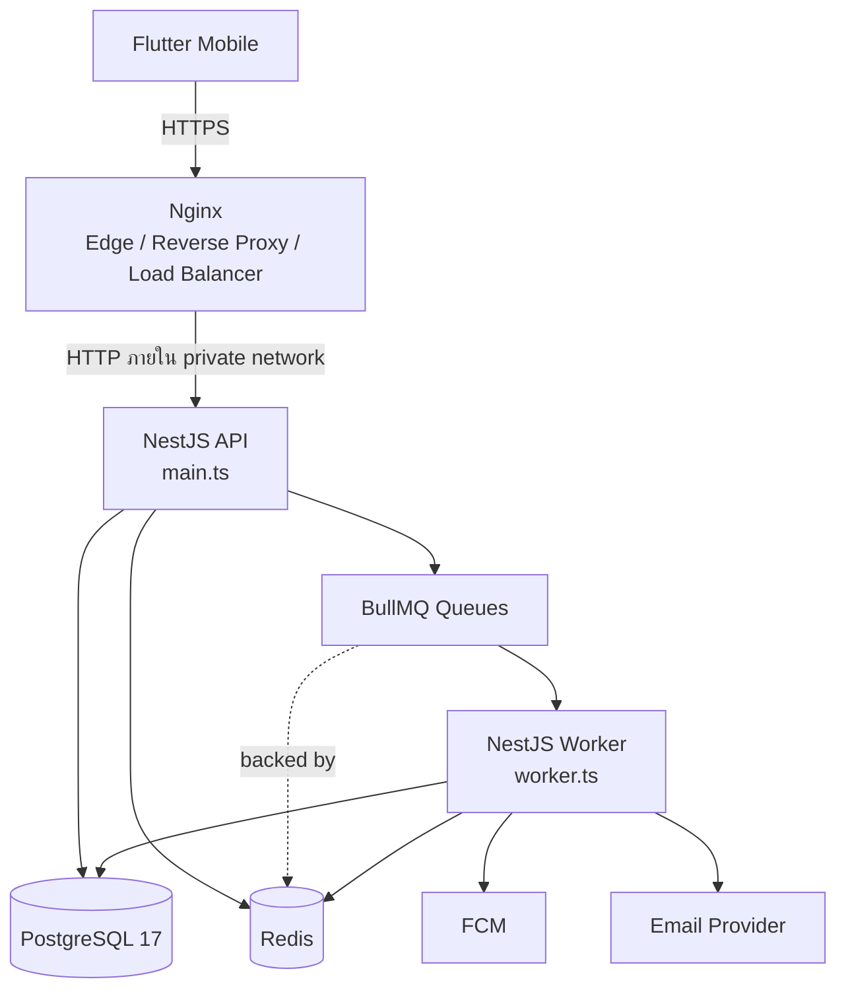
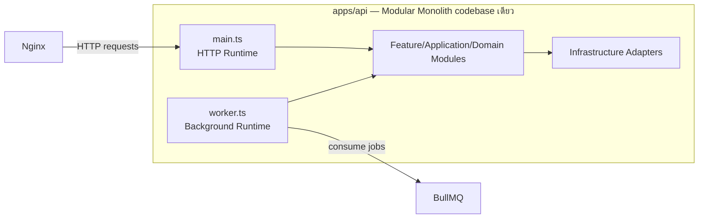
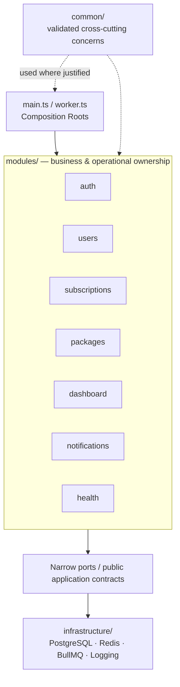
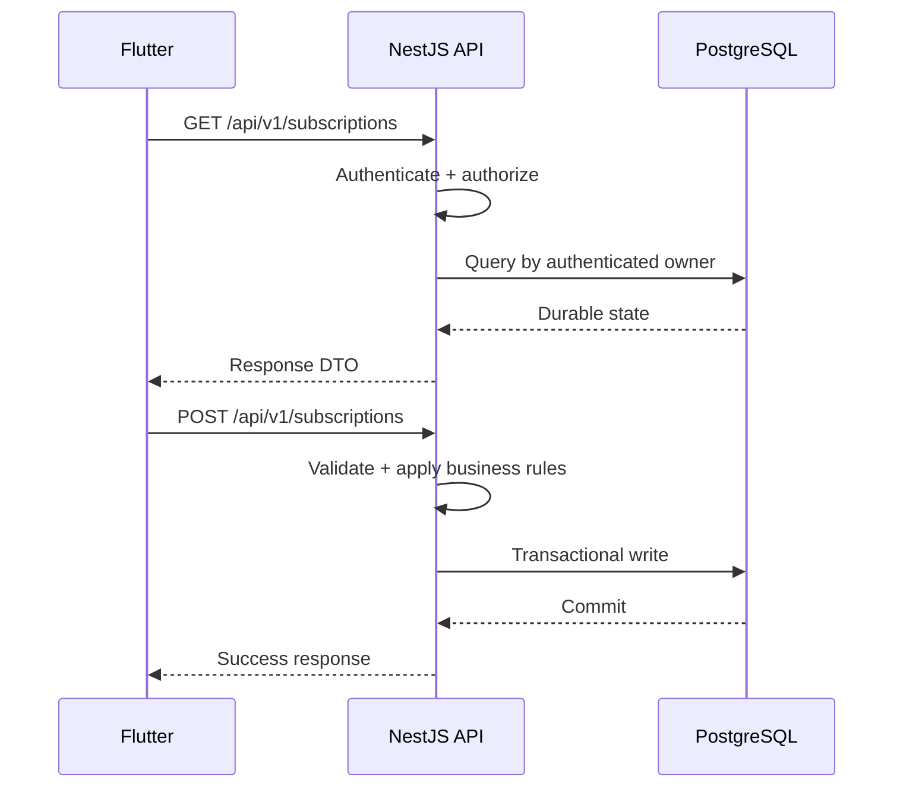
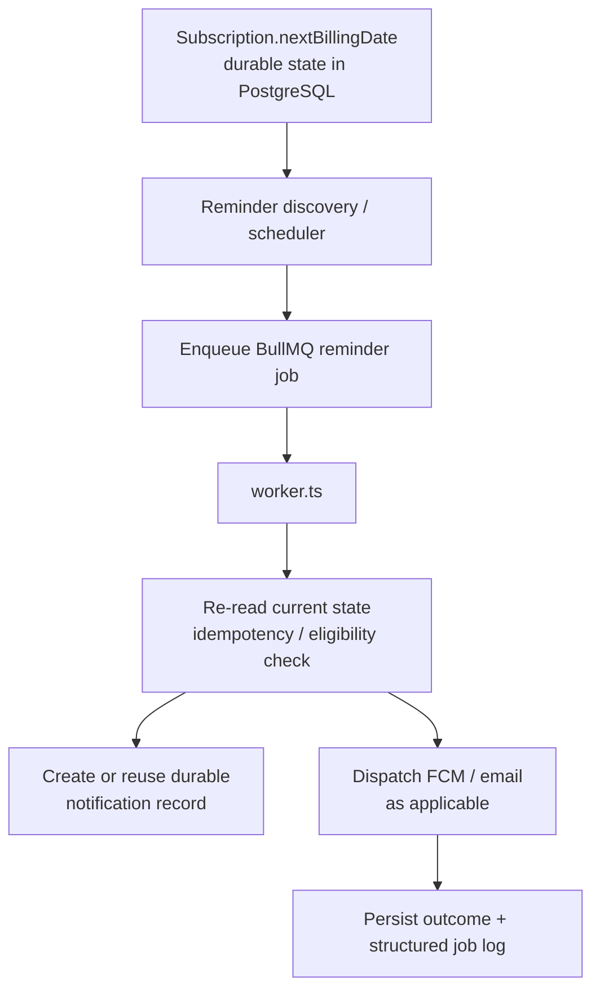
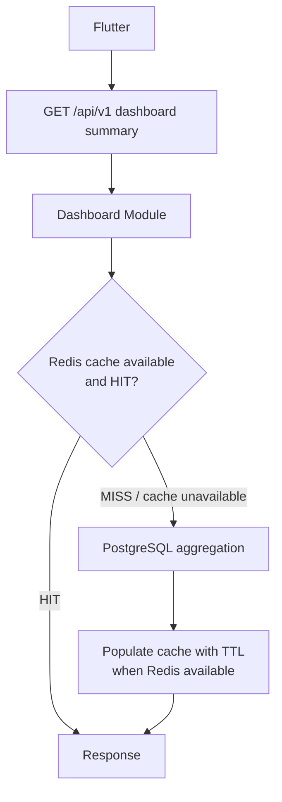
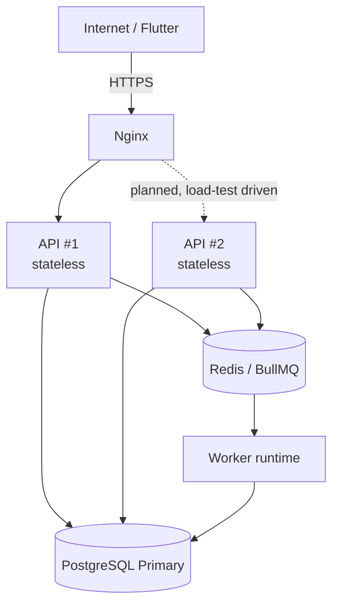

# Subscription Track — Backend Architecture v1

> **Phase:** 0.1 — Architecture v1
>
> **Status:** Current architecture decision baseline ก่อนเริ่ม Backend implementation
>
> **ปรับปรุงล่าสุด:** 14 กันยายน 2026
>
> **ขอบเขต:** Backend, Worker, data/queue boundaries และ production evolution ระดับสถาปัตยกรรม

## 1. วัตถุประสงค์และอำนาจของเอกสาร

เอกสารนี้เป็นข้อตกลงสถาปัตยกรรม Backend หลักของ Subscription Track ก่อนเริ่มออกแบบ Domain Model, ERD และ API contract โดยกำหนด component, runtime, NestJS Module Boundary, data ownership, dependency direction, synchronous/asynchronous flow, failure behavior และแนวทางขยายระบบ

เมื่อเอกสารเก่าขัดแย้งกับเอกสารนี้ ให้ใช้สถานะต่อไปนี้:

- **Current Decision** — ข้อกำหนดที่ Architecture v1 ยอมรับและใช้เป็นฐานของงานถัดไป
- **Legacy / Superseded Direction** — แนวทางจากเอกสารเก่าที่ยังอาจพบใน repository แต่ไม่ใช่ฐานสำหรับ Backend ใหม่
- **Open Decision** — เรื่องที่ยังไม่มีข้อมูลหรือแรงกดดันเพียงพอให้ล็อก และต้องตัดสินใน phase ที่ระบุ

เอกสารนี้อธิบาย architecture ไม่ใช่หลักฐานว่า Backend ถูก implement แล้ว ปัจจุบัน `apps/api/`, `infra/`, `scripts/` และ `.github/workflows/` ยังเป็นขอบเขต placeholder; Flutter MVP ใน `apps/mobile/` ใช้ in-memory/mock data และยังไม่เชื่อม Backend จริง

## 2. บริบทจาก Repository และการแก้ความขัดแย้ง

### 2.1 สถานะ Repository ปัจจุบัน

Repository เป็น full-stack monorepo-style project:

```text
subscription_track/
├── apps/
│   ├── mobile/      # Flutter mobile application
│   └── api/         # NestJS backend application (ยังไม่ scaffold)
├── infra/           # Infrastructure configuration (ยังเป็น placeholder)
├── scripts/         # Repository-level automation (ยังเป็น placeholder)
├── doc/             # Project documentation
├── .agents/         # Repository knowledge และ engineering skills
└── .github/         # CI/CD boundary (ยังเป็น placeholder)
```

Frontend ที่มีอยู่ยืนยัน use cases สำคัญ เช่น subscription lifecycle, dashboard summary, reminder preferences, Notification Center, device/card-related flows และ PIN-protected actions แต่ mock state ฝั่ง Flutter ไม่ใช่ durable business truth ของระบบ Backend ในอนาคต

### 2.2 Current, Legacy และ Open Direction

| หัวข้อ | สถานะ | ทิศทางที่ใช้ใน Architecture v1 |
| --- | --- | --- |
| Backend style | **Current Decision** | NestJS **Modular Monolith + Separate Worker Runtime** |
| Durable database | **Current Decision** | PostgreSQL 17 + TypeORM |
| Cache/coordination/queue backing | **Current Decision** | Redis; BullMQ ใช้ Redis เป็น backing infrastructure |
| Edge/deployment target | **Current Decision** | Nginx + Docker/Compose บน university Linux VM |
| MongoDB/Mongoose/Atlas | **Legacy / Superseded Direction** | พบใน PRD เก่า แต่ห้ามใช้เป็นฐานของ Backend v1 |
| GCP Cloud Run/App Engine | **Legacy / Superseded Direction** | production target ปัจจุบันคือ university-provided VM |
| Optional notification/analytics microservices | **Legacy / Superseded Direction** | ไม่แยก microservices ใน v1 |
| Firebase-centric authentication | **Legacy / Superseded Direction** | Firebase Auth ไม่ได้ถูกล็อก; FCM ยังเป็น candidate สำหรับ push delivery |
| REST + WebSocket ตั้งแต่เริ่ม | **Legacy / Superseded Direction** | REST-first; SSE/WebSocket เป็น Open Decision |
| OAuth provider flow | **Open Decision** | กำหนดเพียง boundary; ตัดสินใน Auth design |
| Offline-first/Hive sync | **Open Decision** | เป็น client/backend contract concern ที่ต้องกำหนด scope ภายหลัง |

## 3. Architecture Drivers และข้อจำกัด

Architecture นี้ต้องเหมาะกับทีม 3 คนและ VM โดยประมาณ 4 vCPU, RAM 5.8 GiB, disk 50 GB และยังไม่มี swap จึงให้ความสำคัญกับ:

- deployable units จำนวนน้อยและ ownership ชัดเจน
- Stateless API เพื่อ scale แนวนอนได้เมื่อ load test ยืนยันความจำเป็น
- PostgreSQL primary เดียวในระยะแรก ลด memory/operations cost
- Redis หนึ่งบทบาทเชิง infrastructure ที่รองรับ cache, coordination และ BullMQ โดยไม่เป็น business truth
- แยก API/Worker เป็น process หรือ container ได้ แต่ reuse code และ business rules จาก codebase เดียว
- เลือก abstraction เมื่อมี responsibility หรือ change pressure จริง ไม่บังคับ DDD, CQRS, event bus หรือ repository wrapper ทุกจุด

## 4. System Context และ Technology Baseline

### 4.1 Technology Direction

| Layer/Concern | Current Decision |
| --- | --- |
| Mobile | Flutter / Dart |
| Backend | NestJS / TypeScript |
| Architecture | Modular Monolith |
| Durable database | PostgreSQL 17 |
| ORM | TypeORM |
| Cache / coordination | Redis |
| Async queue | BullMQ |
| Background runtime | NestJS Worker |
| Edge / gateway | Nginx |
| Deployment | Docker / Docker Compose |
| Production target | University-provided Linux VM |

### 4.2 System Context



- PostgreSQL และ Redis ถูกเข้าถึงจากทั้ง API และ Worker ได้เมื่อ use case มีเหตุผลรองรับ
- BullMQ ไม่ใช่ datastore แยกจาก Redis; queue state และ coordination ของ BullMQ พึ่ง Redis
- Worker ไม่ใช่ microservice และไม่มี public HTTP business interface
- API กับ Worker share feature/application/domain code และ technical adapters ที่เหมาะสมจาก `apps/api/`
- HTTP traffic จาก Mobile/Nginx ต้องไม่ route เข้าสู่ Worker

### 4.3 Ownership Invariant

| Component | Architectural ownership |
| --- | --- |
| Flutter | Client presentation และ client state; ไม่ใช่ durable backend truth |
| Nginx | Edge, HTTPS, Reverse Proxy และ Load Balancing |
| NestJS API | Synchronous application boundary |
| NestJS Worker | Background execution boundary |
| PostgreSQL | Durable Source of Truth |
| Redis | Cache, ephemeral coordination และ queue infrastructure |
| BullMQ | Asynchronous job execution |

## 5. Backend Style และ Runtime Boundary

### 5.1 Modular Monolith + Separate Worker Runtime

Backend เป็น application เดียวในเชิง source ownership และ deployment version แต่มีสอง runtime responsibility:

```text
apps/api/
└── src/
    ├── modules/
    ├── infrastructure/
    ├── common/
    ├── main.ts       # HTTP API bootstrap
    └── worker.ts     # BullMQ Worker bootstrap
```

โครงสร้างนี้เป็น conceptual target เท่านั้น ยังไม่มีการสร้าง directory หรือ NestJS scaffold ใน Phase 0.1 และ Architecture v1 ไม่สร้าง `apps/worker/`



Nginx ส่ง HTTP request เข้า `main.ts` เท่านั้น ส่วน runtime bootstrap ทั้งสองจุดประกอบ module/application code ตามหน้าที่ของตน

### 5.2 API Runtime — `main.ts`

API เป็น synchronous application boundary รับผิดชอบ:

- HTTP routing, API version namespace `/api/v1` และ request/response adaptation
- DTO validation, authentication context และ server-side authorization/ownership
- เรียก synchronous use case และกำหนด transaction boundary ที่เหมาะสม
- persist immediate durable state ก่อนตอบกลับ
- enqueue follow-up work เมื่อ operation นั้นไม่ควร block request และ durable prerequisite สำเร็จแล้ว

API ไม่ควรส่ง FCM/email หรือทำ external side effect ที่ช้าและ retryable ภายใน request หากสามารถ queue อย่างปลอดภัยได้

### 5.3 Worker Runtime — `worker.ts`

Worker เป็น background execution boundary รับผิดชอบ:

```text
BullMQ job
    ↓
Worker processor/handler
    ↓
shared application/domain rule
    ↓
PostgreSQL / Redis coordination / external provider
```

Worker ต้องไม่ copy business calculation จาก API การแยกนี้เป็น runtime responsibility ไม่ใช่ service ownership หรือ microservice boundary การ scale Worker แยกจาก API ทำได้ภายหลังโดยยัง deploy artifact/code version เดียวกัน

### 5.4 Nginx — Edge Boundary

Nginx เป็น public entry point สำหรับ:

- HTTPS termination
- Reverse Proxy และ upstream Load Balancing
- proxy headers และ client/protocol information ที่จำเป็น
- forward หรือ generate request ID ตาม project contract ที่จะกำหนด
- reasonable body-size/connection/read timeouts
- passive upstream failover เมื่อมีหลาย API instance และ configuration รองรับ

Nginx ไม่ทำ business authentication, resource authorization หรือ ownership decision และ infrastructure services ภายในไม่ควรถูก expose ต่อสาธารณะโดยไม่จำเป็น

## 6. Data และ Messaging Ownership

### 6.1 PostgreSQL = Durable Source of Truth

PostgreSQL เป็น authoritative owner ของ durable business state เช่น user, subscription, package และ package history/version, notification record, registered mobile device และ refresh session/credential record ที่ design ภายหลังเห็นว่าจำเป็น

รายละเอียด table, column, constraint และ relation เป็นงานของ Phase 0.2 Domain Model & ERD v1 ไม่กำหนดในเอกสารนี้ แต่ architecture ยืนยันว่า:

- immediate business write ต้องสำเร็จและ commit ใน PostgreSQL ก่อนถือว่าสถานะ durable เปลี่ยนแล้ว
- TypeORM เป็น persistence mechanism แต่ entity ไม่ควรกลายเป็น global data structure ที่ module อื่นเข้าถึงได้โดยไม่มี ownership
- Redis หรือ Flutter local state ไม่ใช่ authoritative copy ของข้อมูลเหล่านี้
- PostgreSQL unavailable หมายถึง durable business operation ไม่สามารถดำเนินต่อได้ตามปกติ

### 6.2 Redis = Supporting Infrastructure

Redis ใช้ได้สำหรับ:

- Cache-Aside
- BullMQ backing store
- distributed coordination และ lock เมื่อมี race condition ข้าม process ที่พิสูจน์ได้
- deduplication และ atomic counter
- ephemeral data
- rate limiting หากเลือกใน design ภายหลัง
- Pub/Sub สำหรับ ephemeral event ที่ยอมรับการสูญหายได้เท่านั้น

กฎสำคัญ:

- cache entry ต้องมี TTL และ invalidation policy เมื่อออกแบบจริง แต่ Architecture v1 ยังไม่กำหนดค่า TTL/key format
- write durable state ลง PostgreSQL และ commit ก่อน invalidate/update cache
- Redis cache unavailable: read ที่ออกแบบให้ fallback ได้ควรอ่าน PostgreSQL พร้อม log/metric ที่เหมาะสม
- Redis/BullMQ unavailable: queue-dependent action ไม่สามารถแสร้งเป็น cache miss แล้วดำเนินต่อแบบเดียวกัน ต้อง surface operational failure และมี recovery semantics ที่ design ภายหลัง
- Redis ต้องไม่เป็นสำเนาเดียวของ notification, subscription, credential หรือ business state ถาวร

### 6.3 BullMQ = Asynchronous Job Execution

BullMQ ใช้กับงานที่ไม่ควรเพิ่ม HTTP latency หรือต้องการ retry, backoff, delayed execution และ asynchronous side effect ตัวอย่างเช่น:

- billing reminder dispatch
- FCM/email delivery
- package-change notification fan-out
- scheduled cancellation execution เมื่อรายละเอียด use case ยืนยันว่าเหมาะกับ queue

Job design ใน phase ถัดไปต้อง:

- **Idempotent** — การทำซ้ำไม่สร้าง durable record หรือ external effect ซ้ำโดยไม่ตั้งใจ
- **Retry-safe** — ตรวจ current durable state ก่อน side effect และแยก transient/permanent failure
- **Observable** — trace ได้ด้วย queue/job ID, correlation metadata และ structured error
- **Bounded** — retry/backoff มีขอบเขต ไม่วนไม่สิ้นสุด
- ใช้ payload แบบ minimal reference แทน snapshot entity ขนาดใหญ่เมื่อกำหนด schema ภายหลัง

Queue ไม่ควรถูกใช้แทน direct application call สำหรับงาน synchronous ทั่วไป และไม่บังคับ event bus สำหรับทุก module interaction

## 7. NestJS Module Boundaries

Business/operational modules ใน Architecture v1 คือ `auth`, `users`, `subscriptions`, `packages`, `dashboard`, `notifications` และ `health`

### 7.1 `auth`

**Responsibility:** Authentication, token/session lifecycle, authentication identity, provider integration boundary, guards และ security authentication flow

**Example Use Cases:** แลก provider identity เป็น application session, refresh/revoke session, สร้าง authenticated request context และ verify PIN สำหรับ protected operation

**Does Not Own:** subscription authorization rule, user profile business data, notification delivery, package access policy

**Primary Dependencies:** public account-association contract ของ `users`, PostgreSQL สำหรับ durable auth/session/PIN credential state ที่ design ภายหลังเลือกเก็บ, token/hash/provider adapters และ configuration/security infrastructure

### 7.2 `users`

**Responsibility:** User profile, account preferences/settings และ domain-level association ระหว่าง application user กับ authentication identity; profile กับ credential ต้องไม่ถูกผูกเป็น object เดียวโดยไม่จำเป็น

**Example Use Cases:** อ่าน/แก้ profile ของตนเอง, จัดการ account preference, associate authenticated identity กับ user account

**Does Not Own:** token issuance/rotation, subscription lifecycle, dashboard calculation, notification dispatch

**Primary Dependencies:** PostgreSQL; authenticated user context ถูกส่งเข้ามาที่ application boundary โดย `users` ไม่ต้องเข้าถึง internals ของ `auth`

### 7.3 `subscriptions`

**Responsibility:** Subscription records, ownership, lifecycle, billing cycle, next-billing-date logic, reminder-relevant settings และ cancellation scheduling rules

**Example Use Cases:** list/create/update subscription, คำนวณ next billing date, schedule/cancel cancellation, expose read contract ให้ dashboard/notifications

**Does Not Own:** provider package catalog/version history, user credential, delivery of FCM/email, dashboard response aggregation

**Primary Dependencies:** PostgreSQL/TypeORM boundary, public contract ของ `packages` เมื่ออ้าง package version และ queue producer contract เฉพาะ follow-up work ที่จำเป็น

Lifecycle concept ขั้นต่ำรองรับ `ACTIVE`, `CANCELLATION_SCHEDULED`, `CANCELLED` แต่รายการ enum ที่สมบูรณ์ยังไม่ล็อกจนกว่า Domain Model จะตรวจ requirements ทั้งหมด

### 7.4 `packages`

**Responsibility:** Service/package catalog, package metadata, package version/history และ package-change detection

**Example Use Cases:** อ่าน preset catalog, publish/update package version, ตรวจว่าข้อมูล provider เปลี่ยนจนต้องแจ้งผู้ใช้หรือไม่

**Does Not Own:** user-specific subscription lifecycle, historical subscription decision, notification delivery หรือ dashboard aggregation

**Primary Dependencies:** PostgreSQL และ notification orchestration contract สำหรับ follow-up หลัง durable package change

Package update ต้อง preserve historical meaning แทน destructive overwrite:

```text
Package
 ├── PackageVersion 1
 ├── PackageVersion 2
 └── PackageVersion 3
```

เมื่อราคา ชื่อ features หรือ metadata เปลี่ยน ประวัติเดิมต้องยังอธิบาย subscription/notification ในอดีตได้ วิธี map และ schema เป็นงาน Phase 0.2

### 7.5 `dashboard`

**Responsibility:** Server-side read aggregation สำหรับ dashboard summary, spending summary, upcoming billing และ derived analytics ที่ UI ต้องใช้

**Example Use Cases:** สรุป monthly/annual spending, active subscription count, upcoming renewals และ derived risk/summary ที่ requirements ยืนยัน

**Does Not Own:** mutation ของ subscription, package catalog, user income/profile state หรือ cache implementation โดยตรง

**Primary Dependencies:** public read contracts ของ `subscriptions`/`users` และ cache port/adaptor เมื่อ optimization ถูกเลือก

Flutter ไม่ควรถูกบังคับให้ดาวน์โหลด subscriptions ทั้งหมดเพื่อคำนวณ authoritative dashboard value เอง การคำนวณ local อาจใช้เพื่อ presentation แต่ server summary เป็น contract ที่เชื่อถือได้

### 7.6 `notifications`

**Responsibility:** Durable notification records, device registration domain, reminder coordination, notification delivery orchestration, FCM/email integration boundary และ async notification job handlers

**Example Use Cases:** register/unlink mobile device, discover reminder candidates, create/read notification records, enqueue และ dispatch reminder/package-change notifications

**Does Not Own:** next-billing-date business calculation, package mutation, auth token lifecycle หรือ generic scheduler framework สำหรับทุก feature

**Primary Dependencies:** PostgreSQL, public read contracts ของ `subscriptions`/`users`, BullMQ producer/consumer infrastructure และ FCM/email adapters

ขอบเขตสามส่วนต้องแยกแนวคิด แม้อยู่ module เดียวกัน:

1. **Notification persistence** — durable inbox/history และ delivery state ใน PostgreSQL
2. **Notification scheduling/discovery** — หา candidate ที่ถึงเวลาตาม subscription/reminder rule
3. **Notification dispatch** — Worker ส่งผ่าน FCM/email และบันทึกผลอย่าง retry-safe

### 7.7 `health`

**Responsibility:** Operational health endpoints ของแต่ละ HTTP runtime ที่มี endpoint

**Example Use Cases:** `/health/live` ตรวจว่า process ตอบสนอง; `/health/ready` ตรวจว่าสามารถรับ meaningful traffic โดยอย่างน้อยพิจารณา PostgreSQL และ Redis เมื่อ Redis เป็น required dependency ของ capability ที่เปิดให้บริการ

**Does Not Own:** business monitoring, queue dashboard, application analytics หรือ provider status page เต็มรูปแบบ

**Primary Dependencies:** lightweight process check และ health indicators/adapters ของ required infrastructure

Readiness policy ต้องแยก Redis cache-only degradation ออกจาก Redis/BullMQ dependency: Redis ล่มอาจไม่จำเป็นต้องทำให้ทุก read endpoint unavailable แต่ instance ต้องไม่ถูกประกาศว่า queue-dependent capability พร้อมทำงานหาก enqueue ที่จำเป็นทำไม่ได้ รายละเอียด status contract กำหนดใน API/operations design

## 8. Supporting และ Cross-Cutting Boundaries

```text
apps/api/src/
├── modules/
│   ├── auth/
│   ├── users/
│   ├── subscriptions/
│   ├── packages/
│   ├── dashboard/
│   ├── notifications/
│   └── health/
├── infrastructure/
│   ├── database/
│   ├── redis/
│   ├── queue/
│   └── logging/
├── common/
│   ├── decorators/
│   ├── filters/
│   ├── guards/
│   ├── interceptors/
│   └── pipes/
├── main.ts
└── worker.ts
```

โครงสร้างนี้เป็น conceptual target ไม่ใช่คำสั่งให้สร้าง directory ทั้งหมดล่วงหน้า:

- `modules/` เป็นเจ้าของ feature behavior, use case, business rule และ public module contract
- `infrastructure/` เป็นเจ้าของ technical configuration/adapters เช่น TypeORM connection, Redis client, BullMQ และ logging transport ไม่เป็นเจ้าของ business decision
- `common/` มีเฉพาะ concern ที่ reuse ข้ามหลาย module อย่างแท้จริงและไม่มี feature owner ที่เหมาะกว่า เช่น global validation/filter/correlation behavior

ห้ามใช้ `common/` เป็นที่รวม `utils`, `helpers`, generic service หรือ abstraction ที่เพียงลดจำนวนบรรทัด หาก concern ใช้ใน feature เดียวให้คงไว้กับ owner นั้น และย้ายเมื่อ reuse/change pressure พิสูจน์แล้ว



## 9. Internal Layering และ Dependency Direction

ใช้ layering แบบ pragmatic ภายในแต่ละ feature:

```text
Controller / Job Handler
        ↓
Application Service / Use Case
        ↓
Domain / Business Rules (เมื่อมี business complexity)
        ↓
Persistence หรือ Infrastructure Port
        ↓
TypeORM / Redis / BullMQ / External Adapter
```

กฎ dependency:

- Controller เป็น thin HTTP adapter: validate/map context แล้ว delegate ไม่เขียน TypeORM query, Redis key logic หรือ business calculation
- Job handler เป็น thin async adapter: validate job context, เรียก use case และบันทึก observable outcome ไม่ duplicate business rules
- Application service orchestrate use case, transaction และ calls ข้าม boundary ผ่าน public contract
- Domain object/service ใช้เมื่อมี invariant/calculation ที่ควรทดสอบโดยไม่เปิด NestJS/database ไม่บังคับสร้าง domain layer ที่ว่างเปล่า
- Infrastructure implement technical detail หลัง port/contract เฉพาะเมื่อ abstraction ช่วย isolate responsibility/testability; ไม่สร้าง generic repository wrapper ที่ pass-through TypeORM ทุก entity
- Module A ห้าม import repository/entity internals ของ Module B ให้เรียก public application/read contract ที่ owner เปิดอย่างแคบ
- TypeORM entity อยู่ใต้ ownership ของ module และไม่ส่งตรงออก API หรือใช้เป็น uncontrolled cross-module global model
- Redis-specific key/TTL/command logic อยู่หลัง cache/coordination adapter ไม่รั่วไปทั่ว business code
- ไม่ใช้ BullMQ หรือ event bus เพื่อแทน synchronous method call ที่ชัดกว่า

## 10. Synchronous vs Asynchronous Decision Model

### 10.1 เลือก Synchronous เมื่อ

- ผู้ใช้ต้องทราบผลก่อนดำเนิน flow ต่อ
- validation/authorization/business invariant ต้องเสร็จใน request
- immediate durable state ต้อง commit ก่อนตอบ
- งานมี latency ที่คาดการณ์ได้และไม่มี external retryable side effect ที่ควรแยก



### 10.2 เลือก Asynchronous เมื่อ

- external side effect ช้า/ไม่แน่นอน
- ต้อง retry/backoff หรือ delayed execution
- fan-out หรือ batch work ไม่ควรผูกกับ request latency
- client ไม่จำเป็นต้องรอผลสุดท้ายเพื่อรับ acknowledgement

หลัก transactional:

> Durable state changes should normally be committed before triggering external side effects.

ตัวอย่าง package-change flow:

```text
Package update validated
    ↓
Commit durable package version
    ↓
Enqueue follow-up notification work
    ↓
Worker performs retry-safe fan-out
```

การ enqueue หลัง commit ยังมี failure window ระหว่าง database commit กับ enqueue Architecture v1 ยังไม่บังคับใช้ Transactional Outbox แต่ให้เป็น reliability evolution หาก reminder/package-change flow ต้องการ guarantee สูงขึ้น ห้ามอ้างว่า dual-write นี้ atomic จนกว่าจะมี mechanism รองรับจริง

## 11. Billing Reminder Architecture (BE-403)



Reminder discovery ระบุ candidate จาก `nextBillingDate` และ preference/rule ที่ authoritative แล้ว enqueue reference ที่จำเป็น Worker ต้อง re-check current state เพราะ subscription อาจถูกแก้ไข ยกเลิก หรือ job อาจถูก retry หลัง enqueue

Duplicate reminder เป็นความเสี่ยงหลัก implementation ภายหลังต้องกำหนด:

- idempotency boundary ที่ครอบ reminder occurrence และ channel
- deduplication ทั้งตอน discovery/enqueue และก่อน external dispatch ตามความจำเป็น
- retry safety หลัง partial success เช่น provider ส่งสำเร็จแต่ process ล้มก่อนบันทึกผล
- observable failure พร้อม job ID, subscription/notification reference ที่ไม่เปิด sensitive data

Architecture v1 ไม่กำหนด Redis lock key, BullMQ job ID, exact payload, retry count หรือ provider-specific delivery contract

## 12. Scheduler Ownership

Architecture v1 ล็อกเพียง API runtime (`main.ts`) และ Worker runtime (`worker.ts`); dedicated scheduler runtime ยังไม่ถูกล็อก

**Initial option:** reminder discovery/scheduler อาจอยู่ใน controlled backend runtime ใด runtime หนึ่งได้ หากป้องกัน duplicate execution ข้าม process/container ได้ และการหยุด runtime นั้นมี failure behavior ที่สังเกตได้ การเลือกว่าจะ host ใน API หรือ Worker จะสรุปใน Notification/Reminder design

**Future evolution:** หาก horizontal API scaling ทำให้ scheduler ownership กำกวม หรือ workload ต้องแยก lifecycle สามารถเพิ่ม composition root จาก codebase เดิม:

```text
main.ts
worker.ts
scheduler.ts   # optional future runtime
```

ไม่สร้าง `scheduler.ts` ใน Phase 0.1 และไม่ถือว่าเป็น Architecture v1 requirement

## 13. Authentication, Authorization และ PIN Boundary

### 13.1 Authentication Boundary

```text
Flutter
   ↓ identity/provider authentication flow
NestJS auth boundary
   ↓
Application access token/session
```

Architecture รองรับ Passport.js, JWT access token, refresh token rotation และ Google/Apple authentication แต่ exact OAuth/provider flow ยัง Open อาจใช้ provider-issued identity proof ที่ NestJS verify หรือ direct NestJS OAuth flow ตาม mobile UX/security constraints ที่ Auth design จะสรุป Firebase Auth ไม่ถูกล็อกและไม่ถูกปฏิเสธล่วงหน้าในฐานะ implementation option

- **Authentication:** “Who are you?” สร้าง trusted request identity
- **Authorization:** “Are you allowed to access/change this resource?” ตรวจ role/policy/ownership ต่อ resource

ทุก user-scoped query/mutation ต้อง enforce ownership ฝั่ง server จาก authenticated identity ไม่เชื่อ `userId` ที่ client ส่งมาโดยลำพัง

### 13.2 PIN Security Boundary

PIN เป็น backend security concern สำหรับ protected/sensitive action ที่ requirements กำหนด แม้ UI ปัจจุบันใช้ตัวเลข 6 หลัก architecture ไม่ผูก domain ถาวรกับความยาวนี้

- Backend เป็นผู้ verify PIN เมื่อ operation ต้องการ ไม่ถือว่าการผ่าน dialog ฝั่ง Flutter เพียงพอ
- ห้ามเก็บ PIN plaintext; PIN credential แยกเชิงแนวคิดจาก ordinary profile data
- keyspace ขนาดเล็กต้องมี attempt limiting, throttling และ/หรือ lockout policy
- log, error context และ telemetry ต้องไม่เปิด PIN หรือ hash
- exact hashing, recovery, attempt window และ re-auth policy เป็น Open Decision ใน Security/Auth design

## 14. Dashboard Read Architecture



- PostgreSQL เป็น authoritative input; Redis เป็น optional optimization
- cache failure ที่ safe ต้อง fallback ไป PostgreSQL และไม่เปลี่ยน correctness
- write ที่กระทบ summary ต้อง commit PostgreSQL ก่อน invalidate/update cache
- exact TTL, cache key, invalidation granularity และ query shape ยังไม่กำหนด
- เริ่มจาก PostgreSQL query/index ที่เหมาะสมก่อนเพิ่ม cache หาก load profile ยังไม่ justify Redis cache

## 15. Mobile Device / FCM Boundary (BE-401)

```text
Flutter device
    ↓ authenticated API
Notifications module: device registration use case
    ↓
PostgreSQL durable association with authenticated user
```

Backend ต้อง associate device registration กับ authenticated user และรองรับแนวคิด:

- device/provider token refresh และ replace/upsert semantics
- duplicate token registration และ ownership transition ที่ปลอดภัย
- logout/device unlink
- cleanup token ที่ invalid/expired ตาม provider response

Exact entity columns, uniqueness constraints, endpoint shape และ FCM payload เป็นงานของ Domain Model/API/Notification design ภายหลัง

## 16. API Versioning และ Contract Boundary

Public REST API ใช้ namespace เชิงแนวคิด `/api/v1` ตั้งแต่เริ่ม เพื่อรักษา Flutter/backend contract และเปิดทางให้ controlled breaking changes ในอนาคต การเพิ่ม v2 ต้องเกิดเมื่อ contract breaking change จริง ไม่ใช่ version ทุก internal refactor

Swagger/OpenAPI จะระบุ endpoint, DTO, response และ error contract ใน Phase 0 document ถัดไป/Phase 1 tooling ตาม roadmap เอกสารนี้ไม่ enumerate endpoints

## 17. Stateless API และ Horizontal Scaling

API ต้อง scale เป็นหลาย instance ได้โดยไม่ redesign:

- ไม่เก็บ durable session/token/business state ใน memory
- ไม่ใช้ local filesystem เป็น business/user data store
- ไม่พึ่ง process-local cache เป็น business truth
- ไม่ตั้ง single-instance cron โดยไม่มี ownership/coordination
- shared durable state อยู่ PostgreSQL; ephemeral shared coordination/cache อยู่ Redis เมื่อ justified
- ไม่ต้องใช้ sticky session ที่ Nginx สำหรับ API design นี้

## 18. Development Baseline และ Production Evolution

### 18.1 Development Baseline

```text
Flutter → NestJS API → PostgreSQL
                    → Redis / BullMQ → Worker
```

Nginx เป็น optional ใน local workflow ที่ไม่ต้องทดสอบ edge behavior ส่วนจำนวน container, hot reload และ port mapping เป็นเรื่อง deployment design ไม่ใช่ Architecture v1

### 18.2 Production Target



API #2 เป็น production scaling target ไม่ใช่ minimum implementation และอาจไม่คุ้มกับ connection/memory overhead บน VM 5.8 GiB จนกว่า load test และ resource budget จะยืนยัน เริ่มด้วย deploy topology ที่เล็กและวัดได้ก่อน

### 18.3 PostgreSQL Replication

**Phase 1 runtime:** PostgreSQL Primary เดียว

**Optional evolution:** เพิ่ม read replica เมื่อ query/load evidence justify:

```text
PostgreSQL Primary
        ↓ replication
PostgreSQL Read Replica
```

หากใช้ replica ภายหลัง:

- stale-tolerant read เท่านั้นที่ควร route ไป replica
- critical business read และ read-after-write flow อาจต้องอ่าน primary
- ต้องออกแบบรับ replication lag
- replica บน VM เครื่องเดียวช่วยสาธิต read scaling แต่ไม่ใช่ High Availability เพราะ share failure domain เดียวกัน

## 19. Failure Model

| Failure | Architecture-level behavior |
| --- | --- |
| PostgreSQL unavailable | Durable reads/writes ล้มเหลวตามปกติ; API readiness ต้องสะท้อนว่าไม่พร้อมรับ meaningful traffic และไม่เปลี่ยนไปใช้ Redis เป็น truth |
| Redis cache unavailable | Cache-enabled read อาจ fallback PostgreSQL เมื่อ use case ออกแบบไว้; log/metric แสดง degradation และไม่ cache result |
| Redis/BullMQ unavailable | enqueue/consume/delayed job ทำงานไม่ได้ ต้อง surface operational failure; queue operation ไม่มี transparent cache fallback |
| Worker unavailable | synchronous API อาจยังให้บริการได้; jobs สะสมใน BullMQ จน Worker ฟื้น หาก Redis ยังพร้อมและ retention/capacity รองรับ |
| FCM/email unavailable | Worker จำแนก transient/permanent failure; transient ใช้ bounded retry/backoff ส่วน invalid token นำไปสู่ cleanup flow ที่เหมาะสม |
| API instance หนึ่ง unavailable | เมื่อ deploy หลาย replica และ Nginx ตรวจ upstream failure traffic อาจไป healthy instance อื่น; topology instance เดียวไม่มีคุณสมบัตินี้ |

ระบบต้องหลีกเลี่ยงคำรับรองแบบ “fallback ได้ทั้งหมด” เพราะ Redis มีทั้ง optional cache role และ required queue role ซึ่ง failure semantics ต่างกัน

## 20. Observability Boundaries

Architecture ต้องเปิดสัญญาณต่อไปนี้โดยไม่ล็อก monitoring product:

- structured JSON log พร้อม timestamp, level, service/runtime context, request/correlation ID, message
- correlation/request ID ต่อเนื่องจาก Nginx → API และ traceable metadata จาก enqueue → Worker job
- `/health/live` และ `/health/ready` ตาม semantics ที่กำหนด
- queue visibility: waiting/active/completed/failed/retry/delay และ failure reason ที่ redacted
- worker log ที่มี queue/job name, job ID, attempt และ outcome
- future metrics สำหรับ HTTP latency/error, DB/Redis dependency, queue depth/age, job duration/failure และ provider delivery outcome

Pino/`nestjs-pino`, Bull Board, uptime monitoring และ Prometheus/Grafana เป็น candidates เท่านั้น การเลือก stack ต้องเหมาะกับ RAM/CPU/operations budget และ Bull Board หากเลือกต้องมี protected access ไม่เปิด public โดยตรง

## 21. Security Principles

- อ่าน secrets จาก environment/configuration; ไม่ hardcode หรือ bake production secret ใน source/image
- authentication เกิดที่ API boundary และ authorization/resource ownership บังคับใช้ server-side
- validate input ผ่าน DTO และ map output โดยไม่ส่ง TypeORM entity/sensitive field ตรงสู่ client
- ใช้ least-privilege credentials/network access ระหว่าง API, Worker, PostgreSQL, Redis และ provider
- ไม่ log PIN, password, refresh/access token, authorization header หรือ provider secret; structured logger ต้องรองรับ redaction
- ใช้ secure token lifecycle/storage/rotation ตาม Auth design
- Nginx ไม่แทน application authorization
- PostgreSQL, Redis, Worker admin/queue UI และ internal service ไม่ควรถูก expose สู่ Internet โดยไม่จำเป็น

## 22. Architecture Decision Summary

| Decision | Status | Choice |
| --- | --- | --- |
| Repository | Locked | Full-stack monorepo-style: `apps/mobile`, `apps/api`, `infra`, `scripts`, `doc` |
| Backend style | Locked | NestJS Modular Monolith |
| API runtime | Locked | NestJS `main.ts` |
| Background runtime | Locked | NestJS `worker.ts` จาก codebase เดียวกัน |
| Database | Locked | PostgreSQL 17 เป็น durable Source of Truth |
| ORM | Locked | TypeORM |
| Cache / coordination | Locked | Redis เป็น supporting infrastructure |
| Async queue | Locked | BullMQ ใช้ Redis backing store |
| Edge proxy | Locked | Nginx |
| Deployment baseline | Locked direction | Docker / Docker Compose บน university Linux VM; config ยังไม่ implement |
| Public API namespace | Locked direction | REST under `/api/v1`; contract กำหนดภายหลัง |
| Microservices | Rejected for v1 | complexity/operations cost ไม่เหมาะกับทีมและ scale ปัจจุบัน |
| API horizontal scaling | Planned evolution | Stateless ตั้งแต่ต้น; เพิ่ม replica ตาม load test/resource budget |
| PostgreSQL replica | Optional evolution | Primary-only ก่อน เพิ่มเมื่อ evidence justify |
| Scheduler runtime | Open evolution | ใช้ controlled runtime ก่อน; แยก `scheduler.ts` เมื่อจำเป็น |
| Realtime | Open | REST-first; SSE/WebSocket เมื่อ use case justify |
| OAuth/provider flow | Open | สรุปใน Auth design; Firebase Auth และ direct NestJS flow ยังไม่ล็อก |
| Monitoring stack | Open | เลือกแบบ resource-aware ภายหลัง |
| Transactional Outbox | Optional evolution | พิจารณาเมื่อ reliability requirement ของ DB→queue dual-write ชัดเจน |

## 23. Explicit Non-Goals

Architecture v1 ไม่กำหนด:

- exact database entities/columns, ERD หรือ migration SQL
- exact DTO fields, endpoint-by-endpoint contract หรือ full OpenAPI schema
- exact Redis key formats, cache TTLs หรือ invalidation implementation
- exact BullMQ payloads, job IDs, retry counts หรือ backoff values
- complete OAuth/provider implementation
- exact PIN schema/hash/attempt policy
- production Docker Compose, Dockerfile, Nginx config หรือ CI/CD YAML
- monitoring tooling ที่เลือกใช้จริง
- exact CPU/RAM/container limits
- PostgreSQL replication implementation
- Flutter offline synchronization protocol

## 24. Open Decisions และกำหนดเวลาตัดสิน

| Decision | Why it remains open | Resolve by |
| --- | --- | --- |
| 1. Exact OAuth implementation flow | ต้องเทียบ mobile provider SDK, token verification, account linking และ security/UX; repository มีเพียง mock frontend | Phase 0 Auth/Security design ก่อน implement Phase 3 |
| 2. REST-only หรือ SSE/WebSocket | MVP use case ยังไม่พิสูจน์ว่าต้อง server-push real-time นอก FCM | API Contract v1; ทบทวนอีกครั้งเมื่อ realtime use case ชัด |
| 3. Dedicated scheduler runtime timing | v1 มี API+Worker; ต้องรู้ replica topology และ reminder load ก่อนแยก owner | Notification design ก่อน BE-403; อย่างช้าที่ Phase 7 |
| 4. PostgreSQL replica timing | VM จำกัด resource และยังไม่มี load/query evidence | หลัง Phase 8 load testing ก่อน production scaling change |
| 5. Production API instance count | 1 vs 2 instances ขึ้นกับ memory, connection pool และ measured load | Phase 8 load/resource test ก่อน production deployment |
| 6. Monitoring stack | Prometheus/Grafana อาจหนักเกิน VM; ต้องประเมิน required signals และ operations effort | Phase 8 observability design / ก่อน Phase 11 |
| 7. HTTPS/domain strategy | ยังไม่ยืนยัน domain ownership, DNS และ certificate lifecycle | Phase 10 production infrastructure design |
| 8. Offline-sync scope | Flutter ปัจจุบันเป็น in-memory; conflict policy, local persistence และ sync semantics ยังไม่กำหนด | ก่อน API Contract v1 freeze หรือ dedicated client-sync design |
| 9. Notification priority/fallback policy | ต้องทราบ channel consent, FCM/email requirements, urgency และ provider cost | Notification design ก่อน Phase 7 implementation |
| 10. Exact PIN policy | ต้องกำหนด protected actions, length evolution, hash, retry/lockout, recovery และ re-auth | Auth/Security design ก่อน PIN-backed API implementation |

Open Decision ไม่ใช่ช่องว่างให้ implementation เลือกเองโดยไม่บันทึก เมื่อถึง phase ที่กำหนดให้ทำ decision record หรืออัปเดตเอกสาร canonical ที่เกี่ยวข้อง

## 25. Clean-Code Architecture Review Record

Architecture v1 ผ่านการทบทวนด้วย repository-wide `$clean-code` criteria โดยผลที่ต้องคงไว้มีดังนี้:

1. Modular Monolith และ ownership ของ 7 modules ระบุชัด ไม่มี premature microservice
2. `main.ts` กับ `worker.ts` แยก runtime responsibility แต่ reuse business/application code
3. PostgreSQL เป็น durable owner เพียงระบบเดียว; Redis ถูกจำกัดเป็น cache/coordination/queue infrastructure
4. BullMQ ใช้เฉพาะ delayed/retryable/background side effects และกำหนด idempotency/retry/observability constraints
5. synchronous flow กับ asynchronous flow แยกตาม latency, durability และ side-effect semantics
6. `common/` ถูกจำกัดด้วย proven reuse; `infrastructure/` ไม่ถือ business decision
7. dependency ชี้ผ่าน application/public contracts; ห้าม controller และ cross-module code แตะ persistence internals โดยตรง
8. Stateless API รองรับหลาย replica โดยไม่ต้อง redesign และ scheduler ห้ามพึ่ง single-instance assumption
9. replica, API #2, scheduler runtime, outbox และ monitoring stack ถูกจัดเป็น evolution/open ไม่อ้างว่า implement แล้ว
10. ไม่เพิ่ม abstraction เพื่อความสวยงาม เช่น generic repository, CQRS/event bus หรือ DDD ceremony ที่ไม่มีแรงกดดัน
11. topology เริ่มต้นและจำนวน runtime เหมาะกับทีม 3 คนและ VM 4 vCPU/5.8 GiB โดยให้ load/resource test เป็น gate ของ scaling
12. เอกสารหยุดที่ architecture boundary ไม่กำหนด entity/column/DTO/key/payload/config ล่วงหน้า

ข้อกังวลที่ตรวจพบและแก้ในเอกสารคือ (ก) แยก cache fallback ออกจาก queue failure เพื่อไม่กล่าวว่า Redis failure ทุกแบบโปร่งใส (ข) ระบุ DB-commit→enqueue failure window และไม่ล็อก outbox ก่อนมี reliability requirement (ค) ไม่ล็อก scheduler ไว้ใน API เมื่ออนาคตมีหลาย replica และ (ง) ทำให้ PIN 6 หลักเป็น UI/current policy input ไม่ใช่ domain constraint ถาวร

## 26. Next Design Documents

ลำดับงานถัดไป:

```text
backend_architecture_v1.md
        ↓
Phase 0.2 — Domain Model / ERD v1
        ↓
API Standards
        ↓
API Contract / OpenAPI v1
        ↓
Backlog Alignment
        ↓
Phase 1 — Backend Foundation
```

โครงสร้างเอกสารที่แนะนำ (ยังไม่สร้างใน Phase 0.1):

```text
doc/backend/
├── backend_architecture_v1.md
├── domain_model_v1.md
├── database/
│   └── erd_v1.md
└── api/
    ├── api_standards.md
    └── api_contract_v1.md
```

เอกสารถัดไปคือ **Phase 0.2 — Domain Model & ERD v1** และต้องยึด ownership, runtime และ data authority จากเอกสารนี้โดยไม่ re-decide overall architecture
