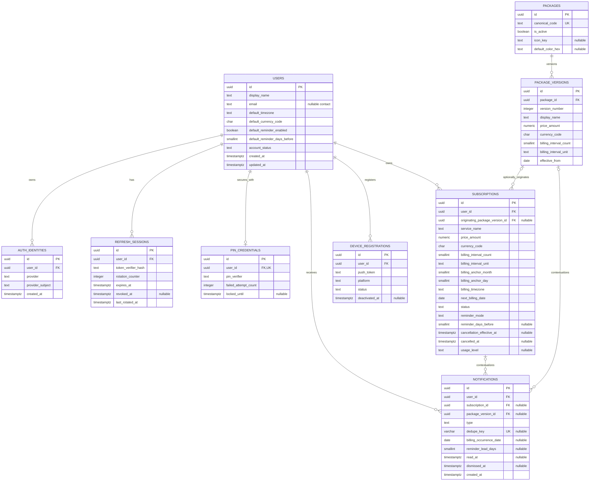

# Subscription Track — Physical / Relational ERD v1

> **Phase:** 0.2B — Physical / Relational ERD v1
>
> **Status:** Relational schema baseline สำหรับออกแบบ TypeORM และ migrations ในภายหลัง
>
> **ปรับปรุงล่าสุด:** 14 กันยายน 2026
>
> **ฐานหลัก:** `doc/backend/domain_model_v1.md`

## 1. Purpose & Scope

เอกสารนี้แปลง Backend Architecture v1 และ corrected Domain Model v1 เป็น physical relational design สำหรับ PostgreSQL 17 โดยกำหนด table, column, type, key, constraint, index, deletion behavior และ assumption ที่ implementation ต้องรักษา

```text
Backend Architecture v1        ✅
        ↓
Domain Model v1                ✅ READY TO START ERD V1
        ↓
Physical / Relational ERD v1   ← เอกสารนี้
        ↓
API Standards
        ↓
API Contract / OpenAPI v1
```

เอกสารนี้ยังไม่ใช่ SQL migration หรือ TypeORM source และไม่ได้ยืนยันว่า database/backend ถูก implement แล้ว

## 2. Inputs & Locked Decisions

อำนาจของข้อมูลเรียงตาม:

1. `doc/backend/domain_model_v1.md`
2. `doc/backend/backend_architecture_v1.md`
3. current backend roadmap/backlog และ current product behavior
4. Flutter models ในฐานะ UI/read-model evidence เท่านั้น
5. legacy PRD เฉพาะ product requirement ที่ยังไม่ถูก supersede

Locked decisions ที่ schema นี้รักษา:

- PostgreSQL 17 เป็น Durable Source of Truth; Redis และ BullMQ ไม่เป็น relational business state
- มี 9 tables ตาม justified durable Entities เท่านั้น
- Subscription มี catalog origin เพียง `originating_package_version_id → package_versions.id → packages.id`; ไม่มี `subscriptions.package_id`
- Subscription เก็บ commercial snapshot ของตนเองครบและ custom subscription มี origin เป็น `NULL` ได้
- BillingSchedule ฝังเป็น columns ใน `subscriptions`; ไม่มี `billing_schedules`
- `NotificationDelivery` เป็น **DEFERRED WITH KNOWN LIMITATION**; ไม่มี `notification_deliveries`
- Dashboard/Savings summaries, BullMQ jobs, Redis cache/locks และ UI-only state ไม่มี authoritative tables
- lifecycle ของ Subscription มีเฉพาะ `ACTIVE`, `CANCELLATION_SCHEDULED`, `CANCELLED`

## 3. Database Design Principles

- ใช้ PostgreSQL constraints กับ row-local integrity และ business uniqueness ที่ database พิสูจน์ได้
- ใช้ application transaction กับ cross-row/cross-table rule, lifecycle transition, authorization และ calendar calculation
- ใช้ surrogate key สำหรับ Entity; business key เป็น `UNIQUE` constraint แยก
- เก็บ snapshot ที่ต้องคง historical meaning แต่ไม่ duplicate derived dashboard totals
- FK deletion policy เป็น conservative; ordinary lifecycle ใช้ status/timestamp ไม่ใช้ hard delete
- ไม่ใช้ JSON blob กับ preference/schedule ที่มี structure คงที่และต้อง validate/query
- ไม่สร้าง lookup table, soft-delete column, trigger หรือ abstraction เพียงเพื่อความสมมาตร
- index มาจาก query family ที่ทราบแล้ว ไม่สร้างทุก prefix combination

## 4. Naming Conventions

| Artifact | Convention | Example |
| --- | --- | --- |
| Table | plural `snake_case` | `package_versions` |
| Column | `snake_case` | `next_billing_date` |
| Primary key | `id` | `subscriptions.id` |
| Foreign key column | `<entity>_id` | `user_id` |
| Index | `idx_<table>_<purpose>` | `idx_notifications_user_created` |
| Unique constraint/index | `uq_<table>_<purpose>` | `uq_auth_identities_provider_subject` |
| Check constraint | `chk_<table>_<rule>` | `chk_subscriptions_price_nonnegative` |
| Foreign key | `fk_<table>_<target>` | `fk_subscriptions_user` |

ชื่อ controlled values ใน database ใช้ uppercase ASCII เพื่อแยกจากข้อความแสดงผล เช่น `ACTIVE`, `MONTH`, `BILLING_REMINDER`

## 5. Primary Key Strategy

### 5.1 Comparison

| Candidate | Strength | Cost / Risk |
| --- | --- | --- |
| UUID v4 | TypeORM/PostgreSQL รองรับตรง, สร้างได้จากหลาย runtime, ไม่เปิดเผย sequence | random index locality และขนาดใหญ่กว่า BIGINT |
| UUID v7 | locality ดีกว่าและเรียงเวลาได้ | PostgreSQL 17 ไม่มี native UUIDv7 generation; เพิ่ม library/custom generation โดยยังไม่จำเป็น |
| BIGINT identity | เล็ก, เร็ว, debug ง่าย | sequential/predictable public IDs และผูก generation กับ database มากกว่า |

### 5.2 Chosen Strategy

ใช้ **UUID v4** เป็น PK ของทั้ง 9 tables โดย default จาก PostgreSQL `gen_random_uuid()` หรือ TypeORM UUID generation ที่ให้ผลเทียบเท่า การเลือก source generation ขั้นสุดท้ายต้องเหมือนกันใน migrations/entities

เหตุผลคือรองรับหลาย API/Worker instances, ปลอดภัยกว่าในการ expose ผ่าน REST และมี tooling support เรียบง่ายกว่า UUIDv7 สำหรับขนาดโครงการนี้ Trade-off ด้าน index locality ยอมรับได้และควรแก้เมื่อมี measured write pressure ไม่ใช่เพิ่ม UUIDv7 dependency ล่วงหน้า

Business identifiers เช่น provider subject, push token และ package canonical code ไม่เป็น PK

## 6. Data Type Strategy

### 6.1 Money and Currency

ใช้ `NUMERIC(19,4)` สำหรับ authoritative monetary amount และ `CHAR(3)` สำหรับ uppercase ISO 4217-style currency code

- ห้ามใช้ `REAL`, `FLOAT` หรือ `DOUBLE PRECISION`
- `NUMERIC(19,4)` รองรับ THB และ future currencies โดยไม่เกิด binary floating-point corruption
- TypeORM/PostgreSQL driver มักคืน `NUMERIC` เป็น string; application ต้อง map เป็น decimal-safe type/string และห้ามแปลงเป็น JavaScript `number` โดยไม่ตรวจ precision
- Money owner แต่ละรายการเก็บ currency ของตนเอง เพื่อไม่ให้การเปลี่ยน user default ย้อนความหมายของ snapshot
- v1 ไม่มี FX rate/conversion table; aggregationข้าม currency ต้อง reject, group by currency หรือใช้ policy ที่กำหนดภายหลัง

### 6.2 Controlled Values

ใช้ `TEXT + CHECK` แทน PostgreSQL ENUM หรือ lookup table ใน v1

- migration เพิ่มค่าใหม่ตรงไปตรงมากว่า PostgreSQL ENUM
- integrity ชัดกว่า free text ที่ application-only
- ไม่สร้าง lookup table สำหรับ vocabulary ขนาดเล็ก
- การเพิ่ม auth provider, notification type หรือ UsageLevel ใหม่ยังต้องมี reviewed migration เพื่อให้ database และ application contractตรงกัน

ข้อยกเว้นคือ free-form/stable identifiers เช่น IANA timezone, provider subject และ canonical code ซึ่งไม่ใช้ finite CHECK list

### 6.3 Dates, Instants and Timezone

| Meaning | PostgreSQL type | Rule |
| --- | --- | --- |
| Calendar billing occurrence | `DATE` | ไม่มี implicit timezone; ตีความร่วมกับ `billing_timezone` |
| Package version effective date | `DATE` | catalog calendar date |
| Absolute event/security time | `TIMESTAMPTZ` | เก็บ instant; render ตาม client context |
| Billing timezone | `TEXT` | valid IANA identifier เช่น `Asia/Bangkok`; application validates against timezone database |

`created_at`, `updated_at`, `expires_at`, `revoked_at`, `locked_until`, `read_at`, `dismissed_at`, `cancelled_at` และ `cancellation_effective_at` ใช้ `TIMESTAMPTZ`

Subscription เก็บ timezone ของตนเองแบบ snapshot ไม่อ่าน User timezone แบบ dynamic เพราะการเปลี่ยน profile timezone ต้องไม่เปลี่ยน recurrence semantics เงียบ ๆ `users.default_timezone` ใช้เป็น default ตอนสร้าง Subscription เท่านั้น

### 6.4 Text and Update Timestamps

- ใช้ `TEXT` กับ business strings ที่ไม่มี meaningful fixed limit; DTO/application กำหนด UX limits และ CHECK ป้องกันค่าว่างใน field สำคัญ
- `created_at`/`updated_at` default `now()`; application/ORM ต้อง update `updated_at` เมื่อ mutation สำเร็จ ไม่มี trigger ใน v1
- email เป็น nullable contact data ไม่ใช่ authentication key และไม่บังคับ unique ใน `users`

## 7. Physical ER Diagram

> **Physical relational ERD v1.** แสดง 9 tables และ FK จริง แต่ย่อ columns บางส่วนเพื่อรักษาความอ่านง่าย รายละเอียด authoritative อยู่ใน table specifications



ไม่มี direct relationship ระหว่าง `packages` กับ `subscriptions`

## 8. Schema Overview

| Table | Owning module | Durable responsibility |
| --- | --- | --- |
| `users` | `users` | application account, profile และ stable defaults |
| `auth_identities` | `auth` | external provider identity association |
| `refresh_sessions` | `auth` | rotatable/revocable refresh session |
| `pin_credentials` | `auth` | PIN verifier และ attempt/lock state |
| `packages` | `packages` | stable catalog identity |
| `package_versions` | `packages` | historical commercial catalog facts |
| `subscriptions` | `subscriptions` | user-owned tracked subscription, snapshot และ embedded BillingSchedule |
| `notifications` | `notifications` | durable user-visible message/reminder occurrence |
| `device_registrations` | `notifications` | durable push destination association |

## 9. `users`

### Responsibility

เก็บ application account, profile/contact data และ global defaults ที่ไม่มี independent lifecycle ไม่เก็บ OAuth subject, refresh secret, PIN verifier หรือ push token

### Columns

| Column | PostgreSQL Type | Null? | Default | Meaning |
| --- | --- | ---: | --- | --- |
| `id` | `UUID` | No | `gen_random_uuid()` | Surrogate account ID |
| `display_name` | `TEXT` | No | — | ชื่อแสดงใน application |
| `email` | `TEXT` | Yes | `NULL` | Contact email; ไม่ใช่ authentication/business key |
| `monthly_reference_amount` | `NUMERIC(19,4)` | Yes | `NULL` | Neutral dashboard reference amount; product ยังไม่สรุปว่า income หรือ budget |
| `monthly_reference_currency_code` | `CHAR(3)` | Yes | `NULL` | Currency ของ monthly reference amount |
| `default_currency_code` | `CHAR(3)` | No | `'THB'` | Default สำหรับรายการใหม่/การแสดงผล; ไม่ rewrite snapshot เดิม |
| `default_timezone` | `TEXT` | No | `'Asia/Bangkok'` | IANA timezone default สำหรับ schedule ใหม่ |
| `locale` | `TEXT` | No | `'th-TH'` | Application locale preference |
| `default_reminder_enabled` | `BOOLEAN` | No | `TRUE` | Global reminder default |
| `default_reminder_days_before` | `SMALLINT` | No | `3` | Global lead days; ใช้ได้มากกว่า UI presets |
| `account_status` | `TEXT` | No | `'ACTIVE'` | `ACTIVE` หรือ `DEACTIVATED` |
| `created_at` | `TIMESTAMPTZ` | No | `now()` | Account creation instant |
| `updated_at` | `TIMESTAMPTZ` | No | `now()` | Last account/profile mutation instant |

### Primary Key

- `pk_users` — `PRIMARY KEY (id)`

### Foreign Keys

- ไม่มี outbound FK

### Unique Constraints

- ไม่มี email uniqueness: identity ใช้ `auth_identities` และ policy เรื่อง shared/relay/contact email ยังไม่ล็อก

### Check Constraints

- `chk_users_display_name_nonblank` — `btrim(display_name) <> ''`
- `chk_users_default_currency_code` — uppercase 3-letter code
- `chk_users_monthly_reference_money_pair` — amount/currency ต้องเป็น `NULL` พร้อมกันหรือมีค่าพร้อมกัน
- `chk_users_monthly_reference_amount_nonnegative` — amount เป็น `NULL` หรือ `>= 0`
- `chk_users_monthly_reference_currency_code` — currency เป็น `NULL` หรือ uppercase 3-letter code
- `chk_users_default_timezone_nonblank`, `chk_users_locale_nonblank`
- `chk_users_default_reminder_days_nonnegative` — `default_reminder_days_before >= 0`
- `chk_users_account_status` — `account_status IN ('ACTIVE', 'DEACTIVATED')`

### Indexes

- ไม่มี secondary index ใน v1; PK และ child-side indexes รองรับ ownership joins แล้ว การค้นด้วย email ไม่ใช่ confirmed auth path

### Mutation / Lifecycle Notes

- User deactivation เปลี่ยน `account_status`; physical deletion ไม่ใช่ ordinary flow
- `default_timezone` และ `default_currency_code` เป็น default สำหรับข้อมูลใหม่ ไม่ cascade update Subscription snapshots
- `monthly_reference_*` เป็น ERD assumption ชั่วคราวและ nullable; ไม่มี income history

### Security Notes

Email และ reference amount เป็น user-scoped personal/financial-like data ต้องผ่าน server-side authorization และ log redaction ตาม context

## 10. `auth_identities`

### Responsibility

เชื่อม User กับ external authentication identity โดยไม่ผูก User business account กับ provider implementation

### Columns

| Column | PostgreSQL Type | Null? | Default | Meaning |
| --- | --- | ---: | --- | --- |
| `id` | `UUID` | No | `gen_random_uuid()` | Surrogate identity-association ID |
| `user_id` | `UUID` | No | — | Owning application User |
| `provider` | `TEXT` | No | — | `GOOGLE` หรือ `APPLE` ใน v1 |
| `provider_subject` | `TEXT` | No | — | Stable subject from verified provider |
| `created_at` | `TIMESTAMPTZ` | No | `now()` | Link creation instant |
| `updated_at` | `TIMESTAMPTZ` | No | `now()` | Association metadata mutation instant |

### Primary Key

- `pk_auth_identities` — `PRIMARY KEY (id)`

### Foreign Keys

- `fk_auth_identities_user`: `user_id → users.id ON DELETE CASCADE`

CASCADE ใช้เฉพาะ rare physical account deletion เพราะ identity association ไม่มีความหมายหากไม่มี User และ business child FKs ยัง block deletion จน retention flow ถูก resolve

### Unique Constraints

- `uq_auth_identities_provider_subject` — `UNIQUE (provider, provider_subject)` ป้องกัน identity เดียว map ไปหลาย User
- `uq_auth_identities_user_provider` — `UNIQUE (user_id, provider)` ให้หนึ่ง linked identity ต่อ provider ต่อ User ใน v1

กฎที่สองลด account-linking ambiguity สำหรับทีมปัจจุบัน แต่ยังรองรับ User มี Google + Apple พร้อมกัน หากอนาคตต้อง link หลาย account จาก provider เดียว ต้อง reviewed migration เอา constraint นี้ออก

### Check Constraints

- `chk_auth_identities_provider` — `provider IN ('GOOGLE', 'APPLE')`
- `chk_auth_identities_subject_nonblank` — `btrim(provider_subject) <> ''`

### Indexes

- Unique constraints ทั้งสองรองรับ provider lookup และ identities-by-user อยู่แล้ว ไม่เพิ่ม index ซ้ำ

### Mutation / Lifecycle Notes

- Account-linking/unlinking ต้องเป็น secure application transaction
- ไม่เก็บ raw OAuth access/refresh token เพราะยังไม่มี confirmed provider API requirement

### Security Notes

Provider subject เป็น identity data ไม่ใช่ secret แต่ห้าม expose/log โดยไม่จำเป็น

## 11. `refresh_sessions`

### Responsibility

เก็บ durable, independently revocable refresh session สำหรับ rotation, expiration, single-session logout และหลายอุปกรณ์

### Rotation Choice

ใช้ **single row per logical session + in-place verifier rotation** พร้อม `rotation_counter` และ `last_rotated_at` ไม่สร้าง family/parent chain

- เล็กและพอสำหรับ student-project session control
- token/session contract ต้องทำให้ backend resolve session row แล้ว compare current verifier ได้
- verifier mismatch ของ session ที่ยัง active ต้องถูกจัดการเป็น suspected replay ตาม Auth design เช่น revoke session
- ไม่มี full token lineage/audit; หากต้อง prove reuse ของ verifierหลาย generation ต้องเพิ่ม family/history modelภายหลัง

### Columns

| Column | PostgreSQL Type | Null? | Default | Meaning |
| --- | --- | ---: | --- | --- |
| `id` | `UUID` | No | `gen_random_uuid()` | Logical session ID |
| `user_id` | `UUID` | No | — | Session owner |
| `token_verifier_hash` | `TEXT` | No | — | Current refresh secret verifier/hash; never raw token |
| `rotation_counter` | `INTEGER` | No | `0` | Monotonic successful rotation count |
| `expires_at` | `TIMESTAMPTZ` | No | — | Absolute expiration instant |
| `revoked_at` | `TIMESTAMPTZ` | Yes | `NULL` | Revocation instant; `NULL` means not explicitly revoked |
| `last_rotated_at` | `TIMESTAMPTZ` | No | `now()` | Last successful verifier rotation |
| `client_label` | `TEXT` | Yes | `NULL` | Optional user-facing device/client hint; non-authoritative |
| `created_at` | `TIMESTAMPTZ` | No | `now()` | Session creation instant |
| `updated_at` | `TIMESTAMPTZ` | No | `now()` | Last session mutation instant |

### Primary Key

- `pk_refresh_sessions` — `PRIMARY KEY (id)`

### Foreign Keys

- `fk_refresh_sessions_user`: `user_id → users.id ON DELETE CASCADE`

### Unique Constraints

- ไม่มี business uniqueness; User มีหลาย sessions ได้

### Check Constraints

- `chk_refresh_sessions_rotation_nonnegative` — `rotation_counter >= 0`
- `chk_refresh_sessions_expiry_after_creation` — `expires_at > created_at`
- `chk_refresh_sessions_revocation_after_creation` — `revoked_at IS NULL OR revoked_at >= created_at`
- `chk_refresh_sessions_verifier_nonblank` — `btrim(token_verifier_hash) <> ''`

### Indexes

- `idx_refresh_sessions_user_created` — `(user_id, created_at DESC, id DESC)` สำหรับ session list/revoke-by-user
- `idx_refresh_sessions_active_expiry` — `(expires_at) WHERE revoked_at IS NULL` สำหรับ cleanup/expiry query

### Mutation / Lifecycle Notes

- Rotation update verifier, increment counter และ set `last_rotated_at` ใน transaction เดียว
- revoked/expired session ห้าม refresh; expiry เป็น derived current-time check ไม่ต้องมี status column

### Security Notes

`token_verifier_hash` ต้องถูก excluded จาก ordinary selection/serialization และทุก log ไม่มี raw refresh tokenใน database

## 12. `pin_credentials`

### Responsibility

แยก PIN verifier และ attempt/lock state จาก ordinary User profile สำหรับ sensitive-operation verification

### Key Choice

ใช้ `id` UUID เป็น PK และ `user_id UNIQUE` แทน `user_id` เป็น PK เพื่อรักษา Entity PK convention เดียวกันและเปิดทาง reference/audit ภายหลังโดยไม่ผูก identity กับ owner FK Cost คือมี surrogate columnเพิ่มหนึ่งรายการซึ่งยอมรับได้

### Columns

| Column | PostgreSQL Type | Null? | Default | Meaning |
| --- | --- | ---: | --- | --- |
| `id` | `UUID` | No | `gen_random_uuid()` | Credential ID |
| `user_id` | `UUID` | No | — | Owner; one credential row per User |
| `pin_verifier` | `TEXT` | No | — | Password-hash-style verifier; never plaintext PIN |
| `failed_attempt_count` | `INTEGER` | No | `0` | Consecutive failed attempts used by server policy |
| `locked_until` | `TIMESTAMPTZ` | Yes | `NULL` | Temporary lock instant if active |
| `created_at` | `TIMESTAMPTZ` | No | `now()` | Credential creation instant |
| `updated_at` | `TIMESTAMPTZ` | No | `now()` | Change/reset/attempt-state mutation instant |

### Primary Key

- `pk_pin_credentials` — `PRIMARY KEY (id)`

### Foreign Keys

- `fk_pin_credentials_user`: `user_id → users.id ON DELETE CASCADE`

### Unique Constraints

- `uq_pin_credentials_user` — `UNIQUE (user_id)` enforces User `1:0..1` PinCredential

### Check Constraints

- `chk_pin_credentials_failed_attempts_nonnegative` — `failed_attempt_count >= 0`
- `chk_pin_credentials_verifier_nonblank` — `btrim(pin_verifier) <> ''`

### Indexes

- `uq_pin_credentials_user` รองรับ lookup by User แล้ว

### Mutation / Lifecycle Notes

- Successful verification/reset policy เป็น application rule และอาจ reset counter/lock atomically
- Schema ไม่ encode ว่า PIN ต้อง 6 digits; ความยาวเป็น configurable validation/security policy

### Security Notes

`pin_verifier` เป็น High sensitivity: select เฉพาะ verification flow, never serialize/log และป้องกัน timing/attempt abuse ที่ service layer

## 13. `packages`

### Responsibility

เก็บ stable catalog identity และ catalog availability ไม่เก็บ current price, current billing cycle หรือ authoritative versioned display name

### Columns

| Column | PostgreSQL Type | Null? | Default | Meaning |
| --- | --- | ---: | --- | --- |
| `id` | `UUID` | No | `gen_random_uuid()` | Stable Package ID |
| `canonical_code` | `TEXT` | No | — | Stable admin/developer identifier เช่น `NETFLIX_PREMIUM` |
| `is_active` | `BOOLEAN` | No | `TRUE` | Available for new preset selection |
| `icon_key` | `TEXT` | Yes | `NULL` | Stable app asset/icon hint; not commercial truth |
| `default_color_hex` | `VARCHAR(9)` | Yes | `NULL` | Optional stable catalog presentation hint |
| `created_at` | `TIMESTAMPTZ` | No | `now()` | Catalog identity creation instant |
| `updated_at` | `TIMESTAMPTZ` | No | `now()` | Stable metadata/availability mutation instant |

### Primary Key

- `pk_packages` — `PRIMARY KEY (id)`

### Foreign Keys

- ไม่มี outbound FK

### Unique Constraints

- `uq_packages_canonical_code` — `UNIQUE (canonical_code)`

### Check Constraints

- `chk_packages_canonical_code_nonblank` — `btrim(canonical_code) <> ''`
- `chk_packages_default_color_hex` — `NULL` หรือรูป `#RRGGBB`/`#AARRGGBB`

### Indexes

- Unique canonical-code index เพียงพอ; catalog active set มีขนาดเล็กจึงไม่ index boolean เดี่ยว

### Mutation / Lifecycle Notes

- Deactivation ใช้ `is_active = FALSE` และไม่ลบ PackageVersions/Subscriptions
- Display name และ commercial state อยู่ `package_versions`; `icon_key`/color เป็น non-authoritative presentation identity ที่ current preset UI ใช้

### Security Notes

ไม่มี credential data; write access จำกัด package administration/publishing flow

## 14. `package_versions`

### Responsibility

เก็บ historical/versioned commercial catalog facts ที่ published แล้วหรือ scheduled ให้มีผลในอนาคต

### Version and Effective-Period Choice

ใช้ทั้ง `version_number` และ `effective_from`:

- `version_number` ให้ admin/developer อ้าง version ได้ชัดและ unique ภายใน Package
- `effective_from` รองรับ future scheduled version และเลือก version ที่มีผลตาม business date
- ไม่เก็บ `effective_to`; เวลาสิ้นสุด derive จาก `effective_from` ของ version ถัดไป จึงไม่มีสอง interval columns ที่ต้อง sync
- `UNIQUE (package_id, effective_from)` ป้องกัน version สองรายการเริ่มวันเดียวกัน
- application publishing transaction บังคับ version number/effective date ให้เพิ่มตามลำดับและไม่ publishย้อนหลังแบบกำกวม

### Columns

| Column | PostgreSQL Type | Null? | Default | Meaning |
| --- | --- | ---: | --- | --- |
| `id` | `UUID` | No | `gen_random_uuid()` | Version ID และ precise Subscription origin |
| `package_id` | `UUID` | No | — | Stable Package owner |
| `version_number` | `INTEGER` | No | — | Positive sequence scoped to Package |
| `display_name` | `TEXT` | No | — | Versioned catalog/display name |
| `price_amount` | `NUMERIC(19,4)` | No | — | Versioned price |
| `currency_code` | `CHAR(3)` | No | — | Currency of catalog price |
| `billing_interval_count` | `SMALLINT` | No | — | Positive recurrence count เช่น 1 หรือ 3 |
| `billing_interval_unit` | `TEXT` | No | — | `MONTH` หรือ `YEAR` |
| `category_code` | `TEXT` | Yes | `NULL` | Optional current catalog grouping/display hint |
| `effective_from` | `DATE` | No | — | First calendar date this version is effective |
| `created_at` | `TIMESTAMPTZ` | No | `now()` | Version record creation instant |

### Primary Key

- `pk_package_versions` — `PRIMARY KEY (id)`

### Foreign Keys

- `fk_package_versions_package`: `package_id → packages.id ON DELETE RESTRICT`

### Unique Constraints

- `uq_package_versions_package_version` — `UNIQUE (package_id, version_number)`
- `uq_package_versions_package_effective_from` — `UNIQUE (package_id, effective_from)`

### Check Constraints

- `chk_package_versions_version_positive` — `version_number > 0`
- `chk_package_versions_display_name_nonblank` — `btrim(display_name) <> ''`
- `chk_package_versions_price_nonnegative` — `price_amount >= 0`
- `chk_package_versions_currency_code` — uppercase 3-letter code
- `chk_package_versions_interval_positive` — `billing_interval_count > 0`
- `chk_package_versions_interval_unit` — `billing_interval_unit IN ('MONTH', 'YEAR')`
- `chk_package_versions_category_nonblank` — `category_code IS NULL OR btrim(category_code) <> ''`

### Indexes

- Unique `(package_id, version_number)` รองรับ versions-by-package/order-by-version
- Unique `(package_id, effective_from)` รองรับ current/effective version lookupด้วย backward index scan ไม่เพิ่ม descending indexซ้ำ

### Mutation / Lifecycle Notes

- Published commercial columns (`display_name`, price, currency, interval, category, effective date) ถือว่า effectively immutable
- Correction ทั่วไปสร้าง PackageVersion ใหม่ ไม่ update historical row
- Database enforce uniqueness/row validity; cross-row ordering และ “ห้าม overlap/ย้อนหลัง” เป็น package publishing transaction เพราะไม่มี `effective_to`

### Security Notes

Write จำกัด catalog publisher/admin; application usersอ่านผ่าน packages public contract

## 15. `subscriptions`

### Responsibility

เป็น central user-owned record ที่อ่าน commercial/billing meaning ได้ครบโดยไม่ join catalog และรองรับทั้ง custom กับ preset-origin Subscription

### Columns

| Column | PostgreSQL Type | Null? | Default | Meaning |
| --- | --- | ---: | --- | --- |
| `id` | `UUID` | No | `gen_random_uuid()` | Subscription ID |
| `user_id` | `UUID` | No | — | Exactly one owner |
| `originating_package_version_id` | `UUID` | Yes | `NULL` | Precise optional catalog origin; custom = `NULL` |
| `service_name` | `TEXT` | No | — | Authoritative user-tracked display-name snapshot |
| `price_amount` | `NUMERIC(19,4)` | No | — | Authoritative user-tracked price snapshot |
| `currency_code` | `CHAR(3)` | No | — | Snapshot currency |
| `category_code` | `TEXT` | Yes | `NULL` | Optional user-facing grouping snapshot |
| `icon_key` | `TEXT` | Yes | `NULL` | Optional user-selected icon key |
| `display_color_hex` | `VARCHAR(9)` | Yes | `NULL` | Optional user-selected color |
| `billing_interval_count` | `SMALLINT` | No | — | BillingCycle positive interval count |
| `billing_interval_unit` | `TEXT` | No | — | `MONTH` หรือ `YEAR` |
| `billing_anchor_month` | `SMALLINT` | No | — | Stable month/phase intent; 1–12 |
| `billing_anchor_day` | `SMALLINT` | No | — | Stable day intent; 1–31 |
| `billing_timezone` | `TEXT` | No | — | IANA timezone snapshotted for deterministic recurrence |
| `next_billing_date` | `DATE` | No | — | Persisted next calendar occurrence; not the anchor |
| `status` | `TEXT` | No | `'ACTIVE'` | Minimal subscription lifecycle |
| `reminder_mode` | `TEXT` | No | `'INHERIT'` | `INHERIT`, `ENABLED`, `DISABLED` |
| `reminder_days_before` | `SMALLINT` | Yes | `NULL` | Required only for explicit `ENABLED` override |
| `cancellation_effective_at` | `TIMESTAMPTZ` | Yes | `NULL` | Scheduled cancellation execution instant |
| `cancelled_at` | `TIMESTAMPTZ` | Yes | `NULL` | Actual terminal cancellation instant |
| `usage_level` | `TEXT` | Yes | `NULL` | User-declared `FREQUENT`, `MODERATE`, `UNUSED`; NULL = unknown |
| `created_at` | `TIMESTAMPTZ` | No | `now()` | Record creation instant |
| `updated_at` | `TIMESTAMPTZ` | No | `now()` | Last business mutation instant |

`billing_anchor_month` ใช้กับทุก interval เพื่อเก็บ initial calendar phase อย่าง explicit โดยเฉพาะ multi-month cadence ไม่ใช่เพียง yearly schedule ความซ้ำเล็กน้อยสำหรับ every-month cadenceแลกกับ model ที่ไม่มี conditional-null anchor

### Primary Key

- `pk_subscriptions` — `PRIMARY KEY (id)`

### Foreign Keys

- `fk_subscriptions_user`: `user_id → users.id ON DELETE RESTRICT`
- `fk_subscriptions_originating_package_version`: `originating_package_version_id → package_versions.id ON DELETE RESTRICT`

ไม่มี `package_id` บน `subscriptions`

### Unique Constraints

- ไม่มี uniqueness ต่อ `(user_id, originating_package_version_id)` เพราะ User อาจ track หลาย subscriptions จาก package version เดียว

### Check Constraints

- `chk_subscriptions_service_name_nonblank` — `btrim(service_name) <> ''`
- `chk_subscriptions_price_nonnegative` — `price_amount >= 0`
- `chk_subscriptions_currency_code` — uppercase 3-letter code
- `chk_subscriptions_interval_positive` — `billing_interval_count > 0`
- `chk_subscriptions_interval_unit` — `billing_interval_unit IN ('MONTH', 'YEAR')`
- `chk_subscriptions_anchor_month` — `billing_anchor_month BETWEEN 1 AND 12`
- `chk_subscriptions_anchor_day` — `billing_anchor_day BETWEEN 1 AND 31`
- `chk_subscriptions_timezone_nonblank` — `btrim(billing_timezone) <> ''`
- `chk_subscriptions_status` — `status IN ('ACTIVE', 'CANCELLATION_SCHEDULED', 'CANCELLED')`
- `chk_subscriptions_reminder_mode` — `reminder_mode IN ('INHERIT', 'ENABLED', 'DISABLED')`
- `chk_subscriptions_reminder_override` — `ENABLED` ต้องมี nonnegative `reminder_days_before`; `INHERIT`/`DISABLED` ต้องเป็น `NULL`
- `chk_subscriptions_cancellation_state` — ACTIVE: schedule/cancel timestampsเป็น `NULL`; CANCELLATION_SCHEDULED: effectiveมีค่าและ cancelledเป็น `NULL`; CANCELLED: effectiveเป็น `NULL` และ cancelledมีค่า
- `chk_subscriptions_usage_level` — `usage_level IS NULL OR usage_level IN ('FREQUENT', 'MODERATE', 'UNUSED')`
- `chk_subscriptions_category_nonblank`, `chk_subscriptions_icon_nonblank` — optional แต่ห้าม blank
- `chk_subscriptions_display_color_hex` — `NULL` หรือรูป `#RRGGBB`/`#AARRGGBB`

CHECK ใช้เพียง broad anchor ranges ไม่ encode calendar algorithm: `day = 31` valid สำหรับ monthly recurrence แม้ target monthสั้น ส่วน yearly invalid combination เช่น February 30 ต้อง reject ที่ application/domain validation; Feb 29 ต้อง valid

### Indexes

- `idx_subscriptions_user_created` — `(user_id, created_at DESC, id DESC)` สำหรับ user list/cursor pagination
- `idx_subscriptions_reminder_due` — `(next_billing_date, user_id, id) WHERE status IN ('ACTIVE', 'CANCELLATION_SCHEDULED')` สำหรับ reminder candidates; effective lead อาจต้อง join User defaultและตรวจ override
- `idx_subscriptions_cancellation_due` — `(cancellation_effective_at, id) WHERE status = 'CANCELLATION_SCHEDULED'` สำหรับ due cancellation executor
- `idx_subscriptions_origin_version` — `(originating_package_version_id) WHERE originating_package_version_id IS NOT NULL` สำหรับ Package → Versions → affected Subscriptions

ไม่เพิ่ม `(user_id,status)` แยกใน v1; user-scoped row count ต่ำและ `idx_subscriptions_user_created` ลด search set ได้ หาก query plan/load test แสดง need ค่อยเพิ่ม composite ที่ตรง query

### Mutation / Lifecycle Notes

- Custom: origin `NULL`, snapshot/scheduleยัง required
- Preset-origin: originชี้ exact version แต่ snapshotอาจต่างจาก catalog และเป็น authoritative value
- New PackageVersion ไม่ update Subscription rowอัตโนมัติ
- `next_billing_date` retained เมื่อ cancelled เพื่อ historical context แต่ schedulerต้อง filter status
- Schedule cancellation set status/effective atomically; execution set `CANCELLED`, move actual instant to `cancelled_at`, clear active effective time
- Cancel Subscription ไม่ hard delete; remove/archive policyยัง openและ schemaไม่เพิ่ม speculative `deleted_at`

### Security Notes

ทุก read/write query ต้อง scope ด้วย authenticated `user_id`; FK อย่างเดียวไม่ให้ authorization ผู้ใช้แก้ origin PackageVersion หรือ ownerไม่ได้ผ่าน client payloadโดยตรง

## 16. `notifications`

### Responsibility

เก็บ durable user-visible inbox/history และ logical reminder occurrence ไม่เก็บ BullMQ attempt, worker host หรือ exact provider/device delivery accounting

### Related Resource Choice

ใช้ explicit nullable FKs `subscription_id` และ `package_version_id` แทน polymorphic `(related_type, related_id)` เพื่อรักษา referential integrity และ query clarity Title/body เป็น message snapshot อยู่แล้ว แต่ context FK ช่วย authorization/debugging

### Dedupe Choice

ใช้ nullable deterministic `dedupe_key VARCHAR(512)` กับ global `UNIQUE`:

- Billing reminder key ต้องเกิดจาก stable logical components เช่น versioned key namespace + user + subscription + `billing_occurrence_date` + `reminder_lead_days`
- ไม่ใช้ random BullMQ job ID, retry number หรือ provider message ID
- key immutable หลัง create
- non-idempotent/manual message ที่ไม่มี logical duplicate identity ใช้ `NULL`; PostgreSQL UNIQUE อนุญาตหลาย `NULL`
- changed lead days เป็นคนละ logical reminder occurrence ตาม current Domain Model; retry/rescanด้วย componentsเดิมชน unique constraintและ reuse existing Notification

ใช้ generic key แทน multi-column UNIQUE เพราะ notification types มี componentต่างกัน และ nullable columnsใน PostgreSQLอาจยอม duplicateโดยไม่ตั้งใจ Database บังคับ durable uniqueness; scheduler/workerยังต้องใช้ insert-or-fetch/idempotent transaction

### Columns

| Column | PostgreSQL Type | Null? | Default | Meaning |
| --- | --- | ---: | --- | --- |
| `id` | `UUID` | No | `gen_random_uuid()` | Durable Notification ID |
| `user_id` | `UUID` | No | — | Inbox owner |
| `subscription_id` | `UUID` | Yes | `NULL` | Explicit Subscription context |
| `package_version_id` | `UUID` | Yes | `NULL` | Explicit PackageVersion context |
| `type` | `TEXT` | No | — | `BILLING_REMINDER`, `PACKAGE_CHANGE`, `UNUSED_SUBSCRIPTION`, `SYSTEM` |
| `title` | `TEXT` | No | — | User-visible title snapshot |
| `body` | `TEXT` | No | — | User-visible message snapshot |
| `dedupe_key` | `VARCHAR(512)` | Yes | `NULL` | Deterministic logical-occurrence identity |
| `billing_occurrence_date` | `DATE` | Yes | `NULL` | Billing date represented by a reminder |
| `reminder_lead_days` | `SMALLINT` | Yes | `NULL` | Effective lead used for that reminder |
| `read_at` | `TIMESTAMPTZ` | Yes | `NULL` | Read instant; NULL = unread |
| `dismissed_at` | `TIMESTAMPTZ` | Yes | `NULL` | Hidden/dismissed instant; not physical deletion |
| `created_at` | `TIMESTAMPTZ` | No | `now()` | Durable message creation instant |

ไม่มี `dispatch_status`: aggregate status หนึ่งค่าจะทำให้เข้าใจผิดเมื่อ User มีหลาย DeviceRegistrations และบาง targetสำเร็จ/ล้มเหลวต่างกัน

### Primary Key

- `pk_notifications` — `PRIMARY KEY (id)`

### Foreign Keys

- `fk_notifications_user`: `user_id → users.id ON DELETE RESTRICT`
- `fk_notifications_subscription`: `subscription_id → subscriptions.id ON DELETE RESTRICT`
- `fk_notifications_package_version`: `package_version_id → package_versions.id ON DELETE RESTRICT`

RESTRICT รักษา user-visible history และ dedupe anchor; UI remove/cancel ไม่ใช่ physical delete หากอนาคต account erasureต้อง hard delete/anonymize จะต้องกำหนด ordered retention workflowก่อนเปลี่ยน FK

### Unique Constraints

- `uq_notifications_dedupe_key` — `UNIQUE (dedupe_key)`

### Check Constraints

- `chk_notifications_type` — allowed v1 type set
- `chk_notifications_title_nonblank`, `chk_notifications_body_nonblank`
- `chk_notifications_dedupe_nonblank` — `dedupe_key IS NULL OR btrim(dedupe_key) <> ''`
- `chk_notifications_reminder_pair` — occurrence date และ lead days ต้องเป็น `NULL` พร้อมกันหรือมีค่าพร้อมกัน
- `chk_notifications_reminder_lead_nonnegative` — lead เป็น `NULL` หรือ `>= 0`
- `chk_notifications_billing_reminder_context` — `BILLING_REMINDER` ต้องมี `subscription_id`, occurrence, lead และ dedupe key
- `chk_notifications_read_after_create`, `chk_notifications_dismiss_after_create` — state timestampsเป็น `NULL` หรือไม่ก่อน `created_at`

Package-change context/dedupe requirementsคงเป็น application ruleจน notification taxonomy/priority policyสรุปก่อน Phase 7 เพื่อไม่ lock schemaเกิน requirement

### Indexes

- `idx_notifications_user_created` — `(user_id, created_at DESC, id DESC)` สำหรับ stable inbox cursor pagination
- `idx_notifications_user_unread` — `(user_id, created_at DESC, id DESC) WHERE read_at IS NULL AND dismissed_at IS NULL` สำหรับ unread inbox/count
- `idx_notifications_subscription` — `(subscription_id) WHERE subscription_id IS NOT NULL` สำหรับ context lookup และ FK delete check

ไม่เพิ่ม index `package_version_id` จนมี query plan ที่ใช้ notification-by-version; package-change fan-outเริ่มจาก Subscriptions ไม่ใช่ Notification history

### Mutation / Lifecycle Notes

- Content, type, context, occurrence และ dedupe key immutableหลัง create; mutationปกติมีเพียง `read_at`/`dismissed_at`
- Scheduler run ซ้ำและ Worker retryต้อง converge ที่ Notification rowเดียวผ่าน unique key
- Notification rowต้องไม่ hard deleteใน active dedupe/retention horizon มิฉะนั้น keyหายและ reminderเดิมอาจถูกสร้างใหม่ ระยะ retentionยัง open

### Security Notes

Notification เป็น user-scoped; title/body อาจมี financial-like contextและห้าม cross-user read/write

## 17. `device_registrations`

### Responsibility

เก็บ durable association ระหว่าง authenticated User กับ push destination รองรับหลาย device, token refresh, logout/unlink และ invalid-token cleanup

### Columns

| Column | PostgreSQL Type | Null? | Default | Meaning |
| --- | --- | ---: | --- | --- |
| `id` | `UUID` | No | `gen_random_uuid()` | Stable registration ID; future delivery FK target |
| `user_id` | `UUID` | No | — | Current/historical registration owner |
| `push_token` | `TEXT` | No | — | Provider destination token required for dispatch |
| `platform` | `TEXT` | No | — | `ANDROID` หรือ `IOS` |
| `status` | `TEXT` | No | `'ACTIVE'` | `ACTIVE`, `REVOKED`, `INVALID` |
| `deactivated_at` | `TIMESTAMPTZ` | Yes | `NULL` | Revoked/invalid instant |
| `created_at` | `TIMESTAMPTZ` | No | `now()` | Registration creation instant |
| `updated_at` | `TIMESTAMPTZ` | No | `now()` | Token/status mutation instant |

### Primary Key

- `pk_device_registrations` — `PRIMARY KEY (id)`

### Foreign Keys

- `fk_device_registrations_user`: `user_id → users.id ON DELETE CASCADE`

Device association ไม่มี standalone business meaningหลัง rare physical User deletion และ future NotificationDeliveryยังไม่มีใน v1

### Unique Constraints / Partial Unique Index

- `uq_device_registrations_active_token` — unique partial index on `(push_token) WHERE status = 'ACTIVE'`

ผลลัพธ์:

- User เดิม register token เดิมซ้ำ → application transactionคืน/update active rowเดิมแบบ idempotent
- token เดิมย้าย User → revoke/deactivate ownerเดิมแล้ว activate/create ownerใหม่ใน transaction
- concurrent owners → partial unique indexให้ commitได้เพียงหนึ่ง owner; loserต้อง reloadและแก้ conflictอย่าง explicit
- historical inactive rowsเก็บ tokenซ้ำได้

### Check Constraints

- `chk_device_registrations_token_nonblank` — `btrim(push_token) <> ''`
- `chk_device_registrations_platform` — `platform IN ('ANDROID', 'IOS')`
- `chk_device_registrations_status` — `status IN ('ACTIVE', 'REVOKED', 'INVALID')`
- `chk_device_registrations_deactivation_state` — ACTIVE ต้องมี `deactivated_at IS NULL`; REVOKED/INVALID ต้องมีค่า

### Indexes

- `idx_device_registrations_user_status` — `(user_id, status, id)` สำหรับ active fan-out targets, registration list และ FK cleanup
- partial unique active-token indexรองรับ active token lookupแล้ว ไม่เพิ่ม index tokenซ้ำ

### Mutation / Lifecycle Notes

- Token refresh update active registration หาก clientรู้ registration identity หรือ transaction deactivate old/create newตาม Notification design
- Logout ใช้ `REVOKED`; permanent provider rejectionใช้ `INVALID`
- ไม่ hard deleteเพื่อแก้ ownership raceโดย default

### Security Notes

Push tokenเป็น sensitive operational identifier: ต้อง exclude จาก generic response/log แต่ต้องเก็บค่าที่ workerใช้ dispatchได้ จึงไม่ hash ใน v1 ไม่มี speculative encryption infrastructure

## 18. Relationship & Foreign-Key Policy

| FK | Cardinality | ON DELETE | Rationale |
| --- | --- | --- | --- |
| `auth_identities.user_id → users.id` | User 1:N | `CASCADE` | Security associationไม่มี ownerแล้วไม่มีความหมาย |
| `refresh_sessions.user_id → users.id` | User 1:N | `CASCADE` | Physical erasureต้องทำให้ credentialsใช้ไม่ได้ |
| `pin_credentials.user_id → users.id` | User 1:0..1 | `CASCADE` | Credentialไม่มี standalone retention value |
| `package_versions.package_id → packages.id` | Package 1:N | `RESTRICT` | Catalog identity/historyห้ามถูกลบทำลาย |
| `subscriptions.user_id → users.id` | User 1:N | `RESTRICT` | User deletion policyยัง open; business stateห้าม cascadeโดยบังเอิญ |
| `subscriptions.originating_package_version_id → package_versions.id` | Version 1:N, optional at Subscription | `RESTRICT` | ลบ originไม่ได้และห้าม destroy Subscription |
| `notifications.user_id → users.id` | User 1:N | `RESTRICT` | Retention/anonymizationต้อง explicit |
| `notifications.subscription_id → subscriptions.id` | Subscription 1:N, optional | `RESTRICT` | Notification/dedupe history block accidental tracker hard delete |
| `notifications.package_version_id → package_versions.id` | Version 1:N, optional | `RESTRICT` | Preserve package-change context/history |
| `device_registrations.user_id → users.id` | User 1:N | `CASCADE` | Operational destinationไม่มี ownerแล้วไม่มีความหมาย |

`CASCADE` ไม่ใช่ ordinary lifecycle mechanism Physical User deleteยังถูก business FKs blockจนกว่าจะมี approved erasure workflow

## 19. Constraint Matrix

| Business rule | PostgreSQL mechanism | Application mechanism |
| --- | --- | --- |
| Entity IDs unique | UUID PK | Treat IDs as opaque |
| Provider subject maps to one User | `UNIQUE(provider, provider_subject)` | Verified provider login/link flow |
| One identity/provider per User in v1 | `UNIQUE(user_id, provider)` | Secure account linking |
| User has at most one PinCredential | `UNIQUE(pin_credentials.user_id)` | Credential create/reset transaction |
| Negative money forbidden | `CHECK amount >= 0` | DTO/domain validation and decimal-safe arithmetic |
| Currency semantics present | paired columns + format CHECK | Supported-currency policy; no implicit FX |
| PackageVersion sequence/effective date unique | two scoped UNIQUE constraints | Publishing transaction enforces monotonic order |
| Published PackageVersion immutable | Keys/CHECKs protect shape | Packages service rejects commercial update |
| Custom Subscription needs no fake Package | nullable origin FK | Create use case allows origin `NULL` |
| Subscription snapshot always complete | NOT NULL + CHECK | Snapshot mapping/validation |
| Only one catalog-origin path | only version FK exists | Packages public contract resolves Package |
| Valid Subscription state shape | status/timestamp CHECK | Service enforces allowed transitions |
| Stable month/leap recurrence | anchor columns retained | Billing calculator applies calendar rule |
| Reminder override unambiguous | mode/days CHECK | Resolve global default + override |
| Duplicate logical reminder forbidden | unique `dedupe_key` | Deterministic key + insert-or-fetch transaction |
| One active owner per push token | partial unique active-token index | Transactional revoke/transfer/register |
| PIN/session secret not plaintext | credential-only columns | Hash/verifier implementation and redaction |
| Cross-user access forbidden | ownership FKs establish owner | Authenticated owner-scoped queries |
| Notification exact target delivery | Not represented in v1 | At-least-once/best-effort; add NotificationDelivery if required |

## 20. Index Strategy

### 20.1 Final v1 Index Set

PK/UNIQUE constraints create their own indexes and are not repeated below

| Index | Definition concept | Query justification |
| --- | --- | --- |
| `idx_refresh_sessions_user_created` | `(user_id, created_at DESC, id DESC)` | list/revoke sessions for one User |
| `idx_refresh_sessions_active_expiry` | `(expires_at) WHERE revoked_at IS NULL` | expired-session cleanup |
| `idx_subscriptions_user_created` | `(user_id, created_at DESC, id DESC)` | user subscription list/cursor |
| `idx_subscriptions_reminder_due` | `(next_billing_date, user_id, id)` partial on reminder-eligible statuses | scheduler candidate range |
| `idx_subscriptions_cancellation_due` | `(cancellation_effective_at, id)` partial on scheduled status | cancellation executor |
| `idx_subscriptions_origin_version` | `(originating_package_version_id)` partial non-null | package impact join |
| `idx_notifications_user_created` | `(user_id, created_at DESC, id DESC)` | latest inbox/cursor |
| `idx_notifications_user_unread` | same keys, partial unread/not-dismissed | unread inbox/count |
| `idx_notifications_subscription` | `(subscription_id)` partial non-null | related notification lookup/FK protection |
| `idx_device_registrations_user_status` | `(user_id, status, id)` | active targets and all registrations by User |

Important unique indexes:

- `uq_auth_identities_provider_subject`
- `uq_auth_identities_user_provider`
- `uq_pin_credentials_user`
- `uq_packages_canonical_code`
- `uq_package_versions_package_version`
- `uq_package_versions_package_effective_from`
- `uq_notifications_dedupe_key`
- `uq_device_registrations_active_token` — partial unique

### 20.2 FK Index Review

PostgreSQLไม่สร้าง index ฝั่ง referencing FK อัตโนมัติ การออกแบบนี้ครอบคลุม FK ที่ query/delete บ่อยผ่าน unique/composite/partial indexes ได้แก่ auth identity owner, sessions owner, PIN owner, versions owner, subscriptions owner/origin, notification owner/subscription และ device owner

ไม่เพิ่ม `notifications.package_version_id` indexใน v1 เพราะไม่มี confirmed notification-by-version query และ historical PackageVersion hard deleteถูกห้ามอยู่แล้ว หาก Phase 7มี queryดังกล่าวค่อยเพิ่มจาก evidence

### 20.3 Duplication Review

- ไม่สร้างชุด `subscriptions(user_id)`, `(user_id,status)`, `(user_id,status,next_billing_date)` ซ้อนกัน
- ไม่สร้าง token indexซ้ำกับ partial unique active-token index
- ไม่สร้าง dedupe lookup indexซ้ำกับ unique constraint
- `uq_package_versions_package_effective_from` รองรับ current-version lookupด้วย backward index scan จึงไม่ต้องมี descending indexซ้ำ
- partial indexesใช้เฉพาะ subset ที่มี queryจริงและ selective

## 21. BillingSchedule Physical Semantics

### 21.1 Representation Decision

BillingSchedule เป็น embedded columns บน `subscriptions`:

```text
billing_interval_count
billing_interval_unit
billing_anchor_month
billing_anchor_day
billing_timezone
next_billing_date
```

เปรียบเทียบ anchor options:

| Option | Result |
| --- | --- |
| Generic month/day columns | **Chosen** — explicit, รองรับ monthly/multi-month/yearly และ leap intent |
| Anchor date without year | PostgreSQL ไม่มี native month-day type; mappingกำกวม |
| Initial date only | historical start กับ recurrence intentปะปน และ user schedule editยาก |

Anchor month/day ทั้งคู่ required สำหรับทุก cadence `billing_anchor_month` รักษา phase ของ multi-month cadence เช่นทุก 3 เดือนเริ่ม January และจำเป็นต่อ yearly recurrence ส่วน count/unitอธิบายระยะห่าง

### 21.2 Month-End and Leap-Year Rules

`next_billing_date` ไม่ใช่ anchor Backend คำนวณ occurrenceจาก stable anchorเสมอ ไม่ chain วันของ short monthเป็น anchorรอบใหม่

```text
interval = 1 MONTH
anchor month/day = January / 31

2026-01-31
2026-02-28   # last valid day for this occurrence only
2026-03-31   # returns to stable day 31
2026-04-30
2026-05-31
```

Multi-month cadence เช่น 3 MONTHใช้ month phaseเดิมและ anchor dayเดียวกัน

```text
interval = 1 YEAR
anchor month/day = February / 29

2024-02-29
2025-02-28
2026-02-28
2027-02-28
2028-02-29
```

Databaseเก็บ intentด้วย broad range CHECK; exact Gregorian calculation, valid yearly anchor combination, leap/month-end handling และ update `next_billing_date` อยู่ใน tested Subscription billing service ไม่เขียน algorithmซับซ้อนใน CHECK

### 21.3 Calendar Date to Execution Instant

```text
next_billing_date (DATE)
        + billing_timezone (IANA)
        + scheduling policy
        ↓
due execution instant (TIMESTAMPTZ semantics)
```

Billing dateเป็น calendar meaning ส่วน Worker executionเป็น instant `Asia/Bangkok` เป็น defaultจาก Userแต่ Subscription snapshot timezoneของตัวเอง การเปลี่ยน User defaultไม่แก้ rowเดิม

## 22. Reminder Deduplication and Reliability Boundary

### 22.1 Durable Notification Dedupe

Conceptual key example:

```text
billing-reminder:v1:<user-id>:<subscription-id>:<billing-date>:<lead-days>
```

Exact encoderเป็น implementation detail แต่ต้อง canonical, deterministic, immutable และไม่เกิน 512 characters Flow ที่ถูกต้อง:

```text
scheduler scan (may repeat)
        ↓
derive logical key
        ↓
INSERT Notification
        ├── success → enqueue/use notification ID
        └── unique conflict → load existing Notification
        ↓
BullMQ Worker retry (may repeat)
```

PostgreSQL unique constraintคือ durable guard ไม่ใช้ Redis lock/job IDเป็น truth Durable stateควร commitก่อน external dispatch; exact DB-commit→enqueue reliability strategy เช่น transactional outboxยังไม่ล็อกใน v1 architecture

### 22.2 Delivery Boundary

```text
durable Notification dedupe = supported
per-device/per-channel delivery audit = deferred
```

Workerอาจส่ง Notificationหนึ่งรายการไปหลาย active DeviceRegistrations แต่ schemaไม่มี stateแยก target ดังนั้น provider/device dispatchเป็น at-least-once/best-effort และ partial successอาจทำให้ retryส่งซ้ำบาง device BullMQ/logsช่วย operationsแต่ไม่ใช่ durable delivery record

หาก Phase 7ต้องการ precise target retry/audit/receipt ให้เพิ่ม `notification_deliveries(notification_id, device_registration_id, channel, ...)` ก่อน implement requirement โดย stable UUID PKs ปัจจุบันรองรับ FKได้ ไม่เพิ่ม placeholderตอนนี้

## 23. Scheduler Query Support

Reminder discoveryต้อง resolve:

```text
Subscription BillingSchedule
        + Subscription reminder_mode/days
        + User default_reminder_enabled/days
        ↓
effective due date/instant
```

`idx_subscriptions_reminder_due` จำกัด candidateด้วย statusและ `next_billing_date`; queryอาจ join `users` เพื่อ resolve `INHERIT` ที่ current scale ไม่ duplicate global defaultsเข้า every Subscription เพียงเพื่อเลี่ยง join Schedulerต้อง re-check status, cancellation timing, effective settings และ existing dedupe keyก่อน dispatch

Cancellation executorใช้ partial indexเฉพาะ `CANCELLATION_SCHEDULED` และ due `cancellation_effective_at`

## 24. Historical Integrity

- `Package` คือ stable identity; `PackageVersion` คือ historical catalog fact
- Version current ณ date = latest `effective_from <= date`; versionถัดไป imply previous end
- Published commercial fields effectively immutable; correctionสร้าง versionใหม่
- Subscription snapshotเป็น authoritative tracked meaningแม้ origin catalogต่างกัน
- `PackageVersion v3 = 199 THB`, Subscription origin v3แต่ snapshot `179 THB` → dashboardใช้ 179 THB
- Publish v4ไม่ mutate existing Subscriptions
- Impact queryใช้ `packages → package_versions → subscriptions.originating_package_version_id`; indexesรองรับ joinและไม่ต้อง `subscriptions.package_id`
- ไม่มี `SubscriptionRevision` จึง reconstructทุก historical user-edited price periodไม่ได้; limitationนี้เปิดเผยและ deferred

## 25. Deletion and Retention

- Cancel Subscription = status transition ไม่ใช่ physical delete และ retain `next_billing_date` เป็น context
- Package deactivation = `is_active = FALSE`; versionsและ originsยังอยู่
- Device logout/invalid = status + `deactivated_at`; ไม่ hard deleteโดย default
- Notification dismiss = `dismissed_at`; ไม่ลบ rowหรือ dedupe key
- Refresh logout = `revoked_at`; sessionsอื่นยัง valid
- ไม่มี generic `deleted_at`
- Physical User deletionไม่ใช่ ordinary v1 flow Business FKsใช้ RESTRICT; security/operational childrenใช้ CASCADEได้หลัง approved workflowจัดการ business historyแล้ว
- Subscription archive/remove และ notification retentionยัง open การ hard delete Notificationภายใน dedupe horizonอาจเปิดให้ reminderเดิมถูกสร้างใหม่ จึงต้องกำหนด retentionก่อนมี purge job

## 26. Sensitive Data Matrix

| Data | Sensitivity | Required handling |
| --- | --- | --- |
| `pin_credentials.pin_verifier` | High credential | Never serialize/log; restricted selection |
| `refresh_sessions.token_verifier_hash` | High credential | Never expose/log; raw token never persisted |
| `device_registrations.push_token` | Sensitive operational | Needed for dispatch; exclude from generic APIs/logs |
| `auth_identities.provider_subject` | Identity data | Access-control and redact where unnecessary |
| `users.email` | Personal data | User-scoped and redact in logs |
| Subscription price/currency | Financial-like user data | Owner-scoped authorization |
| Notification title/body | Potential personal/financial context | Owner-scoped authorization and careful logs |

Schema separationลด accidental profile serialization แต่ TypeORM select/exclude และ response mappingยังเป็น implementation responsibility

## 27. Module / Table Ownership

```text
users
└── users

auth
├── auth_identities
├── refresh_sessions
└── pin_credentials

packages
├── packages
└── package_versions

subscriptions
└── subscriptions

notifications
├── notifications
└── device_registrations

dashboard       → no authoritative table
health          → no business table
infrastructure  → no business table
```

Physical FK ไม่ให้ write ownership ข้าม module `subscriptions` resolve originผ่าน packages public contract; notificationsอ่าน eligibility/contextผ่าน public application contractsและไม่แก้ Subscription internals

## 28. ERD Assumptions v1

| Assumption | Rationale | Future migration impact |
| --- | --- | --- |
| UUID v4 PKทุก Entity | Robust/opaque REST IDsและ TypeORM supportง่าย | UUIDv7/BIGINT conversionภายหลัง expensive; เปลี่ยนเมื่อมี measured needเท่านั้น |
| Money = `NUMERIC(19,4)` | Exact aggregationและ future currency decimals | Applicationต้องใช้ decimal-safe mapping; precision expansionเป็น compatible migration |
| Currency storedกับทุก authoritative amount | Snapshotไม่เปลี่ยนตาม User default | Future FX adds separate rates/policy ไม่ rewrite money columns |
| Controlled values = `TEXT + CHECK` | Integrityพร้อม migration friendliness | New values require CHECK migration |
| Instant = `TIMESTAMPTZ`; billing/effective calendar = `DATE` | แยก absolute timeจาก calendar semantics | API standardsต้องกำหนด serializationชัด |
| Billing timezone snapshotted per Subscription | User timezone changeไม่เปลี่ยน recurrence | Future timezone correctionเป็น explicit subscription mutation |
| Generic required anchor month/day | รองรับ month phase, multi-monthและ Feb 29โดยไม่ conditional NULL | ERD implementationสร้าง 2 columns; algorithmอยู่ application |
| `next_billing_date` = `DATE` | Query schedulerง่ายและไม่สับสน timezone | Scheduler derive instantร่วมกับ timezone |
| Subscription commercial snapshot required | Rowอ่านได้โดยไม่ joinและรองรับ custom/user price | Future SubscriptionRevisionเพิ่ม child tableโดยไม่เปลี่ยน current snapshot owner |
| Origin only `originating_package_version_id` | One canonical catalog path | Package impactมีหนึ่ง joinเพิ่ม; indexesรองรับ |
| PackageVersion uses version number + effective-from only | Admin clarityและไม่มี end-column sync | Backdated correctionต้องผ่าน publishing policy; future effective_toเพิ่มได้ถ้าจำเป็น |
| Notification context uses explicit FKs | Referential integrityดีกว่า polymorphism | New related entityอาจเพิ่ม nullable FKหรือ snapshotเมื่อ requirementชัด |
| Notification dedupe uses nullable deterministic key | รองรับหลาย notification kindsและ PostgreSQL durable uniqueness | Key format versioningต้องรักษา old keys; future structured fieldsเพิ่มได้ |
| No Notification dispatch status | One aggregate status misleadingสำหรับหลาย devices | Add NotificationDelivery before target-level reliability requirement |
| Active push token unique via partial index | รองรับ inactive historyและ ownerเดียว | Requires custom TypeORM migration SQL |
| User business FKs RESTRICT; security children CASCADE | ป้องกัน accidental data lossขณะ deletion policy open | Approved erasure policyอาจเปลี่ยน FKs/workflowภายหลัง |
| Durable Guest absent | Current Guestเป็น frontend/demoและ auth flowยัง open | Future guest accountsต้องกำหนด identity optionality/merge migration |
| Neutral `monthly_reference_*` naming | Income vs budgetยังไม่สรุปแต่ dashboardต้องรองรับค่า | Rename/backfillหรือ splitภายหลัง; nullableลด impact |
| UsageLevel nullable TEXT + current CHECK | NULLแปล unknownและไม่สร้าง usage table | Vocabulary changeแก้ CHECK/data mapping |
| No generic soft delete | Existing lifecycle fieldsพอสำหรับ current flows | Archive requirementอาจเพิ่ม targeted fieldภายหลัง |

## 29. Remaining Open Questions

| Open question | Current ERD assumption | Intentionally not solved | Evolution safety / resolve by |
| --- | --- | --- | --- |
| Durable Guest persistence | Durable Userต้องมี verified AuthIdentityผ่าน application transaction | Guest subtype/merge flow | Add provisional identity/account policy in Auth design before Phase 3 if product requires |
| User deletion/anonymization | Physical deleteไม่ใช่ ordinary flow; business FKs RESTRICT | Legal retention, anonymization order | Resolve before production deletion flow/FK changes |
| Subscription archive/delete | Cancellation only; no archive/delete column | “Remove tracker” retention semantics | Resolve in Subscription API design; targeted migration possible |
| Notification retention | Retain/dismiss; no purge duration | Retention window and purge behavior | Resolve before Phase 7 cleanup; preserve dedupe horizon |
| Historical spending reconstruction | Current snapshot only | Exact price periods after user edits | Add SubscriptionRevision before historical analytics requirement |
| Final UsageLevel vocabulary | Nullable current set `FREQUENT/MODERATE/UNUSED` | Automated usage/confidence semantics | Resolve API Contract or future analytics; CHECK migration |
| Income vs budget semantics | Neutral optional monthly reference Money | Product label/accounting meaning | Resolve API Contract before exposing writable field |
| NotificationDelivery | No table; at-least-once/best-effort dispatch | Partial target success, receipts, precise retries/audit | Resolve before Phase 7 if those guarantees are required |
| OAuth implementation | Identity rows are provider-neutral | Firebase vs direct NestJS flow | Resolve Auth design/Phase 3; schema remains usable |

## 30. Migration and Evolution Readiness

- `notification_deliveries` เพิ่มภายหลังด้วย UUID PK + FKs ไป Notification/DeviceRegistration + channel โดยไม่เปลี่ยน Notification identity
- `usage_records` เพิ่มเป็น childของ User/Subscriptionเมื่อ consent/source/retentionชัด
- `subscription_revisions` เพิ่มเป็น temporal childเมื่อ historical spendingต้อง reconstruct
- auth provider/notification type/UsageLevelใหม่ใช้ CHECK migrationและ application rolloutที่ compatible
- future read replicaไม่เปลี่ยน schema ownership; routing/lag policyเป็น infrastructure concern
- ไม่มี placeholder table/columnสำหรับ future concepts จึงไม่เกิด dead schema

Potential migration hazard ที่ต้องวาง rollout:

- เพิ่ม controlled valueต้อง deploy migrationก่อน codeที่เขียนค่าใหม่
- เปลี่ยน dedupe key encoderต้อง version namespaceและไม่ regenerate old rows
- เปลี่ยน billing anchor representationต้อง backfill/test month-endและ leap-year cases
- เปลี่ยน delete policyต้องตรวจ historical referencesและ retentionก่อน alter FK

## 31. TypeORM Compatibility Review

Designนี้ map กับ TypeORM/PostgreSQL ได้ตรงสำหรับ UUID, numeric, date, timestamptz, relation และ CHECK/UNIQUE ส่วนต่อไปนี้ควรเขียนด้วย reviewed custom migration SQL ภายหลัง:

- partial unique `uq_device_registrations_active_token`
- partial indexes `idx_refresh_sessions_active_expiry`, `idx_subscriptions_reminder_due`, `idx_subscriptions_cancellation_due`, `idx_subscriptions_origin_version`, `idx_notifications_user_unread`, `idx_notifications_subscription`
- named CHECK constraints โดยเฉพาะ reminder/cancellation state combinations

ไม่ใช้ exclusion constraint, trigger, generated column, PostgreSQL ENUM หรือ extensionเฉพาะทางที่เพิ่มภาระทีมโดยไม่มี current need TypeORM entitiesต้อง map `NUMERIC` แบบ string/decimal-safe และ `DATE` แบบ calendar value ไม่แอบใช้ JavaScript local-time `Date` เป็น authority

## 32. Integrity Scenario Review

| Scenario | Schema result |
| --- | --- |
| Custom “My Gym” 599 THB/month | origin `NULL`; required snapshot/scheduleผ่าน |
| Preset origin v3 | version FKเก็บ v3พร้อม own snapshot |
| v3 199 THB แต่ User tracks 179 | Subscription amount 179เป็น authoritative; FKยัง v3 |
| Publish v4 | ไม่มี cascade/updateไป Subscription; affected rowsหาได้ผ่าน version join |
| Jan 31 → Feb 28 → Mar 31 | anchor day 31คงอยู่; next occurrenceเปลี่ยนโดย calculator |
| Yearly Feb 29 | anchor month/day 2/29คงอยู่ผ่าน non-leap years |
| Scheduler runs twice | deterministic dedupe key unique; durable Notificationหนึ่ง row |
| Worker retries | Notificationไม่ซ้ำ; provider dispatchอาจซ้ำเพราะ delivery table deferred |
| Phone + Tablet | active registrationsสอง rowsคนละ tokenได้ |
| Token moves account | transaction deactivate oldก่อน new; partial unique owner guard |
| Logout one session | set one `revoked_at`; other session rowsไม่เปลี่ยน |
| Cancel Subscription | status/timestampsเปลี่ยน; rowและ next billing contextยังอยู่; scheduler filtersออก |
| Package deactivation | `is_active = FALSE`; version/origin/historyยังอ่านได้ |

## 33. Domain Model Consistency Review

| ERD decision | Classification against Domain Model | Result |
| --- | --- | --- |
| Value Objects flattened into owner columns | Physical representation only | Consistent; no new Entity |
| `cancelled_at` added beside active schedule time | Minor clarification | Preserves terminal instant without turning schedule into Entity |
| Catalog presentation fields and Subscription appearance snapshot | Minor clarification from current Flutter behavior | Optional and not commercial Source of Truth |
| `billing_anchor_month` required for all cadences | Physical representation only | Preserves multi-month phase and yearly intent |
| Reminder `dedupe_key` plus occurrence/lead | Physical representation of domain idempotency | Consistent |
| Notification context explicit FKs | Physical representation only | Consistent with conceptual optional context |
| NotificationDelivery absent | Exact domain decision | Known limitation retained |

ไม่พบ Potential domain contradiction และไม่มี direct Package FK, deferred table, derived summary table หรือ superseded lifecycle stateถูกนำกลับมา

## 34. Clean-Code Review Record

ตรวจด้วย repository-wide `$clean-code` แล้ว:

1. ทั้ง 9 tables map กับ durable Entity ที่มี owner/lifecycleชัด ไม่มี frontend-only table
2. Subscriptionมี origin pathเดียวผ่าน PackageVersion และ custom origin `NULL` ได้
3. Snapshot requiredทำให้ Subscriptionอ่านได้โดยไม่ join catalogและไม่เปลี่ยนตาม versionใหม่
4. BillingSchedule flattenเป็น columns ไม่ใช่ table; stable month/day + timezone + DATE occurrenceป้องกัน driftได้
5. Moneyใช้ exact numericและ applicationถูกเตือนเรื่อง Node precision
6. AuthIdentity, session, PIN และ deviceแยกจาก User profile; raw PIN/refresh tokenไม่มีใน schema
7. Userมีหลาย providersต่างชนิด, sessionsและdevicesได้; active push tokenมี ownerเดียว
8. Notificationเป็น durable stateและ dedupeใน PostgreSQL; BullMQไม่เป็น truth
9. NotificationDelivery limitationถูกระบุโดยไม่สร้าง aggregate dispatch statusที่ทำให้เข้าใจผิด
10. PackageVersion history effectively immutableและ effective periodไม่ใช้ columnsซ้ำซ้อน
11. FK deletion conservative; CASCADEจำกัด security/operational childของ rare physical User deletion
12. ไม่มี soft-delete cargo cult, lookup table, JSON settings, event/audit table หรือ advanced constraintที่ไม่จำเป็น
13. Indexทุกตัวผูกกับ query family; ตัด bare/redundant prefix indexesและใช้ unique indexที่มีอยู่
14. Dashboard/Savings/annualized totalsไม่มี authoritative columns/tables
15. Partial indexes/complex CHECKsที่ TypeORMอาจสร้างไม่ครบถูก flagให้ใช้ custom migration
16. Schemaเหมาะกับทีม 3 คนและพร้อมแปลงเป็น TypeORM/migrationsโดยไม่ redesign concept

ประเด็นที่แก้ระหว่าง review:

- ไม่เพิ่ม `subscriptions.package_id` แม้ impact queryมีหนึ่ง joinเพิ่ม
- เลือก anchor month/dayแทน next dateเป็น recurrence anchor
- เลือก reminder tri-state modeแทน nullable booleansที่ตีความกำกวม
- ตัด coarse Notification dispatch statusเพราะหลาย deviceมี partial outcomeได้
- ใช้ deterministic nullable dedupe keyแทน nullable multi-column uniqueness
- จำกัด CASCADEไม่ให้ลบ business historyโดยอัตโนมัติ
- ไม่เพิ่ม indexซ้ำ unique constraintหรือหลาย subscription prefix indexes

## 35. Explicit Non-Goals

ERD v1 ไม่ implement:

- TypeORM entities/decorators/relations
- NestJS modules/controllers/services
- migration หรือ SQL files
- seeders
- Docker/PostgreSQL/Redis/BullMQ configuration
- scheduler/Worker/FCM code
- REST endpoints, DTO หรือ Swagger schema
- OAuth/JWT/PIN cryptographic implementation
- exact dedupe encoder/job payload/retry count
- retention/anonymization workflow
- NotificationDelivery, UsageRecord หรือ SubscriptionRevision
- CI/CD, replication หรือ backup jobs

## 36. Next Step and Implementation Readiness

```text
READY FOR TYPEORM DESIGN
```

Tables, columns, types, keys, constraints, indexes, deletion behavior และ physical assumptionsถูกกำหนดพอให้ implementationออกแบบ TypeORM entitiesและ migrationsได้โดยไม่เปลี่ยน domain model Open questionsที่เหลือมี conservative assumptionและ migration pathชัด จึงไม่ block schema implementation

ขั้นถัดไปตาม design sequence คือ **Phase 0.3 — API Standards** เท่านั้น งานนี้ยังไม่เริ่ม API Standards หรือ TypeORM implementation
