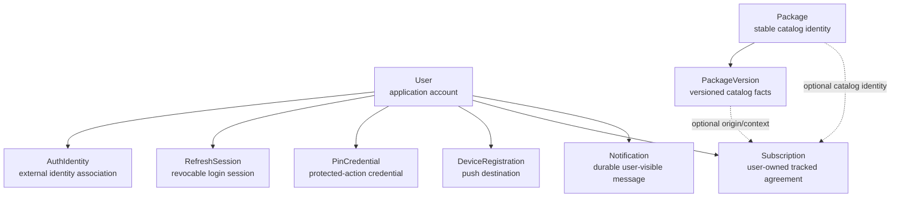
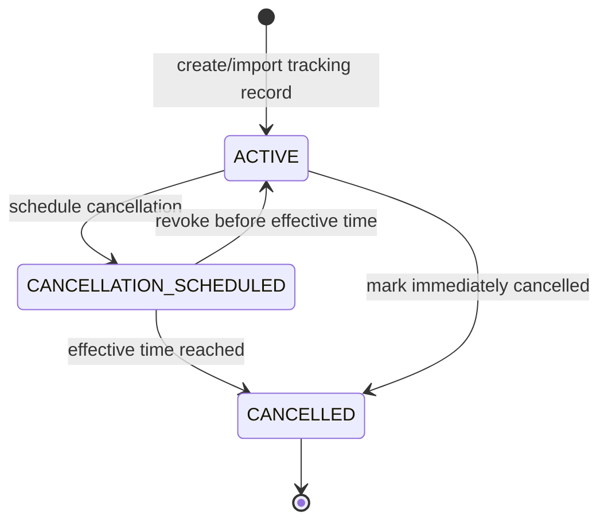
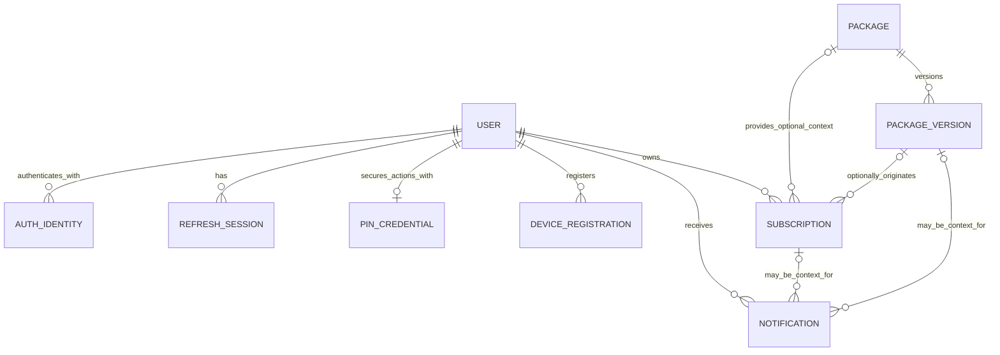

# Subscription Track — Backend Domain Model v1

> **Phase:** 0.2A — Domain Model v1
>
> **Status:** Domain baseline สำหรับนำไปออกแบบ relational ERD v1
>
> **ปรับปรุงล่าสุด:** 14 กันยายน 2026
>
> **อ้างอิงหลัก:** `doc/backend/backend_architecture_v1.md`

## 1. Purpose & Scope

เอกสารนี้กำหนด business/domain model ของ Subscription Track ระหว่าง Backend Architecture v1 กับ Physical/Relational ERD v1 โดยตอบว่า concept ใดเป็น Entity, Value Object, Derived Read Model, future concept หรือ infrastructure state รวมถึง ownership, relationships, lifecycle, invariants และ historical meaning ที่ต้องรักษา

```text
Backend Architecture v1
        ↓
Domain Model v1        ← เอกสารนี้
        ↓
Physical/Relational ERD v1
        ↓
API Standards
        ↓
API Contract / OpenAPI
```

เอกสารนี้เป็น **conceptual business model** ไม่ใช่ physical schema และไม่ยืนยันว่า Backend ถูก implement แล้ว ปัจจุบัน `apps/api/` ยังไม่ได้ scaffold

## 2. Sources, Evidence Priority และ Current Assumptions

### 2.1 Evidence Priority

เมื่อข้อมูลขัดแย้ง ใช้ลำดับพิจารณา:

1. Current explicit decisions ใน Backend Architecture v1
2. Current product behavior/requirements
3. Current backend roadmap และ backlog
4. Flutter implementation และ read models
5. Legacy PRD architecture assumptions

Product requirement ที่ยังมีคุณค่าไม่ถูกทิ้งเพียงเพราะอยู่ในเอกสารเก่า แต่ technology assumptions เช่น MongoDB/Mongoose, Firebase-centric backend, GCP และ optional microservices ไม่ถูกนำมาเป็น domain constraint

### 2.2 Repository Evidence

- Flutter มี `Subscription`, preset package catalog, Notification Center, per-subscription reminder UI, global reminder toggle, PIN verification, Dashboard และ Savings simulation
- Flutter `Subscription` รวม business fields, read concerns และ UI state ไว้ด้วยกัน เช่น `isSelected`; จึงไม่ใช่ backend entity specification
- `DashboardSummary`, `DashboardRenewal`, `SavingsViewState` และ `SavingsItem` เป็น read/interaction models ที่คำนวณจาก subscription state
- `confidence` และ usage records มาจาก mock/legacy future analytics; ส่วน usage level ถูกผู้ใช้เลือกใน current form และใช้แสดง unused state
- `CreditCard` และ `PaymentCard` เป็น mock models ซ้ำความหมายกันและไม่มี external bank integration จริง
- Notification และ card repositories ปัจจุบันเป็น in-memory/mock; persistence behavior ฝั่ง client ไม่ใช่หลักฐานว่าต้องมี table ตรงกัน
- Backend roadmap ล็อก BE-401 device registration และ BE-403 upcoming billing reminders เป็น backend requirements

### 2.3 Model Separation

```text
Frontend/UI Model
    = รูปข้อมูลเพื่อ render, form, interaction หรือ local mock state

Backend Domain Entity
    = business concept ที่มี identity/lifecycle/ownership และ durable meaning

Database Table
    = physical relational representation ที่จะออกแบบใน Phase 0.2B
```

ความสัมพันธ์ไม่ใช่ one-to-one โดยอัตโนมัติ: frontend class หนึ่งอาจ map จากหลาย Entity/Value Object และ Domain Entity หนึ่งอาจใช้มากกว่าหนึ่ง table เมื่อ ERD มีเหตุผลรองรับ

## 3. Domain Modeling Principles

- ใช้ Entity เมื่อ concept มี identity และ lifecycle ที่ต้องติดตาม ไม่ใช่เพียงเพราะมีหลาย attributes
- ใช้ Value Object/embedded concept เมื่อค่ามีความหมายเป็นชุดแต่ไม่มี independent lifecycle
- PostgreSQL เป็น Durable Source of Truth; Redis/BullMQ state ไม่ใช่ business record
- เก็บ authoritative inputs แล้วคำนวณ summary/output เมื่ออ่าน แทน duplicate derived truth
- แยก account profile, external identity, refresh session, PIN credential และ push destination ตาม responsibility/security lifecycle
- `Subscription` เป็นศูนย์กลางของ user-owned business state แต่ไม่รับผิดชอบ auth, catalog versioning, notification delivery หรือ dashboard projection
- ใช้ public module/application contracts ข้าม module ไม่เข้าถึง persistence internals ของ module อื่น
- ไม่เพิ่ม AggregateRoot base class, domain event framework, Factory, Specification, CQRS, event sourcing หรือ generic repository wrapper ใน v1
- Domain event เป็นคำอธิบายเหตุการณ์ได้โดยไม่ต้องมี event bus หรือ event table

## 4. Domain Overview



Core direction:

```text
User
├── AuthIdentity
├── RefreshSession
├── PinCredential
├── DeviceRegistration
├── Subscription
└── Notification

Package
└── PackageVersion
       └── may provide origin/history context to Subscription
```

## 5. Concept Classification and Ownership Matrix

| Concept | Classification | Owning Module | Durable? | v1 Direction |
| --- | --- | --- | ---: | --- |
| User | Core Entity | `users` | Yes | Application account และ owner ของ user-scoped records |
| Subscription | Core Entity | `subscriptions` | Yes | User-owned tracked subscription/agreement |
| Package | Core Entity | `packages` | Yes | Stable catalog identity; ไม่ใช่ user subscription |
| PackageVersion | Supporting Entity | `packages` | Yes | Immutable/versioned commercial catalog state |
| AuthIdentity | Supporting Entity | `auth` | Yes | External provider identity association |
| RefreshSession | Supporting Entity | `auth` | Yes | Rotatable/revocable login session |
| PinCredential | Supporting security Entity | `auth` | Yes | PIN hash และ security lifecycle แยกจาก profile |
| Notification | Supporting Entity | `notifications` | Yes | Durable user-visible inbox/history และ reminder occurrence |
| DeviceRegistration | Supporting Entity | `notifications` | Yes | Active/revoked push destination association |
| UserProfile | Value Object / embedded concept | `users` | As part of User | Name/contact/account-facing information |
| UserPreferences | Value Object / embedded concept | `users` | As part of User | Global defaults เช่น currency/language/reminder default |
| Money | Value Object | owning feature | As part of owner | Amount + currency semantics |
| BillingCycle | Value Object | `subscriptions` / `packages` | As part of owner | Cadence without independent identity |
| ReminderSettings | Value Object | `subscriptions` / `users` | As part of owner | Global default และ per-subscription override |
| CancellationSchedule | Embedded concept | `subscriptions` | As part of Subscription | Status/effective time; ไม่เป็น Entity ใน v1 |
| UsageLevel | Enum/value attribute | `subscriptions` | As part of Subscription | User-declared current usage label |
| NotificationDelivery | Deferred supporting concept | `notifications` | Not in core v1 | Separate entity only when per-channel/per-target audit is required |
| PackageChange | Transient application/domain signal | `packages` | No separate record | Durable facts alreadyอยู่ใน PackageVersion |
| DashboardSummary | Derived Read Model | `dashboard` | No | Computed from durable inputs; Redis cache optional |
| UpcomingBillingSummary | Derived Read Model | `dashboard` | No | Projection from eligible subscriptions |
| SavingsSimulation | UI/request-scoped calculation | `dashboard` or client | No in v1 | Selection/scenario is not durable business truth |
| UsageRecord | Deferred future Entity candidate | future analytics ownership | Not in v1 | Require data-source/privacy decisions first |
| ConfidenceScore | Derived/future value | future analytics | No authoritative v1 value | Current value is mock; method not defined |
| PaymentCard / LinkedAccount | Simulation/future concept | unresolved future module | No in backend v1 | No real bank integration or PCI scope |
| DetectedSubscription | Import candidate/DTO concept | future integration boundary | No | Becomes normal Subscription only after accepted import |
| UserIncome | Value/attribute candidate | `users` | Optional as part of User | Monthly reference income/budget; not a separate Entity |
| BullMQ Job / Queue | Infrastructure concept | `infrastructure` | No business truth | Async execution state |
| Redis Cache Entry / Lock | Infrastructure concept | `infrastructure` | No business truth | Cache/coordination only |

## 6. User & Identity Domain

### 6.1 User

`User` หมายถึง application business account ไม่ใช่ OAuth profile หรือ token container โดยตรง

**Owns conceptually:**

- application account identity และ lifecycle
- profile/contact information
- account-level preferences/defaults
- ownership relationship ไปยัง Subscription, Notification และ security/supporting records

**Does not own directly:**

- provider-specific OAuth token mechanics
- refresh token secret material
- PIN verification detailsใน profile
- FCM token listใน profile
- Package catalog/version history
- DashboardSummary หรือ Savings selection

`UserProfile` และ `UserPreferences` เป็น Value Object/embedded concepts ใน v1 ไม่ต้องมี Entity แยกจนกว่าจะมี independent lifecycle/history requirement

Email/contact information ไม่ควรถูกใช้แทน external identity key โดยอัตโนมัติ เพราะ provider email เปลี่ยนได้ ซ่อนอยู่หลัง Apple relay หรืออาจไม่ unique ตาม policy ที่เลือก

### 6.2 AuthIdentity

`AuthIdentity` คือ association ระหว่าง User กับ external identity provider โดยมีความหมายเชิงแนวคิดเช่น provider และ provider subject ไม่ใช่ User profile

Google และ Apple เป็น initial provider candidates ตาม current product behavior แต่ provider implementation/OAuth flow ยัง open และ model ต้องเพิ่ม provider อื่นได้โดยไม่เปลี่ยนความหมายของ User การใช้ Firebase Auth ไม่ใช่ข้อบังคับของ Domain Model v1

**v1 decision:** User รองรับ AuthIdentity มากกว่าหนึ่งรายการ (`1:N`) ตั้งแต่ domain model แม้ initial implementation อาจเปิดใช้เพียงหนึ่ง provider ต่อ user

เหตุผล:

- account linking Google/Apple ในอนาคตไม่ต้องย้ายความหมายของ User
- provider identity มี lifecycle/uniqueness ต่างจาก profile
- provider subject เป็น identity key ที่เสถียรกว่า email

Trade-off คือ Auth design ต้องกำหนด linking/verification เพื่อไม่ให้ account takeover การรองรับ multiplicity ไม่ได้แปลว่าต้อง implement account-linking UI ใน v1

Invariant สำคัญ: identity คู่เดียวกันใน provider เดียวต้องไม่ map อย่างกำกวมไปหลาย User

Guest mode ปัจจุบันเป็น frontend demo behavior การมี durable anonymous User หรือ anonymous AuthIdentity ยังเป็น **OPEN** ใน Auth design; Domain Model ไม่สร้าง `GuestUser` subtype

### 6.3 RefreshSession

**Recommendation:** เป็น durable Supporting Entity แยกจาก User และ AuthIdentity โดย User มี `1:N RefreshSession`

เหตุผล:

- refresh-token rotation และ replay/reuse detection ต้องมี lifecycle ต่อ session
- logout/revocation เฉพาะอุปกรณ์ทำได้โดยไม่ปิดทุก session
- รองรับหลายอุปกรณ์และ session expiration
- compromised session invalidation ไม่ควรแก้ giant User record

`RefreshSession` สื่อ session identity, validity/revocation/expiration และ rotation lineage ในระดับ concept เท่านั้น Raw refresh token ห้ามเก็บ plaintext และเอกสารนี้ไม่กำหนด token hashing/format

### 6.4 PinCredential

**Recommendation:** เป็น Supporting security Entity แบบ `User 1:0..1 PinCredential` แยกจาก User profile

เหตุผลที่เป็น Entity ไม่ใช่เพียง attribute:

- มี credential lifecycle: not configured, active, locked/temporarily blocked, changed/reset
- มี failed-attempt และ throttle/lockout state ที่เปลี่ยนแยกจาก profile
- ต้องใช้ security access/redaction policy ต่างจาก ordinary user data
- ช่วยป้องกันการโหลด/serialize PIN hash พร้อม profile โดยไม่จำเป็น

PIN secret ต้องเก็บในรูป verifier/hash เท่านั้น ไม่เก็บ plaintext Current UI ใช้ 6 digits แต่ exact length, hashing, attempt window, lockout และ reset/recovery policy ยังอยู่ใน Auth/Security design ไม่ใช่ immutable domain assumption

### 6.5 User Income

Frontend ใช้ `userIncomeProvider` ทั้งรับค่าที่ผู้ใช้แก้และคำนวณจาก mock card balance ซึ่งมีความหมายปะปนกัน

**v1 recommendation:** หาก Creep Score ต้องใช้ ให้เก็บ “monthly reference income/budget” เป็น optional Money-valued attribute ใน User profile/preferences ไม่สร้าง `Income` Entity และไม่ derive จาก payment card balance

ประวัติรายได้ หลายแหล่งรายได้ หรือ financial ledger ไม่อยู่ใน current scope หากต้องการภายหลังจึงพิจารณา Entity ใหม่

## 7. Subscription Domain

### 7.1 Subscription Responsibility

`Subscription` เป็น durable user-owned business state ที่แทนรายการบริการซึ่งผู้ใช้กำลังติดตาม ไม่ใช่ provider catalog entry และไม่จำเป็นต้องพิสูจน์ธุรกรรมชำระเงินจริง

Concept ที่ Subscription ถือครอง:

- owner User หนึ่งราย
- subscription-specific service/display identity
- commercial snapshot เช่น Money และ billing configuration
- optional Package และ originating PackageVersion context
- persisted next billing occurrence
- lifecycle status
- reminder override/settings
- scheduled cancellation effective time เมื่อมี
- user-declared UsageLevel หากเปิดใช้ current unused/savings behavior

ไม่ควรนำ UI-only `isSelected`, calculated monthly/yearly totals, Dashboard score, queue state หรือ FCM delivery stateมาใส่ใน Subscription

### 7.2 Custom และ Preset Subscription ใน Model เดียว

ใช้ `Subscription` Entity เดียว ไม่สร้าง subtype/table แยก:

```text
Preset-origin Subscription
├── optional Package reference
├── optional originating PackageVersion
└── required subscription-specific commercial snapshot

Custom Subscription
├── no Package reference
├── no PackageVersion reference
└── required subscription-specific commercial snapshot
```

Custom subscription ไม่ต้องสร้าง fake Package การเลือก preset เป็นวิธีเริ่มต้นข้อมูล ไม่ใช่ type ที่เปลี่ยน identity/lifecycle ของ Subscription

### 7.3 Money และ BillingCycle

`Money` เป็น Value Object ที่รักษาความหมาย amount + currency สำหรับ subscription price, package price, income/budget และ derived output Amount ต้องไม่ติดลบ; exact precision/type เป็นเรื่อง ERD

`BillingCycle` เป็น Value Object ไม่ใช่ Entity เพราะไม่มี independent identity/lifecycle โดย v1 แนะนำ concept แบบ positive interval + supported unit:

- current UI รองรับ monthly และ yearly
- quarterly จาก mock/legacy requirement สามารถแทนเป็น interval สามเดือนโดยไม่เพิ่ม lifecycle state
- custom cadence/unit เพิ่มเมื่อมี product requirement ไม่ต้องสร้าง `BillingCycle` table

BillingCycle ใช้คำนวณ next billing date, annualized cost และ reminder date ด้วยกฎเดียวกันฝั่ง Backend

### 7.4 Next Billing Date

**v1 decision:** `nextBillingDate` เป็น durable state บน Subscription ที่คำนวณ/validate จาก persisted billing anchor/cycle เมื่อสร้าง เปลี่ยนรอบ หรือ advance รอบบิล ไม่ derive ใหม่ทุก request

เหตุผล:

- scheduler ต้อง query รายการที่จะถึงกำหนดอย่างมีประสิทธิภาพ
- ผู้ใช้อาจแก้วันเรียกเก็บจริง ไม่ได้สอดคล้องกับ created date
- ลดความกำกวมของ month-end/leap-year และป้องกัน client clock เป็น authority
- Dashboard/reminder อ่าน occurrence เดียวกัน

Combination นี้จึงเป็น **persisted next occurrence + deterministic backend calculation rule** ไม่ใช่การเก็บค่าซ้ำที่ไร้ owner เมื่อ billing cycle เปลี่ยน ต้องคำนวณ next occurrence ใหม่ภายใน use case เดียวกัน

### 7.5 Reminder Preference

หลักฐานปัจจุบันมีทั้ง global reminder toggle/default days ใน settings/user model และ per-subscription enabled/days ใน detail UI

**v1 decision:** รองรับทั้งสองระดับโดยไม่สร้าง Entity แยก:

```text
UserPreferences.reminderDefault
          +
Subscription.reminderOverride?   # optional
          ↓
Effective ReminderSettings       # derived
```

- global default ใช้เมื่อ Subscription ไม่มี override
- per-subscription override สามารถ disable หรือกำหนด lead time เฉพาะรายการ
- effective reminder date derive จาก `nextBillingDate` และ effective settings
- reminder occurrence/Notification ที่สร้างแล้วเป็น durable state แต่ schedule calculation ไม่ใช่ Entity

Exact allowed lead days ไม่ล็อกไว้ที่ 1/3/7 หรือ 3/7 ตาม UI mock; validation policyกำหนดภายหลัง

### 7.6 UsageLevel, Confidence และ Savings Selection

- `UsageLevel` เป็น enum/value attribute แบบ user-declared เพื่อรองรับ frequent/moderate/unused behavior ปัจจุบัน โดย vocabulary สุดท้ายตรวจใน API/domain design
- `CANCELLED` ไม่ใช่ UsageLevel; current Flutter ที่ใส่ `cancelled` ใน `usageStatus` เป็น UI/model shortcut ที่ Backend ห้ามคัดลอก
- `ConfidenceScore` ไม่เป็น authoritative v1 attribute จนกว่าจะมี algorithm/data provenance ที่กำหนด
- `isSelected` เป็น Savings scenario/UI selection ไม่เป็น durable Subscription state

## 8. Subscription Lifecycle and Cancellation

### 8.1 Minimal Lifecycle

v1 ใช้เพียง:

| State | Business meaning | Current need |
| --- | --- | --- |
| `ACTIVE` | ยังติดตามเป็น subscription ที่มี future billing/reminder eligibility | Required |
| `CANCELLATION_SCHEDULED` | ผู้ใช้กำหนดว่าจะสิ้นสุดในอนาคตและมี effective time | Required by architecture |
| `CANCELLED` | สิ้นสุดแล้ว ไม่สร้าง future billing reminder | Required by current UI/product |

`PAUSED` และ `EXPIRED` จาก roadmap/legacy PRD ยังไม่มี rule/use case ชัด จึง **deferred** ไม่เพิ่มใน v1



Direct `ACTIVE → CANCELLED` รองรับ current “mark cancelled” behavior ส่วน scheduled flow รองรับ architecture requirement ไม่มี reactivation transition ใน v1; หากผู้ใช้กลับมาสมัครใหม่ให้เป็น explicit future decision/use case ไม่ย้อน state เงียบ ๆ

### 8.2 Scheduled Cancellation Model

เปรียบเทียบ:

| Option | Strength | Cost |
| --- | --- | --- |
| Status + effective time บน Subscription | เรียบง่าย, lifecycle อยู่กับ owner, query eligibility ตรง | ไม่มี independent schedule history |
| Separate CancellationSchedule Entity | รองรับหลาย schedule/audit/attempt lifecycle | เพิ่ม identity, relation และ consistency rule โดย current scope ยังไม่ใช้ |

**v1 recommendation:** ใช้ embedded cancellation concept บน Subscription: status + optional effective time/relevant metadata ไม่สร้าง `CancellationSchedule` Entity เมื่อ schedule ถูก revoke ให้ Subscription กลับ ACTIVE และ clear active schedule concept ตาม rule ประวัติการ schedule หลายครั้งยังไม่ใช่ requirement

Cancel Subscription ไม่เท่ากับ delete record และ cancelled subscription ต้องไม่สร้าง future billing reminder

## 9. Package & Versioning Domain

### 9.1 Package

`Package` เป็น stable catalog identity ของ service/plan ที่ระบบดูแล เช่น canonical plan identity และ active/inactive catalog availability Package ไม่ถือ user ownership, user price หรือ subscription lifecycle

Package deactivation หมายถึงไม่เสนอเป็น preset ใหม่ ไม่ทำลาย PackageVersion หรือ Subscription ที่เคยอ้างถึง

### 9.2 PackageVersion

`PackageVersion` เป็น Supporting Entity ที่เก็บ commercial/catalog meaning ตามช่วงเวลา เช่น name, price, billing characteristics, included features และ effective period ในระดับ concept

```text
Package
├── PackageVersion v1
├── PackageVersion v2
└── PackageVersion v3
```

Published historical version ต้องไม่ถูกแก้ทับแบบทำลายความหมาย หาก correction policy จำเป็นต้องกำหนดแยกจาก ordinary “new version” ใน Package design

### 9.3 Subscription Historical Snapshot Decision

#### Option A — Reference Current PackageVersion Only

```text
Subscription → current PackageVersion
```

**ข้อดี:** duplicate commercial data น้อย; catalog update แสดงทันที

**ข้อเสีย:** ราคา/dashboard ของผู้ใช้อาจเปลี่ยนย้อนหลังโดยไม่ใช่ข้อตกลงจริง, custom price ทำได้ยาก, historical meaning ผูกกับ mutable “current” pointer

ไม่เหมาะกับ Subscription Track

#### Option B — Snapshot Commercial Data Only

```text
Subscription
├── subscribed service name
├── subscribed Money
└── BillingCycle
```

**ข้อดี:** รายการผู้ใช้คงความหมายและรองรับ custom subscription

**ข้อเสีย:** ไม่รู้ต้นกำเนิด catalog/version, หา affected subscriptions เมื่อ package เปลี่ยนยาก, plan comparison/switching สูญ context

ใช้ได้แต่เสียประโยชน์จาก versioned catalog

#### Option C — Hybrid Model

```text
Subscription
├── optional Package
├── optional originating PackageVersion
└── required subscription-specific commercial snapshot
```

**ข้อดี:** รักษาราคา/ชื่อ/รอบบิลที่ผู้ใช้ติดตาม, รองรับ custom price, หา package-change impact ได้, รองรับ future plan switching

**ข้อเสีย:** ต้องมีกฎชัดว่า snapshot กับ catalog ไม่ auto-sync และต้องรักษาความสอดคล้องของ optional references

**Recommended v1 decision: Option C — Hybrid Model**

กฎ:

- Subscription snapshot เป็น authoritative commercial meaning ของรายการผู้ใช้
- Package/PackageVersion เป็น origin/context ไม่ใช่ live price pointer
- package version ใหม่ไม่แก้ subscription snapshot อัตโนมัติ
- ระบบอาจแจ้งความต่างและให้ผู้ใช้ยืนยันการปรับรายการ/plan switch
- custom subscription มี snapshot ครบโดยไม่มี package references
- full history ของ user-edited subscription price ยังไม่เพิ่ม Entity ใน v1; หาก historical spending charts ต้อง reconstruct exact past periods ให้พิจารณา `SubscriptionRevision` ใน future design

### 9.4 Package Change Signal

```text
New durable PackageVersion
        ↓ compare affected subscriptions
Transient application/domain signal
        ↓ BullMQ execution job
Durable Notification per eligible user/occurrence
```

`PackageChange` ไม่ต้องเป็น Entity หรือ event table โดย default เพราะ durable historical fact คือ PackageVersion และ durable user-visible outcome คือ Notification Signal/event และ BullMQ job เป็น orchestration/execution concepts

## 10. Notification & Device Domain

### 10.1 Notification

`Notification` เป็น durable user-visible message/inbox record ของ User (`User 1:N Notification`) อาจสื่อ reminder, package change, unused warning หรือ system messageตาม taxonomy ที่กำหนดภายหลัง

Concept ที่ควรมีความหมาย:

- owner User
- type/category และ user-facing content
- creation time
- read/unread และ optional dismissed/hidden state
- optional related business context เช่น Subscription หรือ PackageVersion โดย exact relation ตัดสินใน ERD
- reminder occurrence identity/deduplication meaning เพื่อไม่สร้างข้อความซ้ำ
- minimal dispatch summary หาก worker ต้องใช้ retry guard; summary ไม่เท่ากับ provider receipt

```text
Notification        = durable application/user-visible state
BullMQ Job          = infrastructure execution state
Provider message ID = delivery integration detail
```

ห้ามใช้ queue retention หรือ worker log เป็น Notification Center history

### 10.2 Notification Delivery Decision

| Option | Fit | Trade-off |
| --- | --- | --- |
| Minimal delivery metadata on Notification | พอสำหรับ single-channel v1 และ retry guard ระดับข้อความ | ไม่เห็น per-device/channel attempt ละเอียด |
| Separate NotificationDelivery | รองรับหลาย channel/target, audit และ partial outcomes | เพิ่ม Entity/state machine และ consistency cost |
| Queue/log only | ง่ายที่สุด | ไม่พอสำหรับ durable idempotency/user-visible linkage |

**v1 recommendation:** ยังไม่สร้าง `NotificationDelivery` Entity ใช้ durable Notification เป็น idempotency/user-visible anchor และเก็บเพียง coarse dispatch metadata ที่จำเป็นบน Notification; BullMQ/structured logs ดู execution attempts และ DeviceRegistration ดู invalid token lifecycle

สถานะอย่าง pending, sent, failed หรือ invalid-token เป็น candidate ของ delivery execution ไม่ใช่ read/unread lifecycle ของ Notification และ Domain Model v1 ยังไม่ล็อกว่าจะ persist รายละเอียดเหล่านี้ระดับ channel/device อย่างไร

หาก Phase 7 ยืนยัน multi-channel fallback, per-device audit หรือ retry after partial fan-out ที่ต้องแม่นยำ ให้ promote `NotificationDelivery` เป็น Supporting Entity ก่อน implement ไม่ใช้ queue stateเป็น business audit แทน

### 10.3 DeviceRegistration

`DeviceRegistration` เป็น durable push destination association แยกจาก User profile และ Auth session เพราะ FCM token มี lifecycle เฉพาะ

**v1 cardinality:** User หนึ่งคนมีหลาย registrations ได้ (`1:N`)

Responsibilities:

- associate current push token/destination กับ authenticated User
- active/revoked/invalid lifecycle
- token refresh/replace
- logout/unlink และ invalid-token cleanup
- optional platform/device metadata เท่าที่ delivery operations ต้องใช้

Business uniqueness semantics:

- push token เดียวต้องไม่ active ให้หลาย User พร้อมกัน
- register ซ้ำสำหรับ User เดิมต้องได้ deterministic idempotent result
- เมื่ออุปกรณ์ logout แล้ว login เป็นอีก User ต้อง revoke/unlink association เดิมก่อน activate owner ใหม่
- device registration ไม่อนุญาตให้ client เลือก owner User เองนอก authenticated context

Exact database unique constraint และ token storage protection เป็นงาน ERD/Security design

### 10.4 Billing Reminder Occurrence

```text
Eligible Subscription + nextBillingDate + effective ReminderSettings
        ↓ discovery
Deterministic reminder occurrence meaning
        ↓ create/reuse Notification
BullMQ job → Worker → FCM as applicable
```

ไม่สร้าง `Reminder` Entity แยกใน v1 Notification เป็น durable occurrence/output ส่วน eligibility/schedule เป็น calculation จาก Subscription Deduplication ต้องพิจารณา user, subscription, billing occurrence และ reminder lead/channel context โดยไม่กำหนด physical key ในเอกสารนี้

## 11. Dashboard, Savings และ Derived Data

### 11.1 DashboardSummary

`DashboardSummary` เป็น Derived Read Model ไม่ใช่ Entity:

```text
Durable User + Subscription inputs
        ↓ backend calculation
DashboardSummary / UpcomingBillingSummary
        ↓ optional Redis cache
API response
```

ค่าที่ derive ได้แก่ monthly total, annualized spending, active count, upcoming renewal list, unused count/savings estimate และ Creep Score เมื่อ input/policy พร้อม PostgreSQL inputs ยังคง authoritative; Redis cache มี TTL/invalidation และไม่กลายเป็น truth

### 11.2 SavingsSimulation

Current frontend เลือก `Subscription.isSelected` แล้วคำนวณ yearly savings นี่เป็น interaction scenario ไม่ใช่คุณสมบัติถาวรของ Subscription

**v1 decision:** `SavingsSimulation`, `SavingsItem`, selection set และ savings estimate เป็น request/UI-scoped derived data ไม่สร้าง Entity/table และไม่ persist `isSelected` ใน Backend หากอนาคตมี named plans, sharing หรือ saved goals จึงพิจารณา durable scenario model

### 11.3 Derived Values

ค่าต่อไปนี้ควรคำนวณจาก durable inputs:

- monthly/annualized subscription cost
- active subscription count
- upcoming renewals
- effective reminder settings/date
- dashboard risk/creep score
- unused monthly savings estimate
- savings simulation result
- age จาก birth date หากยังมี product need

ไม่ duplicate เป็น authoritative mutable state เว้นแต่มี measured query cost/audit requirement และกำหนด refresh/invalidation semantics ชัด

## 12. Optional / Future Concepts

### 12.1 UsageRecord และ ConfidenceScore

Current status:

- user-declared UsageLevel: **Current v1 value concept**
- automated UsageRecord from Screen Time: **Future domain feature**
- ConfidenceScore algorithm/provenance: **Future derived concept / Open design**
- unused subscription detection แบบ automated: **Future feature**

เหตุผลที่ไม่ใส่ UsageRecord ใน core v1: iOS/Android permissions, privacy/consent, data granularity, retention และ algorithm ยังไม่กำหนด Mock `confidence` ใน Flutter ไม่ใช่ durable backend requirement

### 12.2 PaymentCard / LinkedAccount / Auto-import

Frontend จำลอง KBank/SCB/UOB/Krungsri, balance และ recurring charges โดยไม่มี bank API จริง และมีทั้ง `CreditCard` กับ `PaymentCard` model ที่ความหมายทับกัน

**v1 classification:** simulation/demo state และ future integration concept ไม่สร้าง backend Entity ไม่ออกแบบ PCI/payment processing และไม่อ้างว่ามี external bank integration

หาก import candidate ถูกผู้ใช้ยอมรับ ให้สร้าง normal Subscription ผ่าน subscription use case Candidate/DetectedSubscription เป็น transient input ไม่ใช่ durable Entity ส่วน import provenance หรือ deduplication key จะเพิ่มเมื่อ real integration contract ชัด

### 12.3 Other Deferred Concepts

- `NotificationDelivery` per target/channel
- `SubscriptionRevision` หรือ historical price timeline
- saved SavingsScenario/goal
- paused/expired subscription states
- real banking/card/link-account domain
- usage ingestion and analytics domain
- admin role/publishing workflow รายละเอียด

## 13. Module Ownership and Cross-Module Interaction

| Module | Owns | May consume through public contract | Must not do |
| --- | --- | --- | --- |
| `users` | User, profile, account preferences, income/budget value | auth context at application boundary | own provider token/PIN/session logic |
| `auth` | AuthIdentity, RefreshSession, PinCredential | user account association contract | own User profile business rules |
| `subscriptions` | Subscription, BillingCycle, Reminder override, cancellation lifecycle | Package/version lookup contract | mutate PackageVersion หรือ dispatch notification directly |
| `packages` | Package, PackageVersion, version publishing/change detection | notification orchestration contract after durable change | mutate user Subscription snapshot automatically |
| `notifications` | Notification, DeviceRegistration, reminder discovery/dispatch orchestration | subscription/package/user read contracts | modify subscription lifecycle internals |
| `dashboard` | Derived read-model assembly/cache policy | user/subscription/package read contracts | own or mutate source entities |
| `health` | Operational health semantics | infrastructure health indicators | own business Entities/monitoring history |

Allowed interaction examples:

```text
auth → resolve verified external identity through User account contract
subscriptions → validate optional PackageVersion through packages public contract
notifications → read reminder eligibility through subscriptions public contract
packages → request async notification follow-up after PackageVersion commit
dashboard → aggregate read data without taking ownership of source state
```

Feature module ห้าม import TypeORM repository/entity internals ของ module อื่น การมี conceptual relationship ใน ERD ไม่ให้สิทธิ์แก้ข้อมูลข้าม owner โดยตรง

## 14. Conceptual Domain Relationships

### 14.1 Relationship Diagram

> **Conceptual Domain Relationship Diagram — not physical database schema.** Cardinality นี้อธิบาย business meaning; nullability, join strategy, FK และ delete action เป็นงาน Phase 0.2B



Notes:

- registered User รองรับหลาย AuthIdentity; guest persistence ยัง open
- PinCredential มีได้อย่างมากหนึ่ง active credential concept ต่อ User ใน v1
- Package/PackageVersion references บน Subscription เป็น optional เพื่อรองรับ custom subscriptions
- Notification related-resource relationships เป็น conceptual optional context ไม่ใช่ข้อสรุปว่าจะใช้ polymorphic column หรือ FK แบบใด

### 14.2 Entity Lifecycle Summary

| Entity | Minimal v1 lifecycle meaning |
| --- | --- |
| User | created/active → deactivated or deletion-requested; exact deletion/anonymization remains open |
| AuthIdentity | linked/verified association → unlinked/revoked; relinking must pass account-linking security rules |
| RefreshSession | active → rotated, revoked, or expired; terminal session cannot refresh again |
| PinCredential | absent/not configured → active; active may be temporarily locked, changed, reset, or removed according to the future PIN policy |
| Subscription | `ACTIVE` → `CANCELLATION_SCHEDULED` → `CANCELLED`, with the explicitly supported direct/revoke transitions in section 8 |
| Package | active catalog identity → inactive/deactivated; deactivation preserves versions and references |
| PackageVersion | recorded for a future/current effective period → historical/superseded; published historical meaning is not destructively overwritten |
| Notification | created unread ↔ read; may become dismissed/hidden without becoming a queue deletion |
| DeviceRegistration | active → revoked/unlinked or invalid; token refresh replaces/rotates the active destination deterministically |

รายละเอียด state names บางส่วนเป็น semantic states ไม่ใช่ข้อกำหนด enum/table โดยตรง ERD/API design ต้องใช้เฉพาะ state ที่ต้อง persist จริงและไม่สร้าง state machine เพื่อความสวยงาม

## 15. Business Invariants

`Database-enforceable` หมายถึง candidate ที่ ERD ควรแปลงเป็น relational constraint เมื่อทำได้ ไม่ใช่การกำหนด SQL ในเอกสารนี้ ส่วน rule ที่ต้องอ่านหลาย records, current time หรือ authenticated context อยู่ที่ application/domain service

### 15.1 User, Auth and Security

| Invariant | Primary enforcement |
| --- | --- |
| User-owned durable record ต้องอ้าง User ที่มีอยู่ | Database-enforceable relationship + application transaction |
| provider + provider subject เดียวต้องไม่ map หลาย User | Database-enforceable uniqueness candidate + auth application rule |
| User profile email ไม่ใช้แทน provider identity key | Domain/application rule |
| raw refresh token และ plaintext PIN ห้ามเก็บ/log | Security/application/infrastructure rule |
| RefreshSession ต้องมี owner เดียวและ revoked/expired session ใช้ refresh ไม่ได้ | Relationship + auth application rule |
| User มี PinCredential active concept ได้ไม่เกินหนึ่งใน v1 | Database-enforceable candidate + auth rule |
| PIN lock/throttle ต้องบังคับ server-side ไม่เชื่อ client dialog | Auth application rule |

### 15.2 Subscription

| Invariant | Primary enforcement |
| --- | --- |
| Subscription ต้องเป็นของ User เดียวเสมอ | Database-enforceable relationship |
| Money amount ต้องไม่ติดลบ; create UI อาจกำหนดมากกว่า zero | Value/domain validation + database candidate |
| custom Subscription valid ได้โดยไม่มี Package/PackageVersion | Domain rule + nullable optional relationship |
| Subscription ทุกตัวต้องมี commercial snapshot ที่ครบโดยไม่พึ่ง live catalog | Domain/application rule |
| originating PackageVersion ถ้ามีต้องอยู่ใต้ Package context ที่สอดคล้องกัน | Application rule; ERD constraintเมื่อเหมาะสม |
| package update ห้ามเปลี่ยน Subscription snapshot อัตโนมัติ | Module/domain rule |
| lifecycle transition ต้องอยู่ใน minimal state diagram | Subscription application/domain rule |
| `CANCELLATION_SCHEDULED` ต้องมี future effective time; state อื่นไม่ควรมี active schedule | Domain/application rule; database candidateบางส่วน |
| `CANCELLED` ไม่สร้าง future billing reminders | Reminder application rule |
| ผู้ใช้ห้ามอ่าน/แก้ Subscription ของผู้อื่น | Server-side authorization + owner-scoped query |
| next billing occurrence และ billing cycle ต้องสอดคล้องหลัง mutation | Subscription use case transaction |

### 15.3 Package

| Invariant | Primary enforcement |
| --- | --- |
| PackageVersion ต้องอยู่ใต้ Package เดียว | Database-enforceable relationship |
| published historical PackageVersion ห้าม destructive overwrite | Package application/domain rule |
| effective periods/version order ต้องไม่กำกวมตาม publishing policy | Package application rule; database supportภายหลัง |
| Package deactivation ห้ามลบ historical versions/subscription meaning | Package domain rule |

### 15.4 DeviceRegistration and Notification

| Invariant | Primary enforcement |
| --- | --- |
| DeviceRegistration ต้องผูก authenticated User เดียว | Relationship + notifications application rule |
| push token เดียวไม่ active ให้หลาย User พร้อมกัน | Database uniqueness candidate + transactional application rule |
| duplicate registration ของ owner เดิมต้อง idempotent | Notifications application rule |
| Notification ต้องเป็นของ User เดียว | Database-enforceable relationship |
| reminder occurrence เดียวต้องไม่สร้าง Notification ซ้ำ | Application idempotency + database uniqueness candidateเมื่อ key ถูกกำหนด |
| Worker retry ต้อง re-check current Subscription eligibility | Worker/application rule |
| Notification read/dismiss ห้ามแก้ resource ของ User อื่น | Server-side authorization |

## 16. Historical Data Semantics

สิ่งที่ต้องรักษา:

- **Package price/name/features change:** สร้าง PackageVersion ใหม่และเก็บ version เก่า ไม่ rewrite catalog history
- **Subscription commercial meaning:** hybrid snapshot ทำให้ค่าที่ผู้ใช้ติดตามไม่เปลี่ยนย้อนหลังเมื่อ catalog เปลี่ยน
- **Subscription cancellation:** ใช้ lifecycle state/effective time ไม่ลบ recordเพียงเพื่อสื่อ “cancelled”
- **Notification history:** Notification เป็น durable inbox/occurrence แม้ BullMQ job ถูก remove หรือ log rotate
- **Package deactivation:** ห้ามทำให้ Subscription/Notification เดิมอธิบายไม่ได้

Architecture v1 ไม่รับประกัน full historical spending reconstruction ทุกช่วงเวลา เพราะยังไม่มี SubscriptionRevision/payment ledger หาก requirement “กราฟย้อนหลัง” ต้องคำนวณตามค่าที่มีผลจริงในแต่ละ period เรื่องนี้ต้อง resolve ก่อนเพิ่ม historical analytics

## 17. Deletion / Retention Semantics

| Concept/action | v1 domain semantics | Physical policy status |
| --- | --- | --- |
| Cancel Subscription | Status transition; ไม่ใช่ row deletion | Chosen |
| User chooses “delete/remove tracker” | แยกจาก cancellation; ควร retire/hide tracking recordโดยไม่ทำลาย referenced historyโดยบังเอิญ | Exact hard/soft retention OPEN |
| Package deactivation | หยุดเสนอสำหรับ subscription ใหม่; preserve versions | Chosen |
| Device logout/unlink | Revoke/deactivate registration; token ใช้ส่งไม่ได้ | Chosen |
| Notification mark read | Read-state transition | Chosen |
| Notification dismiss/clear UI | Hide/dismiss user view; ไม่เท่ากับ queue deletion | Retention duration OPEN |
| Refresh logout/revoke | Session state transition; credential ใช้ต่อไม่ได้ | Chosen |
| User deletion | Revoke sessions/devices และหยุด processing ก่อน; retention/anonymization policyต้องกำหนด | OPEN |

ไม่กำหนด GDPR policy, cascade action หรือ retention duration ใน Domain Model v1 แต่ ERD ต้องไม่เลือก destructive cascade ที่ขัดกับ historical requirements โดยไม่บันทึกเหตุผล

## 18. Time Semantics

- Backend เป็น authority ของ durable billing/reminder/cancellation calculation ไม่เชื่อ mobile local clock เพียงอย่างเดียว
- แยก **calendar billing date** ออกจาก **execution instant** เชิงแนวคิด; exact database type เป็นงาน ERD
- Subscription ต้องมี timezone/calendar context ที่ชัดพอสำหรับ next billing occurrence โดยไม่ hardcode Thailand ตลอดระบบ
- user/project อาจใช้ Asia/Bangkok เป็น initial/default context แต่ persisted rule ต้องรองรับ user/provider timezone ที่ต่างกันเมื่อ requirement เกิด
- month-end, leap year และ invalid calendar day ต้องมีกฎ deterministic เดียวใน subscription domain
- reminder due time derive จาก persisted next billing occurrence + effective reminder settings + timezone policy
- cancellation effective time และ PackageVersion effective period ต้องเปรียบเทียบด้วย backend-controlled time semantics
- Notification creation time คือเวลาที่ durable record ถูกสร้าง; dispatch attempt/sent time ไม่ควรถูกสับสนกับ provider delivery/receipt
- clock injection/test control ควรใช้เมื่อ implement time-sensitive rules แต่ไม่กำหนด abstraction/code ในเอกสารนี้

## 19. Domain vs Infrastructure Separation

สิ่งต่อไปนี้อาจ carry domain identifiers แต่ไม่ใช่ Domain Entity:

| Infrastructure concept | Why not a business Entity |
| --- | --- |
| Redis cache entry | สำเนาชั่วคราวของ derived/read data; expire/rebuild ได้ |
| Redis lock/dedup key | Coordination mechanism ไม่ใช่ business record |
| BullMQ job | Execution/retry state; retention ไม่เท่ากับ user history |
| BullMQ queue | Runtime work channel |
| Nginx upstream | Edge routing configuration |
| Docker container | Deployment unit |
| API instance | Stateless runtime process |
| Worker process | Background runtime process |
| Request correlation ID | Observability context ไม่ใช่ durable business identity |
| FCM provider response | Integration result; จะเป็น domain recordเมื่อ delivery audit requirement justify เท่านั้น |

## 20. Recommended Domain Model v1

### 20.1 Core v1 Entities

```text
User
Subscription
Package
```

### 20.2 Supporting v1 Entities

```text
AuthIdentity
RefreshSession
PinCredential
PackageVersion
Notification
DeviceRegistration
```

### 20.3 Value Objects / Embedded Concepts

```text
UserProfile
UserPreferences
Money
BillingCycle
ReminderSettings
CancellationSchedule concept
UsageLevel
```

### 20.4 Derived / Non-Entity Models

```text
DashboardSummary
UpcomingBillingSummary
SavingsSimulation / SavingsSummary
Effective ReminderSettings
Annualized Spending
ConfidenceScore (future calculation)
```

### 20.5 Infrastructure

```text
BullMQ Job / Queue
Redis Cache Entry / Lock
API / Worker Process
Nginx Upstream
Docker Container
Correlation ID
```

### 20.6 Deferred / Future

```text
NotificationDelivery
UsageRecord
SubscriptionRevision
Saved SavingsScenario
PaymentCard / LinkedAccount
DetectedSubscription provenance
PAUSED / EXPIRED lifecycle states
```

## 21. Decisions to Carry Into ERD v1

ส่วนนี้เป็น direct input ของ Phase 0.2B

| # | Decision | Chosen v1 direction / OPEN | Reason | ERD impact |
| ---: | --- | --- | --- | --- |
| 1 | Package/PackageVersion/Subscription snapshot | **CHOSEN — Hybrid** | รักษา user price/history พร้อม catalog context | Subscription มี optional Package/originating PackageVersion relationships และ required own snapshot concepts |
| 2 | Custom subscription modeling | **CHOSEN — Same Subscription Entity** | lifecycle/rules เดียวกัน; ไม่สร้าง fake Package | Package relationships optional; snapshot requiredเสมอ |
| 3 | AuthIdentity multiplicity | **CHOSEN — User 1:N** | รองรับ future identity linking โดยแยก provider subject จาก profile | AuthIdentity เป็น supporting relation; provider identity ต้อง uniqueเชิงธุรกิจ |
| 4 | PinCredential separation | **CHOSEN — Separate 0..1 supporting Entity** | credential/lockout lifecycle และ security accessต่างจาก profile | แยก relationจาก User; ห้าม plaintext |
| 5 | RefreshSession durability | **CHOSEN — Durable User 1:N Entity** | rotation, revocation, multi-device และ compromise handling | แยก session relation; raw tokenไม่เก็บ plaintext |
| 6 | DeviceRegistration ownership/uniqueness | **CHOSEN — User 1:N; token active ownerเดียว** | หลาย device ต่อ user แต่ tokenไม่ควร activeข้าม users | Separate relation พร้อม uniqueness/lifecycle semanticsที่ ERDแปลงต่อ |
| 7 | Notification delivery persistence | **CHOSEN — No separate NotificationDelivery in core v1** | ลด state-machine cost; FCM-first scopeยังไม่ต้อง per-target audit | Notification มี minimal dispatch summary; no delivery table เว้น Phase 7 requirementเปลี่ยน |
| 8 | Scheduled cancellation | **CHOSEN — Embedded on Subscription** | ไม่มี independent history/lifecycle requirement | Status + effective-time concept; no CancellationSchedule table |
| 9 | Reminder preference ownership | **CHOSEN — Global default + optional per-subscription override** | สอดคล้องทั้ง settings และ detail UI | User preferences และ Subscription ต่างเก็บ owned value concepts; effective setting derived |
| 10 | nextBillingDate semantics | **CHOSEN — Persisted next occurrence + backend calculation** | efficient scheduler และ deterministic calendar behavior | Subscription ต้อง represent next occurrence และ calculation inputs; ไม่ deriveทุก request |

Additional ERD directives:

- `UsageLevel` เป็น attribute/value; `CANCELLED` อยู่ lifecycle status คนละแกน
- Savings selection/summary และ DashboardSummary ไม่มี table
- PackageVersion historyต้อง preserve; Package deactivationไม่ cascade destroy history
- Notification กับ BullMQ job ต้องไม่มี business-entity relationshipที่ทำให้ queueเป็น Source of Truth
- PaymentCard/LinkedAccount ไม่อยู่ ERD v1 เว้น scope change อย่างเป็นทางการ

## 22. Open Questions Before or During ERD v1

คำถามเหล่านี้ไม่เปลี่ยน core entity set และไม่ block การเริ่ม ERD แต่ต้องบันทึก/resolve ตามจุดที่ระบุ:

| Open question | Why open | Resolve by |
| --- | --- | --- |
| Durable Guest mode หรือ frontend-only demo | Current Flutter รองรับ guest แต่ Backend auth flowยัง open | Auth/Security design; ERD อาจรองรับ identity-less provisional accountโดยไม่สร้าง subtype |
| Exact User deletion/anonymization/retention | ยังไม่มี legal/product retention policy | ก่อนกำหนด destructive FK actions/production deletion flow |
| “Delete subscription” hard delete, archive หรือ retention window | UI มี delete แต่ historical/notification linkageต้องไม่เสีย | ERD v1 review หรือ Subscription API designก่อน implementation |
| Notification dismiss/clear retention duration | Current UI clear/dismiss แต่ backend durable history requirementไม่มี duration | Notification designก่อน Phase 7 |
| Multi-channel/per-device delivery audit | Email fallback/priority policyยัง open | Notification design; ถ้าต้อง audit ให้เพิ่ม NotificationDeliveryก่อน implementation |
| Full historical spending reconstruction | PRD กล่าวถึง future history/analytics แต่ไม่มี exact period semantics | Analytics designก่อนเพิ่ม SubscriptionRevision |
| Exact billing timezone/month-end policy | ต้องเทียบ product locale/provider behavior | Subscription domain/API standardsก่อน coding date calculator |
| Final UsageLevel vocabulary และ whether user-editable | Current formมี frequent/moderate/unused แต่ automated usageยัง future | API Contract v1 หรือ future analytics design |
| Income vs budget naming/meaning | Frontend conflates editable incomeกับ card balance | Product/API Contract ก่อน expose authoritative field |

## 23. Clean-Code Domain Review Record

ตรวจ Domain Model v1 ด้วย repository-wide `$clean-code` แล้ว:

1. Entity ทุกตัวมี identity/lifecycle/owner ชัด; Money, BillingCycle, settings และ cancellation scheduleไม่ถูกยกเป็น Entityโดยไม่มีเหตุผล
2. ไม่ copy frontend `isSelected`, `DashboardSummary`, `SavingsViewState`, mock confidence หรือ duplicate card modelsเป็น durable entities
3. User ไม่เป็น God Object: AuthIdentity, RefreshSession, PinCredential และ DeviceRegistrationแยกตาม security/operational lifecycle
4. Subscription ยังเป็น central business entity แต่ Package history, notification execution และ dashboard aggregationอยู่กับ owner modules
5. Custom subscriptionอยู่ใน modelเดียวโดยไม่สร้าง fake Package/subtype
6. Hybrid snapshotป้องกัน catalog updateทำลาย user historical meaning
7. Notificationแยกจาก BullMQ job; queue/logไม่เป็น user-visible history
8. derived values/cacheแยกจาก durable inputs
9. lifecycleมีเพียง ACTIVE, CANCELLATION_SCHEDULED, CANCELLED; PAUSED/EXPIREDถูก defer
10. module interactionsผ่าน public contractsและไม่อนุญาต cross-module persistence access
11. ไม่มี speculative Aggregate Root framework, event table, CQRS, repository wrapper หรือ Entityต่อทุก attribute
12. Entity setและ decisions tableเพียงพอให้เริ่ม ERDโดยไม่ redesign core model

ประเด็นที่พบและแก้ระหว่าง review:

- แยก `CANCELLED` ออกจาก frontend `usageStatus` เพื่อไม่ผสม lifecycle กับ usage classification
- ตัด `isSelected` ออกจาก Subscription เพราะเป็น Savings UI scenario state
- แยก editable income/budget ออกจาก mock card balance
- เลือก Hybrid snapshotแทน live PackageVersion pointer
- เลือก embedded cancellation และ reminder settingsแทน Entity/tableใหม่
- defer NotificationDelivery แต่ระบุ triggerที่ต้องเพิ่มเพื่อไม่ปิดทาง reliability requirement
- ระบุ nextBillingDateเป็น persisted occurrenceเพื่อให้ scheduler/queryมี ownerชัด

## 24. Explicit Non-Goals

Domain Model v1 ไม่กำหนด:

- physical table/column names
- SQL/database types หรือ column lengths
- TypeORM decorators/entities
- migrations หรือ SQL
- indexes, exact unique constraints, foreign-key actions หรือ cascade policy
- endpoint URLs, complete REST catalog, DTO shapes หรือ Swagger schemas
- Redis key names/TTL
- BullMQ job payload, job ID, retry/backoff counts
- cryptographic/token implementation details
- Docker topology, Nginx config หรือ CI/CD
- exact retention duration
- detailed OAuth/provider flow
- full monitoring/operations design

## 25. Next Step and ERD Readiness

**ERD readiness: READY FOR ERD V1**

Core Entity set, optional relationships, snapshot strategy, lifecycles, ownership และ ten required carry-forward decisionsถูกกำหนดแล้ว Open questionsที่เหลือสามารถทำเป็น explicit ERD assumptions/notesโดยไม่ re-decide business modelหลัก

ขั้นถัดไปคือ **Phase 0.2B — Physical/Relational ERD v1** เท่านั้น เอกสารนี้ยังไม่เริ่มออกแบบ table, column, SQL type, index หรือ foreign-key action
