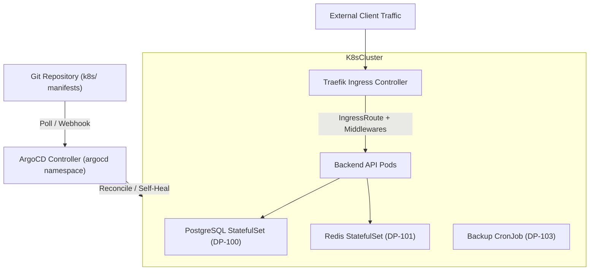

# 🐙 GitOps Continuous Delivery: ArgoCD & Traefik IngressRoute

**Topology**: Declarative GitOps Delivery with ArgoCD & Edge Ingress Routing via Traefik  
**Target Cluster**: Kubernetes (Staging / Production)  

---

## 1. GitOps Core Architecture

In this architecture, the Git repository acts as the **single source of truth** for all infrastructure and deployment configurations.



---

## 2. ArgoCD Application Manifest ([`k8s/argocd/application.yaml`](file:///c:/Users/Devasipason/Desktop/subject/moblie%20app/subscription_track/k8s/argocd/application.yaml))

- **Self-Healing (`selfHeal: true`)**: If someone manually edits or deletes a Kubernetes resource via `kubectl`, ArgoCD immediately detects configuration drift and resets the cluster back to the state declared in Git.
- **Automated Pruning (`prune: true`)**: When a manifest is deleted from Git, ArgoCD automatically removes the corresponding object from the cluster.
- **Namespace Isolation**: Deploys into `default` with automated namespace creation options enabled.

### Applying the ArgoCD Application:
```bash
kubectl apply -n argocd -f k8s/argocd/application.yaml
```

---

## 3. Traefik IngressRoute & Middlewares ([`k8s/traefik-ingressroute.yaml`](file:///c:/Users/Devasipason/Desktop/subject/moblie%20app/subscription_track/k8s/traefik-ingressroute.yaml))

Traefik replaces traditional ingress objects with modern, declarative Kubernetes CRDs (`traefik.io/v1alpha1`):

1. **IngressRoute**:
   - Listens on `web` (HTTP:80) and `websecure` (HTTPS:443).
   - Routes traffic matching `Host('api.subtracker.local')`, `/api`, and `/health` to service `taskflow` on port 8080.
2. **Security Headers Middleware**:
   - Injects `X-Frame-Options: DENY`, `X-Content-Type-Options: nosniff`, and `Strict-Transport-Security`.
3. **Rate Limiting Middleware**:
   - Restricts client requests to an average of 100 requests/second with a 50-request burst limit.
4. **Compression Middleware**:
   - Automatically applies Gzip compression to JSON responses.

### Applying Traefik IngressRoute:
```bash
kubectl apply -f k8s/traefik-ingressroute.yaml
```
