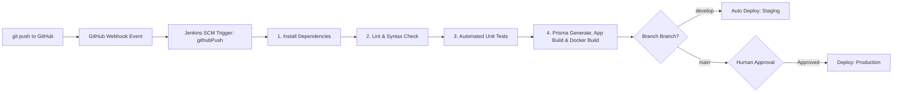

# 🔄 Jenkins Declarative Pipeline & SCM Webhook Setup Guide

**Workload**: Backend CI/CD Pipeline (`Jenkinsfile`)  
**Trigger Mechanism**: GitHub / SCM Webhook (`githubPush()`) + Fallback Polling (`pollSCM`)  

---

## 1. Overview & Pipeline Lifecycle

The backend CI pipeline is triggered automatically whenever code is pushed to any feature, develop, or main branch via SCM webhook integration.

---

## 2. GitHub Webhook Configuration

To connect your GitHub repository to Jenkins:

1. Navigate to **GitHub Repository Settings** > **Webhooks** > **Add webhook**.
2. **Payload URL**: `http://<YOUR_JENKINS_HOST>:8080/github-webhook/`
3. **Content type**: `application/json`
4. **Secret**: Optional shared secret token configured in Jenkins credentials.
5. **Which events would you like to trigger this webhook?**:
   - Select **Just the push event** (or **Pushes and Pull Requests**).
6. Click **Add webhook**.

---

## 3. Build Stage Mechanics (DP-400)

The pipeline executes a two-phase Build stage:
1. **Application Compilation**: Generates the Prisma ORM Client (`pnpm prisma:generate`) and compiles the TypeScript NestJS codebase into production JavaScript bundles (`pnpm build`).
2. **Container Image Build**: Packages the application using the multi-stage Dockerfile ([`apps/server/Dockerfile`](file:///c:/Users/Devasipason/Desktop/subject/moblie%20app/subscription_track/apps/server/Dockerfile)) tagged with the 7-character Git commit SHA (`${APP_NAME}:${SHORT_COMMIT}`).
