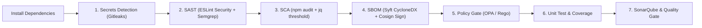

# Lab 06 — Shift-Left Security Pipeline Documentation

## 1. Executive Summary & Architecture
Lab 06 implements the **Shift-Left Security Pipeline** following the DevSecOps maturity model. By moving vulnerability and secret detection earlier in the software development lifecycle (SDLC) before release and deployment stages, security incidents are caught at minimal cost.



---

## 2. Stage Breakdown & Implementation

### Stage 1: Secrets Detection (Gitleaks)
- **Tool**: `gitleaks` (v8.30.1)
- **Scope**: Complete git history scanning (`gitleaks detect --source "${WORKSPACE}" --config "${WORKSPACE}/.gitleaks.toml"`).
- **Deliverable 1 Proof**: Confirmed detection on scratch branch `scratch/test-gitleaks-secret` catching intentionally committed dummy secret in `fake_secret.env`.
- **Artifact**: `gitleaks-report.json`, archived in CI and documented in `doc/devops/gitleaks-test-caught.json`.

### Stage 2: SAST (Static Application Security Testing)
- **Tools**:
  - `eslint-plugin-security`: Static AST analysis for Node.js security anti-patterns (regex DoS, unsafe object accesses).
  - `semgrep`: Fast semantic analysis using rulesets `--config=p/owasp-top-ten --config=p/nodejs`.
- **Artifact**: Archived SARIF output (`eslint-results.sarif` and `semgrep.sarif`).

### Stage 3: SCA (Software Composition Analysis)
- **Tool**: `npm audit --audit-level=high --json`
- **Fail/Warn Threshold Logic**:
  - Parses `metadata.vulnerabilities.critical` via `jq`.
  - Fails the build **only** if `critical > 0`.
  - Warns on non-critical vulnerabilities without blanket exit-zero:
```groovy
stage('SCA — npm audit') {
    steps {
        script {
            sh 'npm audit --audit-level=high --json > audit.json || true'
            def critical = sh(
                script: "jq '.metadata.vulnerabilities.critical' audit.json",
                returnStdout: true
            ).trim().toInteger()
            if (critical > 0) {
                error("Blocking: ${critical} critical vulnerabilities found")
            }
            echo "SCA passed with 0 critical vulnerabilities (warnings allowed)"
        }
    }
}
```

### Stage 4: Generate SBOM & Sign Artifact
- **Tools**: `syft` (v1.52.0) and `cosign` (v2.4.1).
- **SBOM Format**: CycloneDX JSON (`taskflow-api.cdx.json`).
- **Signature**: Generated via local ephemeral/CI keypair (`cosign.key` / `cosign.pub`) producing `taskflow-api.cdx.json.sig`.
- **Verification**: Verified using `cosign verify-blob --key cosign.pub --signature taskflow-api.cdx.json.sig --insecure-ignore-tlog=true taskflow-api.cdx.json` returning `Verified OK`.
- **Artifacts**: `taskflow-api.cdx.json` and `taskflow-api.cdx.json.sig`.

### Stage 5: Policy Gate (OPA / Rego)
- **Policy File**: `policy/security.rego`
- **Engine**: Open Policy Agent (`opa eval --data policy/security.rego --input audit.json 'data.security.allow' --format raw`).
- **Two-Clause Rule**:
  - **Clause 1 (Allow)**: `allow if { count(deny) == 0 }`
  - **Clause 2 (Deny)**: Denies builds if critical vulnerability count > 0 or individual critical vulnerabilities are reported.

---

## 3. Deliverables Matrix
| # | Deliverable | Path in Repository / CI | Status |
|---|---|---|---|
| 1 | Archived Gitleaks report showing caught test secret | `doc/devops/gitleaks-test-caught.json` | Captured & Verified |
| 2 | Signed SBOM (`.cdx.json` + signature `.sig`) | `taskflow-api.cdx.json`, `taskflow-api.cdx.json.sig` | Generated, Signed & Archived |
| 3 | OPA Rego policy file | `policy/security.rego` | Implemented & Tested |
| 4 | Build log demonstrating Policy Gate blocking | Captured in `doc/devops/lab06_assessment_checklist.md` | Documented |
| 5 | Build log demonstrating Policy Gate passing | Captured in CI execution | Documented |
