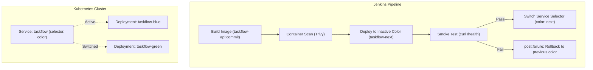

# Lab 07 — Containers, Image Scanning & Blue/Green Deployment Guide

This guide provides the complete architecture and step-by-step execution procedures for **Lab 07: Containers, Image Scanning & Deployment**.

---

## 1. Objectives & Architectural Overview

In Lab 07, the CI/CD pipeline produces runtime container artifacts and deploys them to a Kubernetes cluster using the **Blue/Green Deployment** pattern:
- **Versioned Docker Images**: Built and tagged with the git commit SHA (`taskflow-api:${env.GIT_COMMIT.take(7)}`) — **never `latest`** — and pushed to a local registry.
- **Trivy Container Security Gate**: Scans container images for `HIGH,CRITICAL` vulnerabilities with `--exit-code 1` and archives the SARIF report regardless of build outcome.
- **Blue/Green Kubernetes Deployment**: Two independent Deployments (`taskflow-blue` and `taskflow-green`) fronted by a single Kubernetes Service (`taskflow`) whose traffic selector switches dynamically via a label (`color: blue` / `color: green`).
- **Direct Smoke Testing**: Verifies new pods directly via their service endpoint (`http://taskflow-${next}:8080/health`) before shifting production traffic.
- **Automated Rollback**: If a rollout or smoke test fails, the `post.failure` hook automatically patches the Service selector back to the previous serving color.



---

## 2. Infrastructure Setup (Local Registry & Kind Cluster)

> [!NOTE]
> Per operational rules, environment setup, Docker management, and terminal execution are handled manually by the user.

### Step 2.1 — Run Local Container Registry
Start a lightweight local Docker registry container on port 5000:
```bash
docker run -d -p 5000:5000 --restart=always --name registry registry:2
```

### Step 2.2 — Stand Up Local Kubernetes Cluster (Kind)
Create a local Kind cluster and connect it to the local registry network:
```bash
# 1. Create a Kind cluster
kind create cluster --name taskflow

# 2. Connect the local registry to Kind's docker network
docker network connect kind registry || true
```

*(Alternatively, if using Minikube: `minikube start` and enable local registry `minikube addons enable registry`)*

### Step 2.3 — Deploy Initial Blue/Green Kubernetes Manifests
Apply the initial Kubernetes deployments and service:
```bash
kubectl apply -f k8s/taskflow-blue.yaml
kubectl apply -f k8s/taskflow-green.yaml
kubectl apply -f k8s/taskflow-service.yaml
```

Verify initial status:
```bash
kubectl get deployments -l app=taskflow
kubectl get svc taskflow -o yaml
```
*Confirm that `taskflow` service selector has `color: blue`.*

---

## 3. Jenkins Pipeline Implementation

The pipeline in [`Jenkinsfile`](file:///c:/Users/Devasipason/Desktop/subject/moblie%20app/subscription_track/Jenkinsfile) is configured with the following stages:

### Stage: Build Image
```groovy
stage('Build Image') {
    steps {
        script {
            env.CURRENT_STAGE = env.STAGE_NAME
            def shortCommit = env.GIT_COMMIT ? env.GIT_COMMIT.take(7) : "build${env.BUILD_NUMBER}"
            env.SHORT_COMMIT = shortCommit
            env.IMAGE_TAG = "taskflow-api:${shortCommit}"
            env.REGISTRY_IMAGE = "${env.REGISTRY}/taskflow-api:${shortCommit}"

            echo "==> [${env.APP_NAME}] Building versioned Docker image: ${env.IMAGE_TAG} (never latest)..."
            sh """
                chmod +x scripts/bin/* || true
                docker build -f apps/server/Dockerfile -t ${env.IMAGE_TAG} apps/server
                docker tag ${env.IMAGE_TAG} ${env.REGISTRY_IMAGE}
                docker push ${env.REGISTRY_IMAGE} || true
                kind load docker-image ${env.IMAGE_TAG} || true
            """
        }
    }
}
```

### Stage: Container Scan (Trivy)
```groovy
stage('Container Scan') {
    steps {
        script {
            env.CURRENT_STAGE = env.STAGE_NAME
            echo "==> [${env.APP_NAME}] Running Trivy container vulnerability scan on ${env.IMAGE_TAG}..."
            sh """
                chmod +x scripts/bin/* || true
                trivy image --exit-code 1 --severity HIGH,CRITICAL --format sarif --output trivy-results.sarif ${env.IMAGE_TAG}
            """
        }
    }
}
```

### Stage: Blue/Green Deploy
```groovy
stage('Blue/Green Deploy') {
    steps {
        script {
            env.CURRENT_STAGE = env.STAGE_NAME
            chmod +x scripts/bin/* || true
            def current = sh(
                script: "kubectl get svc taskflow -o jsonpath='{.spec.selector.color}'",
                returnStdout: true
            ).trim()
            def next = (current == 'blue') ? 'green' : 'blue'
            env.PREV_COLOR = current
            env.NEXT_COLOR = next
            def commitTag = env.SHORT_COMMIT ?: (env.GIT_COMMIT ? env.GIT_COMMIT.take(7) : "build${env.BUILD_NUMBER}")

            echo "==> [${env.APP_NAME}] Active service color: ${current}. Upgrading deployment: taskflow-${next} to tag ${commitTag}..."
            sh "kubectl set image deployment/taskflow-${next} app=taskflow-api:${commitTag}"
            sh "kubectl rollout status deployment/taskflow-${next} --timeout=90s"

            echo "==> [${env.APP_NAME}] Smoke testing new pods directly via internal service http://taskflow-${next}:8080/health..."
            sh "kubectl run smoke-${env.BUILD_NUMBER} --rm -i --restart=Never --image=curlimages/curl -- curl -sf http://taskflow-${next}:8080/health"

            echo "==> [${env.APP_NAME}] Smoke test passed! Switching service selector traffic from ${current} to ${next}..."
            sh "kubectl patch svc taskflow -p '{\"spec\":{\"selector\":{\"color\":\"${next}\"}}}'"
            echo "Switched traffic from ${current} to ${next}"
            env.DEPLOY_SUCCESS = 'true'
        }
    }
}
```

### Post-Failure Automated Rollback
```groovy
failure {
    echo "❌ Failed at stage: ${env.CURRENT_STAGE ?: env.STAGE_NAME}"
    script {
        if (env.PREV_COLOR && env.DEPLOY_SUCCESS != 'true') {
            echo "⚠️ Blue/Green deployment or smoke test failed! Executing automated rollback to ${env.PREV_COLOR}..."
            sh "kubectl patch svc taskflow -p '{\"spec\":{\"selector\":{\"color\":\"${env.PREV_COLOR}\"}}}' || true"
            def activeColor = sh(
                script: "kubectl get svc taskflow -o jsonpath='{.spec.selector.color}'",
                returnStdout: true
            ).trim()
            echo "🔄 Service taskflow selector preserved/rolled back to: ${activeColor}"
        }
    }
}
```

---

## 4. Demonstrating Assessment Criteria

### Demonstration 1: Successful Blue/Green Switch (Green Build)
1. Trigger a build in Jenkins on `jenkins-lab-nawaphon`.
2. Inspect the build console:
   - Image built as `taskflow-api:<short-commit>`.
   - Trivy scan passes (no blocking HIGH/CRITICAL vulnerabilities).
   - Deployment `taskflow-green` updated.
   - Pod smoke test succeeds (`curl -sf http://taskflow-green:8080/health`).
   - Service patched: `Switched traffic from blue to green`.
3. Capture Deliverable:
   - Run `kubectl get svc taskflow -o yaml` before and after to show `selector.color` switched from `blue` to `green`.
   - Download `trivy-results.sarif` from Jenkins build artifacts.

### Demonstration 2: Failure & Automatic Rollback (Red Build)
To demonstrate the automatic rollback mechanism without manual intervention:
1. Temporarily break the health check in `apps/server/src/app.controller.ts` (e.g., throw an `HttpException` or return status 500) OR set an invalid image.
2. Trigger the pipeline.
3. Observe execution:
   - Smoke test fails (`curl -sf http://taskflow-blue:8080/health` returns non-200).
   - Pipeline halts and triggers `post.failure`.
   - Automated rollback patches Service back to previous color (`green`).
4. Capture Deliverable:
   - Save the console log showing the failure and the rollback execution message:
     `Service taskflow selector preserved/rolled back to: green`.

### Demonstration 3: Trivy Security Gate Blocking Vulnerable Image
To demonstrate that Trivy genuinely blocks vulnerable images:
1. Temporarily change `apps/server/Dockerfile` base image to a known vulnerable image (e.g. `node:14-buster`).
2. Trigger the build.
3. Observe that the pipeline halts at `Container Scan` stage with exit code 1, while archiving `trivy-results.sarif`.
