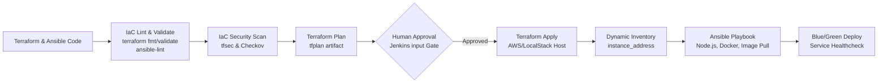

# Lab 08: Infrastructure as Code (IaC) in the CI/CD Pipeline

## 1. Overview & Architecture

Lab 08 transitions the taskflow-api deployment from pre-existing static clusters to automated, declarative Infrastructure as Code (IaC). Every infrastructure change is version-controlled, linted, security-scanned, gated behind human approval, and automatically provisioned and configured.



---

## 2. Infrastructure Specifications

### 2.1 Terraform Configuration (`infra/terraform/`)

- [backend.tf](file:///c:/Users/Devasipason/Desktop/subject/moblie%20app/subscription_track/infra/terraform/backend.tf): Remote state stored in S3/LocalStack bucket `taskflow-terraform-state` under key `infra/state/terraform.tfstate`.
- [provider.tf](file:///c:/Users/Devasipason/Desktop/subject/moblie%20app/subscription_track/infra/terraform/provider.tf): Configures AWS provider with LocalStack endpoint support and standard resource tags.
- [variables.tf](file:///c:/Users/Devasipason/Desktop/subject/moblie%20app/subscription_track/infra/terraform/variables.tf): Defines parameters for region, instance type (`t3.medium`), AMI, application port (8080), and restricted SSH CIDRs.
- [main.tf](file:///c:/Users/Devasipason/Desktop/subject/moblie%20app/subscription_track/infra/terraform/main.tf):
  - `aws_security_group.taskflow_sg`: Ingress on port 8080, restricted ingress on SSH 22, full egress with descriptive tags.
  - `aws_instance.taskflow_host`: EC2 compute instance with gp3 encrypted root block storage (`encrypted = true`) and IMDSv2 token enforcement (`http_tokens = "required"`).
- [outputs.tf](file:///c:/Users/Devasipason/Desktop/subject/moblie%20app/subscription_track/infra/terraform/outputs.tf): Exposes `instance_id`, `instance_address`, `instance_private_ip`, and `security_group_id`.

---

### 2.2 Ansible Configuration (`infra/ansible/`)

- [playbook.yml](file:///c:/Users/Devasipason/Desktop/subject/moblie%20app/subscription_track/infra/ansible/playbook.yml):
  - Updates package cache.
  - Installs prerequisites (`curl`, `gnupg`, `ca-certificates`, `lsb-release`).
  - Installs Node.js runtime and npm.
  - Installs and enables Docker service.
  - Pulls the versioned `taskflow-api` container image built in CI.
  - Validates Node.js version on host.
- [ansible.cfg](file:///c:/Users/Devasipason/Desktop/subject/moblie%20app/subscription_track/infra/ansible/ansible.cfg): Configures SSH connection optimization, timeout, and privileges.

---

## 3. Jenkins Pipeline Stages Breakdown

```groovy
stage('IaC Lint & Validate') {
    parallel {
        stage('Terraform Validate') { ... }
        stage('Ansible Lint') { ... }
    }
}
stage('IaC Security Scan') { ... }
stage('Terraform Plan') { ... }
stage('Terraform Approval') { ... }
stage('Terraform Apply') { ... }
stage('Configure with Ansible') { ... }
```

1. **IaC Lint & Validate**:
   - `terraform validate` ensures valid HCL syntax and internal consistency.
   - `terraform fmt -check -recursive` ensures uniform indentation and formatting.
   - `ansible-lint` enforces Ansible best practices and modern collection standards.

2. **IaC Security Scan**:
   - `tfsec` scans for cloud misconfigurations (e.g. unencrypted storage, exposed ports, IMDSv1).
   - `checkov` evaluates policy checks against industry security frameworks.

3. **Terraform Plan & Approval Gate**:
   - Generates binary `tfplan` and human-readable `tfplan.txt`.
   - Halts pipeline execution at `input` prompt requiring manual review of planned resource changes before apply.

4. **Terraform Apply & Ansible Provisioning**:
   - Applies `tfplan` non-interactively (`-input=false`).
   - Dynamically writes `instance_address` to `infra/ansible/inventory.ini`.
   - Executes Ansible playbook against provisioned host.

---

## 4. Teardown & Verification

To confirm zero residual cloud resources upon session conclusion:
```bash
cd infra/terraform
terraform destroy -auto-approve
terraform show
```
