# Lab 10 — Capstone: End-to-End Pipeline Architecture & Rollback Runbook

---

## 1. End-to-End Pipeline Architecture

The **TaskFlow Capstone CI/CD Pipeline** integrates all automated quality, security, packaging, verification, and deployment stages across two coordinated repositories/workspaces:
1. **`taskflow-api`** (Backend NestJS Modular Monolith / Microservices)
2. **`taskflow-mobile`** (Frontend Flutter Android/iOS Client)

```mermaid
flowchart TD
    subgraph SCM["Source Control & Trigger"]
        Commit["Git Commit / Push<br/>(jenkins-lab-nawaphon / main)"]
    end

    subgraph API_Pipeline["taskflow-api Pipeline (Jenkinsfile)"]
        A1["Stage: Install & Setup<br/>(Cache-first npm install)"]
        A2["Stage: Secrets Detection<br/>(Gitleaks scan)"]
        
        subgraph API_Parallel["Parallel Quality & Security Gates"]
            A3a["Lint & Static Check<br/>(ESLint --max-warnings 0)"]
            A3b["Unit Tests & Coverage<br/>(Jest/Vitest JUnit/LCOV)"]
            A3c["SAST Analysis<br/>(ESLint Security & Semgrep SARIF)"]
            A3d["SCA & Dep Audit<br/>(npm audit --audit-level=high)"]
        end

        A4["Stage: Generate SBOM & Sign<br/>(Syft CycloneDX + Cosign keypair)"]
        A5["Stage: Policy Gate<br/>(OPA Rego policy/security.rego)"]
        A6["Stage: SonarQube & Quality Gate<br/>(SonarQube Server + waitForQualityGate)"]
        A7["Stage: Build Image<br/>(Immutable tag: short-commit)"]
        A8["Stage: Container Scan<br/>(Trivy exit-code 1 for High/Critical)"]
        A9["Stage: Pipeline Health Gate<br/>(Prometheus rolling build success >= 90%)"]
        A10["Stage: Deploy — Production<br/>(K8s Blue/Green rollout + Smoke Test + Traffic Switch)"]
        A11["Post Actions: Slack Notifications + Artifacts Archival"]
    end

    subgraph Mobile_Pipeline["taskflow-mobile Pipeline (apps/mobile/Jenkinsfile)"]
        M1["Stage: Install Dependencies<br/>(flutter pub get)"]
        
        subgraph Mobile_Parallel["Parallel Analysis & Test"]
            M2a["Flutter Analyze<br/>(flutter analyze)"]
            M2b["Flutter Test<br/>(flutter test --coverage)"]
            M2c["SCA Security Check<br/>(OSV-Scanner pubspec.lock)"]
        end

        M3["Stage: Build Debug APK<br/>(flutter build apk --debug)"]
        M4["Stage: Build Signed Release AAB<br/>(flutter build appbundle --release with Keystore credentials)"]
        M5["Post Actions: Slack Notification + APK/AAB/Coverage Archival"]
    end

    Commit --> A1
    A1 --> A2
    A2 --> API_Parallel
    A3a --> A4
    A3b --> A4
    A3c --> A4
    A3d --> A4
    A4 --> A5
    A5 --> A6
    A6 --> A7
    A7 --> A8
    A8 --> A9
    A9 --> A10
    A10 --> A11

    Commit --> M1
    M1 --> Mobile_Parallel
    M2a --> M3
    M2b --> M3
    M2c --> M3
    M3 --> M4
    M4 --> M5
```



---

## 2. Pipeline Gates & Verification Matrix

| Pipeline | Gate Name | Tool / Mechanism | Pass Condition | Failure Action |
|---|---|---|---|---|
| **API** | Secrets Detection | `gitleaks detect` | 0 leaked API keys, tokens, or credentials | Fail immediately; report JSON saved |
| **API** | SAST Gate | `semgrep` & `eslint-plugin-security` | No OWASP Top 10 High/Critical flaws | Fail fast; emit SARIF report |
| **API** | SCA Gate | `npm audit` & `jq` | Critical vulnerabilities = 0 | Fail fast |
| **API** | OPA Policy Gate | `opa eval policy/security.rego` | `data.security.allow == true` | Abort build; output deny reasons |
| **API** | Quality Gate | SonarQube `waitForQualityGate` | Coverage > threshold, 0 bugs/vulnerabilities | Build marked unstable/failed |
| **API** | Container Scan | `trivy image --exit-code 1` | 0 unpatched High/Critical CVEs | Abort before staging/k8s deploy |
| **API** | Pipeline Health Gate | Prometheus HTTP API query | Rolling 20-build success rate >= 90% | Abort deploy; prevent cascade failures |
| **API** | Smoke Test Gate | `curlimages/curl` pod | `GET http://taskflow-{next}:8080/health` HTTP 200 | Auto-rollback to previous color |
| **Mobile** | Flutter Analyze | `flutter analyze` | 0 errors / lints | Fail build |
| **Mobile** | Flutter Test | `flutter test --coverage` | All widget & unit tests green | Fail build |
| **Mobile** | OSV-Scanner SCA | `osv-scanner` | 0 critical package CVEs in `pubspec.lock` | Log report & gate build |
| **Mobile** | Release Signing Gate | Keystore secret binding | Valid keystore signature present on `main` | Fail release package generation |

---

## 3. Production Rollback Runbook (On-Call Engineer)

### Incident Trigger
The pipeline fails during `Deploy — Production (Blue/Green)` stage (e.g., failed pod readiness, crash loop, or smoke test non-200 HTTP code) or post-deploy health alerts fire in Prometheus/Grafana.

### Automated Mitigation (Level 0)
The Jenkins pipeline automatically executes a rollback in `post.failure`:
```groovy
kubectl patch svc taskflow -p "{\"spec\":{\"selector\":{\"color\":\"${PREV_COLOR}\"}}}"
```
This instantly repoints incoming cluster traffic back to the proven active deployment (`taskflow-blue` or `taskflow-green`).

---

### Manual Emergency Runbook (Level 1)

If manual on-call intervention is required:

#### Step 1: Verify Current Traffic Routing
Check which color is currently receiving production traffic:
```bash
kubectl get svc taskflow -o jsonpath='{.spec.selector.color}'
```

#### Step 2: Check Deployment Health & Pod Status
Inspect both Blue and Green deployment replicas:
```bash
kubectl get deployments -l app=taskflow-api
kubectl get pods -l app=taskflow-api -o wide
```

#### Step 3: Force Immediate Traffic Switch to Healthy Color
If traffic is directed to an unhealthy color (e.g., `green` is crashing, switch to `blue`):
```bash
kubectl patch svc taskflow -p '{"spec":{"selector":{"color":"blue"}}}'
```
*(Or replace `"blue"` with `"green"` if blue was the failing deployment).*

#### Step 4: Verify Service Endpoints & Health Check
Verify that the service endpoints are bound to healthy pods:
```bash
kubectl get endpoints taskflow
kubectl run rollback-verify --rm -i --restart=Never --image=curlimages/curl -- curl -sf http://taskflow:8080/health
```

#### Step 5: Isolate Unhealthy Deployment for Diagnostics
Scale down or isolate the failed deployment to prevent resource starvation:
```bash
kubectl logs -l app=taskflow-api,color=green --tail=100
kubectl describe deployment taskflow-green
```

#### Step 6: Post-Mortem & Notification
1. Notify the engineering team in Slack channel `#ci-deployments` with the commit hash and error log.
2. File an incident post-mortem documenting root cause, recovery time (MTTR), and corrective action.

---

## 4. Live Demo Walkthrough Guide

### Demo Scenario 1: Pushing a Valid Feature (Green Path)
1. **Change**: Add a new API field (e.g. `billingCycle: 'monthly' | 'yearly'`) in `apps/server/src/subscriptions` and surface it in `apps/mobile/lib`.
2. **Commit & Push**:
   ```bash
   git add apps/server apps/mobile
   git commit -m "feat(api,mobile): add billingCycle field to subscription payload"
   git push origin jenkins-lab-nawaphon
   ```
3. **Narration Flow**:
   - **Install & Secret Detection**: Point out Gitleaks verifying no developer credentials leaked in commit history.
   - **Parallel Stage**: Show Lint, Unit Test, SAST (Semgrep/ESLint security), and SCA (npm audit) executing simultaneously in parallel slots.
   - **SBOM & Cosign**: Show CycloneDX JSON generated and signed with Cosign keypair.
   - **Policy Gate**: OPA evaluating `security.rego` verifying policy compliance.
   - **SonarQube Quality Gate**: Static code metrics passed.
   - **Build & Trivy Scan**: Immutable image tagged with commit SHA; Trivy scanning for zero High/Critical CVEs.
   - **Prometheus Pipeline Health Gate**: Rolling 20-build success rate verified >= 90%.
   - **Blue/Green Deployment**: New pod started on inactive color, smoke test verified internal `/health`, service patched to switch traffic seamlessly with zero downtime.
   - **Mobile Pipeline**: Flutter analyze, widget tests, OSV-Scanner SCA, and Debug APK build successfully generated and archived.

### Demo Scenario 2: Gate Actively Blocking a Bad Change (Red Path Demo)
1. **Simulate Gate Violation**: Introduce a high-severity vulnerability or policy violation (e.g., adding an intentionally insecure dependency or a secret in commit).
2. **Trigger Pipeline**: Push branch to Jenkins.
3. **Narration Flow**:
   - Show the specific gate (e.g., **Policy Gate** or **Container Scan**) catching the violation.
   - Show the pipeline aborting immediately before any container build or production deployment occurs.
   - Point out the Slack alert notification detailing the exact failed stage and build URL.
