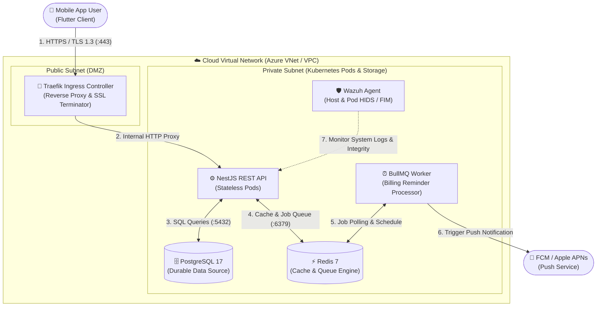

# 🐉 OWASP Threat Dragon — Threat Modeling Template & Analysis (DP-005)

**Project:** Subscription Track  
**Task ID:** `DP-005` (Issue #63)  
**Lead & Author:** `zukataiyo` (Security & Cloud Infrastructure Lead)  
**Standard:** OWASP Threat Dragon v2 (STRIDE Methodology)  
**Model File:** [`subscription-track-threat-model.json`](./subscription-track-threat-model.json)

---

## 1. 📌 วัตถุประสงค์ (Overview)

เอกสารและไฟล์โมเดลนี้จัดทำขึ้นตามข้อกำหนดของงาน **DP-005** เพื่อวางรากฐานด้านความปลอดภัย (**Security by Design**) ในขั้นตอน **Plan** ของสถาปัตยกรรม DevSecOps 

โดยนำสถาปัตยกรรมระบบทั้งหมด (Mobile App, Traefik Ingress, NestJS API, BullMQ Worker, PostgreSQL, Redis, Cloud Network) มาสร้างเป็น **Data Flow Diagram (DFD)** และประเมินความเสี่ยงตามมาตรฐาน **STRIDE** ของ OWASP ก่อนเริ่มนำระบบขึ้น Cloud จริง

---

## 2. 🗺️ Data Flow Diagram (DFD) & Architecture Trust Boundaries

---

## 3. 🎯 การวิเคราะห์ภัยคุกคามตามกรอบ STRIDE Matrix

| องค์ประกอบ (Component) | ประเภท STRIDE | ภัยคุกคาม (Threat Scenario) | ระดับความเสี่ยง (Severity) | มาตรการป้องกัน / รับมือ (Mitigation Strategy) | Task ที่รับผิดชอบ |
|:---|:---:|:---|:---:|:---|:---:|
| **Mobile App (Flutter)** | **S** - Spoofing | เครื่องสูญหายหรือถูกเข้าถึงโดยไม่ได้รับอนุญาต | **Medium** | บังคับยืนยันรหัส **Security PIN 6 หลัก** ก่อนทำธุรกรรมสำคัญ (เช่น แก้ไขบัตร, ลบการสมัคร) | Done (Mobile) |
| **Mobile App (Flutter)** | **I** - Info Disclosure | Token ถูกแอบอ่านจาก Client Storage | **High** | จัดเก็บ Access/Refresh Token ใน **Hardware-backed Secure Storage** (Keychain/KeyStore) เท่านั้น | Done (Mobile) |
| **Traefik Ingress** | **D** - Denial of Service | โดนยิง DDoS / API Flooding โจมตีจนเซิร์ฟเวอร์ล่ม | **High** | ติดตั้ง **Traefik RateLimiting Middleware** จำกัดจำนวน Request ต่อ IP และกำหนด ResourceQuota | **DP-303 / DP-202** |
| **Traefik Ingress** | **I** - Info Disclosure | ถูกดักฟังข้อมูลระหว่างทาง (Man-in-the-Middle) | **High** | บังคับใช้ **TLS 1.3** เข้ารหัส 100% พร้อมจัดการใบรับรอง SSL อัตโนมัติด้วย Let's Encrypt (ACME) | **DP-301** |
| **Traefik Ingress** | **T** - Tampering | บอทสแกนหาช่องโหว่และยิง Header แปลกปลอม | **Medium** | เพิ่ม Security Headers Middleware (`X-Content-Type-Options`, `HSTS`, `CSP`) และบล็อก User-Agent บอท | **DP-303** |
| **NestJS Backend API** | **E** - Elevation of Privilege | BOLA / IDOR (ผู้ใช้ A แอบเข้าถึงหรือลบข้อมูลของ B) | **High** | ตรวจสอบความเป็นเจ้าของ (`CurrentUser`) ในทุก Service Layer หากไม่ใช่เจ้าของให้ตอบกลับเป็น `404 Concealment` | **BE-206** |
| **NestJS Backend API** | **S** - Spoofing | ปลอมแปลง JWT Token เพื่อสวมรอยเป็น Admin | **High** | ตรวจสอบ Signature ด้วยความลับ `JWT_SECRET` ที่เข้ารหัสผ่าน **Ansible Vault** และมีระบบ Refresh Token Rotation | **DP-102** |
| **NestJS Backend API** | **T** - Tampering | การโจมตีประเภท SQL Injection | **High** | ใช้ Parameterized Queries ผ่าน TypeORM / Prisma และตรวจ Schema ขาเข้าด้วย `class-validator` | Done (Backend) |
| **PostgreSQL 17** | **I** - Info Disclosure | ฐานข้อมูลถูกเข้าถึงจากภายนอกโดยตรง | **Critical** | ล็อกพอร์ต 5432 ให้อยู่เฉพาะใน **Private Subnet** ห้ามเปิด Public IP และกั้นด้วย NetworkSecurityGroup (NSG) | **DP-200 / DP-302** |
| **PostgreSQL 17** | **D** - Denial of Service | ข้อมูลสูญหายจากเครื่องพัง | **High** | บันทึกลง Persistent Volume (PVC) และทำสำรองข้อมูลอัตโนมัติ (Automated Backup Cronjob) | **DP-100 / DP-103** |
| **K8s Worker Nodes** | **E** - Elevation of Privilege | Attacker เจาะ Container ทะลุออกมายังระดับ Host | **Critical** | ติดตั้ง **Wazuh Agent** ตรวจจับ File Integrity Monitoring (FIM), Rootkit และส่ง Alert ไปยัง SIEM ทันที | **DP-203** |

---

## 4. 💻 วิธีการเปิดดูและแก้ไขไฟล์ด้วยโปรแกรม OWASP Threat Dragon

คุณสามารถนำไฟล์ [`subscription-track-threat-model.json`](./subscription-track-threat-model.json) ไปเปิดในโปรแกรมได้ง่ายๆ 2 วิธี:

### วิธีที่ 1: เปิดผ่าน Web App (ไม่ต้องติดตั้งโปรแกรม)
1. เปิดเบราว์เซอร์ไปที่ [https://threatdragon.github.io/](https://threatdragon.github.io/)
2. เลือก **Open an existing model from file**
3. เลือกไฟล์ `subscription-track-threat-model.json` จากโฟลเดอร์นี้
4. คุณจะเห็นแผนผัง DFD และรายการ Threats พร้อมวิธี Mitigation ทั้งหมดแบบ Interactive

### วิธีที่ 2: เปิดผ่าน Desktop Application
1. ดาวน์โหลดโปรแกรม [OWASP Threat Dragon Desktop](https://github.com/OWASP/threat-dragon/releases)
2. เปิดโปรแกรมแล้วคลิก **Open Project** $\rightarrow$ เลือกไฟล์ JSON นี้
3. สามารถแก้ไข, เพิ่ม Threats หรือ Export เป็นรายงาน PDF / JSON ได้ทันที

---

## 5. 🔗 ความเชื่อมโยงกับงานอื่นๆ ในโปรเจกต์
ผลจากการทำ Threat Model ในเอกสารนี้ ได้ถูกนำไปแปลงเป็นงานจริงใน Backlog ดังนี้:
* **DP-200:** กั้น Private Subnet และ NSG ป้องกันฐานข้อมูลรั่วไหล
* **DP-202:** ป้องกัน Denial of Service ด้วย ResourceQuota
* **DP-203:** ติดตั้ง Wazuh Agent ตรวจจับการบุกรุกระดับ Host
* **DP-301 & DP-303:** กำหนด Traefik Ingress ให้ทำ TLS 1.3, Rate Limiting และ Security Headers
