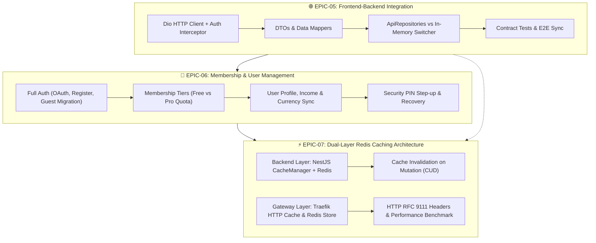
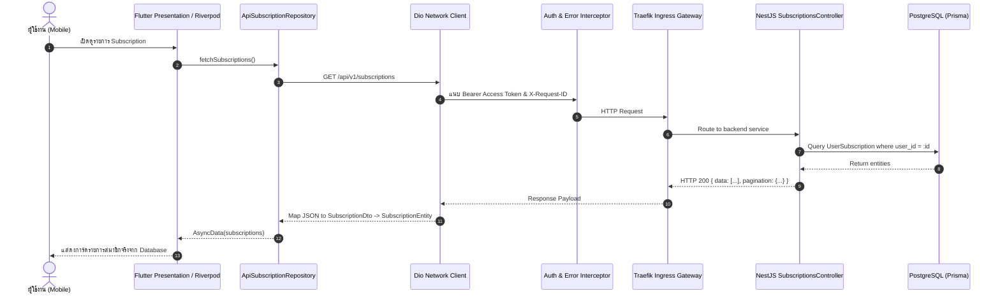
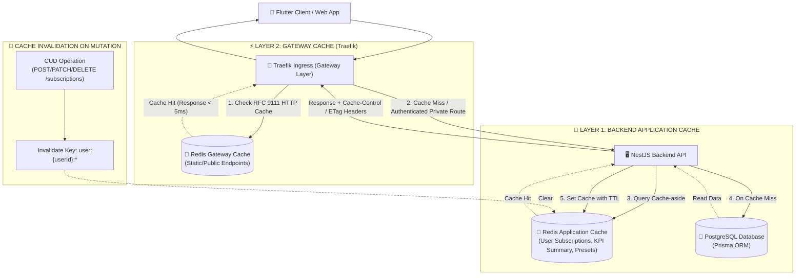

# 🚀 Roadmap & Epics Specification: Next-Phase Full-Stack Evolution

**Project:** Subscription Track (Full-Stack Monorepo)  
**Target Phase:** Phase 1.0 — Production Integration & High-Performance Platform  
**Team Members:**  
- 👤 **เน (Person 1 - Lead Architecture & Frontend Lead)**  
- 👤 **นะ (Person 2 - Subscription, Caching & Data Integration Lead)**  
- 👤 **อาทิตย์ (Person 3 - Auth, Membership & Security Lead)**  
**Status:** 📋 Proposed & Ready for Execution  
**Created Date:** 1 ตุลาคม 2026  

---

## 📌 Executive Summary

หลังจากทีมงานพัฒนา **Frontend MVP Feature-Complete (13 Screens/Sheets, 43 Tests Passing)** และ **Backend Modular Monolith Baseline (Prisma, PostgreSQL, BullMQ, Swagger, Docker/K8s)** เสร็จสิ้นสมบูรณ์ เอกสารฉบับนี้กำหนดรายละเอียด **3 Epics เชิงกลยุทธ์** เพื่อนำระบบก้าวสู่ Production-Ready อย่างแท้จริง:



---

## 👥 ภาพรวมการกระจายภาระงาน (Team Allocation Matrix)

| สมาชิก | บทบาทหลักใน 3 Epics | EPIC-05 (เชื่อมต่อ API) | EPIC-06 (ระบบสมาชิก) | EPIC-07 (Redis Caching) | ชั่วโมงรวม |
|---|---|---|---|---|:---:|
| **เน (Person 1)** | Lead Architecture & Traefik Gateway | • Network Layer (Dio)<br>• Riverpod API Wiring<br>• Error State Handling | • UI Membership/Upgrade Screen<br>• Profile & Settings Binding | • Traefik Ingress Cache Config<br>• RFC 9111 Cache-Control Rules<br>• K6 Load Testing | **58 ชม.** |
| **นะ (Person 2)** | Subscriptions & Backend Caching | • Subscriptions API Client<br>• Payment Cards Integration<br>• DTOs Serialization | • Subscription Quota Enforcement<br>• Guest Subscription Migration | • NestJS CacheModule Setup<br>• Subscriptions Cache-Aside<br>• Cache Invalidation Interceptor | **62 ชม.** |
| **อาทิตย์ (Person 3)** | Auth, Security & Membership Core | • Auth Interceptor (Bearer & 401)<br>• PIN Step-up Token Header<br>• Network Security Config | • Registration & OAuth Backend/App<br>• Membership Tier Data Model<br>• PIN Step-up & Reset Workflow | • Redis Token Blacklist/Session<br>• User Profile Redis Cache | **60 ชม.** |
| **รวมทั้งทีม** | | **64 ชม.** | **60 ชม.** | **56 ชม.** | **180 ชม.** |

---

# 🌐 EPIC-05: การเชื่อมต่อ Frontend (Flutter) และ Backend (NestJS)
> **Epic ID:** `EPIC-05-FE-BE-INTEGRATION`  
> **Priority:** 🔴 High (Blocker สำหรับระบบสมาชิกและการเก็บข้อมูลจริง)  
> **Owner:** เน (Lead) ร่วมกับ นะ และ อาทิตย์  
> **Estimated Effort:** 64 ชั่วโมง  

### 1. วัตถุประสงค์ (Objective)
เชื่อมต่อแอปพลิเคชัน Flutter บนมือถือเข้ากับ REST API ของ NestJS อย่างสมบูรณ์ โดยเปลี่ยนผ่านจาก `InMemorySubscriptionRepository` มาใช้ `ApiSubscriptionRepository` ที่ติดต่อกับฐานข้อมูล PostgreSQL จริงผ่านเครือข่าย พร้อมรองรับการทำงานแบบ Offline/Mock fallback และการจัดการ Token อัตโนมัติ

### 2. สถาปัตยกรรมทางเทคนิค (Technical Architecture)



### 3. ขอบเขตงานและ User Stories (Scope & User Stories)

#### 🔹 Story 5.1: Flutter Network Infrastructure & Dio Client Setup
- **As a** นักพัฒนาโมบายล์
- **I want to** มี HTTP Client แบบรวมศูนย์ที่จัดการ Base URL ตาม Environment (Localhost, Android Emulator `10.0.2.2`, Dev VM, Production)
- **So that** โค้ดส่วนอื่นๆ สามารถเรียกใช้ API ได้โดยไม่ต้อง hardcode ค่า IP/Port และสลับ Environment ได้ง่าย
- **Acceptance Criteria:**
  - [ ] ติดตั้งแพ็กเกจ `dio` และ `pretty_dio_logger` (Debug mode only) ใน `apps/mobile/pubspec.yaml`
  - [ ] สร้าง `ApiClient` พร้อม Timeout: Connect 10s, Receive 10s, Send 10s
  - [ ] สร้าง Interceptor สำหรับแนบ `Authorization: Bearer <token>` อัตโนมัติจาก Secure Storage
  - [ ] ดักจับ HTTP 401 Unauthorized และสั่ง Trigger Refresh Token Flow อัตโนมัติ หาก Refresh ไม่ผ่านให้เคลียร์ Session และนำทางไปยัง Login Screen
  - [ ] รองรับ Header พิเศษ `X-PIN-Verification: <token>` สำหรับ Endpoint ที่ต้องการการยืนยัน PIN ขั้นสูง

#### 🔹 Story 5.2: DTOs, JSON Serialization & Clean Architecture Mappers
- **As a** นักพัฒนา
- **I want to** มี Data Transfer Objects (DTOs) ที่ตรงตาม `doc/backend/api/openapi_v1.yaml`
- **So that** ข้อมูลที่รับ/ส่งกับ Backend สอดคล้องกับ API Contract อย่างสมบูรณ์
- **Acceptance Criteria:**
  - [ ] สร้าง Request/Response DTOs: `SubscriptionResponseDto`, `CreateSubscriptionDto`, `UpdateSubscriptionDto`, `CardResponseDto`, `UserDto`
  - [ ] ใช้ `json_serializable` ในการแปลง JSON ↔ DTO
  - [ ] สร้าง Mapper function แปลงระหว่าง DTO กับ Domain Entity เพื่อป้องกันไม่ให้โครงสร้าง API ผูกมัดกับ UI logic

#### 🔹 Story 5.3: Real API Repositories Implementation
- **As a** ผู้ใช้งาน
- **I want to** สามารถ เพิ่ม/ลบ/แก้ไข/ดู รายการ Subscription, บัตรชำระเงิน, และประวัติการยกเลิก แล้วข้อมูลถูกบันทึกจริง
- **So that** ข้อมูลของฉันไม่สูญหายเมื่อปิดแอปพลิเคชัน
- **Acceptance Criteria:**
  - [ ] สร้าง `ApiSubscriptionRepository` implements `SubscriptionRepository`
  - [ ] สร้าง `ApiPaymentCardRepository` implements `PaymentCardRepository`
  - [ ] สร้าง `ApiSavingsRepository` implements `SavingsRepository`
  - [ ] สร้าง `ApiNotificationRepository` implements `NotificationRepository`
  - [ ] สร้าง Environment Toggle ผ่าน Riverpod Provider (`useMockDataProvider`) ทำให้สามารถสลับโหมด Mock และ Real API ได้จากหน้านักพัฒนา (Debug Settings)

#### 🔹 Story 5.4: Comprehensive Error Handling & Network Resilience
- **As a** ผู้ใช้งาน
- **I want to** ได้รับข้อความแจ้งเตือนที่เข้าใจง่ายเมื่อเกิดปัญหาทางเครือข่ายหรือข้อผิดพลาดจากเซิร์ฟเวอร์
- **So that** ฉันเข้าใจสาเหตุและสามารถกดลองใหม่ (Retry) ได้
- **Acceptance Criteria:**
  - [ ] แปลง HTTP Status Codes (400, 403, 404, 409, 429, 500) และ Network Timeout เป็น `AppException` (เช่น `NoInternetException`, `SessionExpiredException`, `ValidationException`)
  - [ ] แสดง Reusable Error Banner หรือ SnackBar พร้อมปุ่ม "ลองอีกครั้ง (Retry)" ใน UI

### 4. รายการงานย่อยและการประเมินเวลา (Task Breakdown)

| รหัสงาน | ชื่องาน | ผู้รับผิดชอบ | ความยาก | ชม. | สถานะ |
|---|---|---|:---:|:---:|:---:|
| `TASK-501` | ติดตั้งและคอนฟิก Dio Client, Base URL Environment Provider | เน | ⭐⭐ | 8 | 📝 Ready |
| `TASK-502` | สร้าง Auth Token & Refresh Interceptor + PIN Step-up Header | อาทิตย์ | ⭐⭐⭐ | 14 | 📝 Ready |
| `TASK-503` | ออกแบบ DTOs และ Mappers ทั้งหมดตาม OpenAPI v1 Contract | นะ | ⭐⭐ | 12 | 📝 Ready |
| `TASK-504` | พัฒนา `ApiSubscriptionRepository` และทดสอบ CRUD กับ Backend | นะ | ⭐⭐⭐ | 14 | 📝 Ready |
| `TASK-505` | พัฒนา `ApiPaymentCardRepository` & `ApiSavingsRepository` | เน | ⭐⭐ | 8 | 📝 Ready |
| `TASK-506` | จัดทำ Error Handling Layer & UI Retry Mechanism | เน | ⭐ | 8 | 📝 Ready |

---

# 👑 EPIC-06: การพัฒนาระบบสมาชิก (Membership & User Management System)
> **Epic ID:** `EPIC-06-MEMBERSHIP-SYSTEM`  
> **Priority:** 🔴 High (Core Business Domain)  
> **Owner:** อาทิตย์ (Lead) ร่วมกับ เน และ นะ  
> **Estimated Effort:** 60 ชั่วโมง  

### 1. วัตถุประสงค์ (Objective)
ยกระดับระบบผู้ใช้งานจากระดับ Basic Auth/Mock สู่ **ระบบสมาชิกเต็มรูปแบบ (Membership Platform)** รองรับการลงทะเบียนด้วย Email/Password, OAuth (Google/Apple), การย้ายข้อมูลจาก Guest Mode, การแบ่งระดับสมาชิก (Membership Tiers: Free vs Pro) พร้อมการจำกัดโควต้าการใช้งาน และระบบความปลอดภัยยืนยันตัวตนด้วย Security PIN 6 หลัก

### 2. สถาปัตยกรรมระดับสมาชิกและโควต้า (Membership Architecture)

```text
┌────────────────────────────────────────────────────────────────────────┐
│                        MEMBERSHIP TIERS & QUOTA                        │
├───────────────────────────────────┬────────────────────────────────────┤
│           🌱 FREE TIER            │           💎 PRO TIER              │
├───────────────────────────────────┼────────────────────────────────────┤
│ • ติดตามได้สูงสุด 5 บริการ (Limit 5) │ • ไม่จำกัดจำนวนบริการ (Unlimited)  │
│ • ผูกบัตรชำระเงินได้ 1 ใบ          │ • ผูกบัตรชำระเงินได้ไม่จำกัด        │
│ • แจ้งเตือนล่วงหน้า 1 รูปแบบ (3 วัน)│ • แจ้งเตือนแบบกำหนดเอง (1, 3, 7 วัน)│
│ • Creep Score ขั้นพื้นฐาน          │ • Creep Score ขั้นสูง + AI Insights│
│ • โฆษณา/ฟีเจอร์พื้นฐาน             │ • ส่งออกข้อมูล CSV/PDF รายงานการเงิน│
└───────────────────────────────────┴────────────────────────────────────┘
```

### 3. ขอบเขตงานและ User Stories (Scope & User Stories)

#### 🔹 Story 6.1: Full Authentication & OAuth 2.0 Integration
- **As a** ผู้ใช้ใหม่
- **I want to** สามารถสมัครสมาชิกและเข้าสู่ระบบผ่าน Email/Password หรือแตะปุ่ม Google / Apple Sign-In
- **So that** ฉันสามารถเข้าใช้งานแอปได้อย่างสะดวกรวดเร็วและปลอดภัย
- **Acceptance Criteria:**
  - [ ] พัฒนาหน้าจอ Registration Screen พร้อม Client-side Validation (Email format, Password strength 8+ ตัวอักษร)
  - [ ] Backend ออก Access Token (JWT อายุ 15 นาที) และ Refresh Token (อายุ 30 วัน, เก็บ hash ใน PostgreSQL)
  - [ ] รองรับการแลกเปลี่ยน Identity Token กับ Google/Apple API ใน Backend (`/api/v1/auth/google`, `/api/v1/auth/apple`)
  - [ ] รองรับการ Logout ที่ทำลาย Session ในเซิร์ฟเวอร์ (Token Revocation)

#### 🔹 Story 6.2: Guest Mode Onboarding & Account Migration
- **As a** ผู้ใช้ที่ทดลองใช้งานแอปในโหมด Guest
- **I want to** สามารถกด "สมัครสมาชิก" แล้วระบบนำข้อมูล Subscriptions ทั้งหมดที่เคยกรอกไว้โอนเข้าบัญชีใหม่ให้อัตโนมัติ
- **So that** ฉันไม่ต้องเสียเวลากรอกข้อมูลบริการใหม่ทั้งหมดตั้งแต่ต้น
- **Acceptance Criteria:**
  - [ ] เมื่อผู้ใช้ Guest ตัดสินใจลงทะเบียน Client จะส่ง Payload บันทึกที่มีอยู่ขึ้น Endpoint `/api/v1/auth/migrate-guest`
  - [ ] Backend ทำ Database Transaction ผูกรายการ Subscription และบัตรเข้ากับ User ID ใหม่
  - [ ] ล้าง Local Guest Data และสลับ Context เป็น Authenticated User สมบูรณ์

#### 🔹 Story 6.3: Membership Tiers & Quota Enforcement (Free vs Pro)
- **As a** ระบบ Subscription Track
- **I want to** ตรวจสอบระดับสมาชิกของผู้ใช้ (Tier Guard) ก่อนอนุญาตให้เพิ่ม Subscription หรือใช้ฟีเจอร์พรีเมียม
- **So that** เป็นกลไกสร้างรายได้และควบคุมการใช้ทรัพยากรของระบบ
- **Acceptance Criteria:**
  - [ ] เพิ่มคอลัมน์ `tier` (ENUM: `FREE`, `PRO`) และ `tier_expires_at` ใน Prisma `User` Entity
  - [ ] Backend สร้าง NestJS Guard `@RequireTier(Tier.PRO)` และตรวจสอบจำนวน Subscription สูงสุดใน `SubscriptionsService.create()`:
    - ถ้า Tier = `FREE` และมี Subscriptions $\ge 5$ รายการ ให้คืน HTTP 403 Forbidden พร้อม Error Code `TIER_QUOTA_EXCEEDED`
  - [ ] ฝั่ง Flutter แสดง Modal Sheet เชิญชวนอัปเกรดเป็น Pro ("Upgrade to Pro") เมื่อชนโควต้า

#### 🔹 Story 6.4: Profile, Financial Preferences & PIN Lifecycle
- **As a** สมาชิก
- **I want to** แก้ไขข้อมูลส่วนตัว, ปรับเปลี่ยนรายได้ประจำเดือน, สกุลเงิน, และจัดการรหัส PIN 6 หลัก
- **So that** ข้อมูลของฉันถูกต้องและได้รับการปกป้องอย่างปลอดภัย
- **Acceptance Criteria:**
  - [ ] ซิงก์ข้อมูล `monthly_income` ขึ้น Backend ผ่าน `PATCH /api/v1/users/me` ทันทีที่มีการแก้ไข
  - [ ] สร้าง Endpoint `/api/v1/auth/pin-verifications` สำหรับขอ Single-use Token เมื่อป้อน PIN ถูกต้อง เพื่อนำไปใช้เป็น Header ในการกระทำความเสี่ยงสูง (เช่น การลบ Subscription หรือ การเปลี่ยน PIN)
  - [ ] รองรับการลืม PIN (Forgot PIN) โดยส่ง OTP/Confirmation Link ไปยัง Email เพื่อรีเซ็ตรหัสผ่าน

### 4. รายการงานย่อยและการประเมินเวลา (Task Breakdown)

| รหัสงาน | ชื่องาน | ผู้รับผิดชอบ | ความยาก | ชม. | สถานะ |
|---|---|---|:---:|:---:|:---:|
| `TASK-601` | พัฒนา Register Screen, Validation และเชื่อมต่อ Auth Service | อาทิตย์ | ⭐⭐ | 10 | 📝 Ready |
| `TASK-602` | พัฒนา Google/Apple OAuth Identity Token Exchange บน Backend | อาทิตย์ | ⭐⭐⭐ | 14 | 📝 Ready |
| `TASK-603` | ระบบย้ายข้อมูลจาก Guest Account สู่ Registered Account (Data Migration) | นะ | ⭐⭐ | 10 | 📝 Ready |
| `TASK-604` | ออกแบบ Prisma Schema ขยาย Tier System + Quota Guard ใน NestJS | นะ | ⭐⭐ | 8 | 📝 Ready |
| `TASK-605` | ออกแบบหน้า UI "Upgrade to Pro", Modal โควต้าเต็ม และสถานะสมาชิก | เน | ⭐⭐ | 10 | 📝 Ready |
| `TASK-606` | พัฒนาระบบ Step-up PIN Verification Token และ Reset PIN ทางอีเมล | อาทิตย์ | ⭐⭐ | 8 | 📝 Ready |

---

# ⚡ EPIC-07: สถาปัตยกรรม Caching สองระดับด้วย Redis (Backend & Traefik)
> **Epic ID:** `EPIC-07-REDIS-CACHING`  
> **Priority:** 🟡 Medium (Performance, Scalability & Resource Optimization)  
> **Owner:** นะ (Lead Backend Caching) ร่วมกับ เน (Traefik Gateway) และ อาทิตย์ (Auth Cache)  
> **Estimated Effort:** 56 ชั่วโมง  

### 1. วัตถุประสงค์ (Objective)
สร้างระบบ Caching ประสิทธิภาพสูงแบบ **Dual-Layer Architecture** โดยใช้ Redis เป็น Distributed Cache Store เพื่อลดภาระการคิวรีฐานข้อมูล PostgreSQL, ลด Response Latency ของระบบให้ต่ำกว่า 50ms สำหรับคำขอทั่วไป และรองรับ Throughput ระดับสูง โดยแบ่งเป็น 2 เลเยอร์:
1. **Layer 1 (Backend Application Cache):** แคชข้อมูลระดับ Service/Controller ใน NestJS
2. **Layer 2 (API Gateway / Ingress Cache):** แคชข้อมูล HTTP Responses ที่ Traefik Reverse Proxy หน้าแอปพลิเคชัน

### 2. แผนผังสถาปัตยกรรม Caching สองระดับ (Architecture Diagram)



### 3. ขอบเขตงานและ User Stories (Scope & User Stories)

#### 🔹 Story 7.1: NestJS Redis Cache Module & Strategy Setup
- **As a** วิศวกรแบ็กเอนด์
- **I want to** ติดตั้งและคอนฟิก Redis Caching ใน NestJS ผ่าน `@nestjs/cache-manager`
- **So that** เซิร์ฟเวอร์สามารถจัดเก็บและดึงข้อมูลที่ใช้บ่อยได้อย่างรวดเร็ว
- **Acceptance Criteria:**
  - [ ] ติดตั้ง `@nestjs/cache-manager`, `cache-manager` และ `cache-manager-redis-yet` (หรือ `ioredis`) ใน `apps/server`
  - [ ] สร้าง `CacheConfigModule` เชื่อมต่อไปยัง Redis StatefulSet (`redis://redis:6379`) ใน Kubernetes และ Docker Compose
  - [ ] กำหนด Default TTL และ Key Prefix: `subtracker:cache:`
  - [ ] ทดสอบการเชื่อมต่อและความพร้อม (Readiness) ผ่าน `/health` check endpoint

#### 🔹 Story 7.2: Application-Level Caching (Presets, Dashboard Summary & Subscriptions)
- **As a** ผู้ใช้งาน
- **I want to** เปิดหน้า Dashboard และหน้ารายการ Subscription โหลดได้อย่างรวดเร็วทันใจ (Instant Load)
- **So that** ได้รับประสบการณ์การใช้งานที่ลื่นไหล ไม่ต้องรอโหลดนาน
- **Acceptance Criteria:**
  - [ ] **Public Presets Cache:** แคชข้อมูล Preset Packages (`GET /api/v1/packages`) ด้วย TTL 24 ชั่วโมง (เพราะแคตตาล็อกเปลี่ยนไม่บ่อย)
  - [ ] **User Subscriptions & Summary Cache:** แคชผลลัพธ์ของ `GET /api/v1/subscriptions` และ `GET /api/v1/dashboard/summary` แยก Namespace รายบุคคล `user:{userId}:subscriptions` และ `user:{userId}:summary` ด้วย TTL 10 นาที
  - [ ] **Cache Hit Ratio Monitoring:** มี Log และตัวชี้วัดบันทึกสถานะ `X-Cache: HIT` หรือ `X-Cache: MISS` ใน HTTP Response Header

#### 🔹 Story 7.3: Event-Driven Cache Invalidation (ปราบผีข้อมูลค้าง / Stale Data)
- **As a** ผู้ใช้งาน
- **I want to** เห็นข้อมูลอัปเดตทันทีเมื่อฉันทำการ เพิ่ม, แก้ไข, ลบ หรือยกเลิกบริการ
- **So that** ข้อมูลบนหน้าจอตรงกับความเป็นจริงเสมอ ไม่แสดงผลข้อมูลเก่าที่ค้างในแคช
- **Acceptance Criteria:**
  - [ ] สร้าง Cache Invalidation Interceptor หรือ Service Hook:
    - เมื่อเกิด `POST /api/v1/subscriptions` (สร้างรายการใหม่) -> สั่งล้างแคช `user:{userId}:*` ทันที
    - เมื่อเกิด `PATCH /api/v1/subscriptions/:id` (แก้ไขรายการ) -> สั่งล้างแคช `user:{userId}:*`
    - เมื่อเกิด `POST /api/v1/subscriptions/:id/cancellation` (ยกเลิกบริการ) -> สั่งล้างแคช `user:{userId}:*` และ summary
  - [ ] ใช้ Redis Pattern Matching (`SCAN` หรือ Redis Tags) เพื่อล้างเฉพาะข้อมูลของผู้ใช้นั้นๆ โดยไม่กระทบผู้ใช้อื่น

#### 🔹 Story 7.4: Traefik Ingress Gateway HTTP Caching & RFC 9111 Compliance
- **As a** วิศวกร DevOps / SRE
- **I want to** ให้ Traefik ทำหน้าที่เป็น HTTP Reverse Proxy Cache โดยดักจับคำขอที่แคชได้ที่ชั้น Gateway
- **So that** คำขอไม่ต้องวิ่งลงไปถึง NestJS Pod ช่วยประหยัด CPU/Memory ของ Cluster ได้มหาศาล
- **Acceptance Criteria:**
  - [ ] ปรับปรุง NestJS ให้ส่ง HTTP Headers มาตรฐาน RFC 9111 สำหรับ Public Endpoints:
    - `Cache-Control: public, max-age=86400, stale-while-revalidate=3600`
    - `ETag: W/"..."` รองรับการคืน `304 Not Modified`
  - [ ] สำหรับ Private/User Endpoints กำหนดอย่างเข้มงวด: `Cache-Control: private, no-cache, no-store, must-revalidate`
  - [ ] คอนฟิก Traefik Middleware (`k8s/traefik-ingressroute.yaml`):
    - ติดตั้ง Traefik Cache Plugin (เช่น Souin HTTP Cache Plugin ร่วมกับ Redis Storage) หรือ Traefik Enterprise/Community Caching Middleware
    - ตั้งกฎ Route ให้แคชเฉพาะ Method `GET` และไม่มี Sensitive Headers
  - [ ] อัปเดต `k8s/traefik-ingressroute.yaml` ผ่าน GitOps Pipeline

#### 🔹 Story 7.5: Performance Benchmarking & Load Testing (K6 / Autocannon)
- **As a** ทีมพัฒนา
- **I want to** มีผลทดสอบประสิทธิภาพเชิงประจักษ์ (Empirical Evidence) เปรียบเทียบระหว่าง มีแคช vs ไม่มีแคช
- **So that** มั่นใจได้ว่าระบบรองรับโหลดจริงได้อย่างเสถียร
- **Acceptance Criteria:**
  - [ ] เขียนสคริปต์ทดสอบโหลดด้วย **k6** (`scripts/benchmarks/cache-load-test.js`):
    - Scenario 1: `GET /api/v1/packages` (100 Virtual Users, 60s)
    - Scenario 2: `GET /api/v1/dashboard/summary` (50 Concurrent Auth Users)
  - [ ] รายงานผลเปรียบเทียบ: Throughput (RPS เพิ่มขึ้น $\ge 300\%$), Latency p95 ($\le 50\text{ ms}$)
  - [ ] บันทึกผลการทดสอบลงใน `doc/backend/cache_benchmark_results.md`

### 4. รายการงานย่อยและการประเมินเวลา (Task Breakdown)

| รหัสงาน | ชื่องาน | ผู้รับผิดชอบ | ความยาก | ชม. | สถานะ |
|---|---|---|:---:|:---:|:---:|
| `TASK-701` | ติดตั้ง NestJS Cache Module & Redis Client Configuration | นะ | ⭐⭐ | 8 | 📝 Ready |
| `TASK-702` | ทำ Cache-aside สำหรับ Packages Presets, Subscriptions และ Summary | นะ | ⭐⭐⭐ | 14 | 📝 Ready |
| `TASK-703` | พัฒนากลไก Cache Invalidation เมื่อเกิดการ Mutation (CUD Operations) | นะ | ⭐⭐⭐ | 12 | 📝 Ready |
| `TASK-704` | กำหนด HTTP RFC 9111 Cache-Control/ETag ใน NestJS Interceptors | เน | ⭐⭐ | 6 | 📝 Ready |
| `TASK-705` | คอนฟิก Traefik Gateway Cache Middleware + Redis Store บน Kubernetes | เน | ⭐⭐⭐ | 10 | 📝 Ready |
| `TASK-706` | รัน k6 Performance Benchmark & บันทึกรายงานเปรียบเทียบ Latency | อาทิตย์ | ⭐ | 6 | 📝 Ready |

---

# 📅 แผนการส่งมอบงานและการรันงาน (Timeline & Execution Roadmap)

การดำเนินงานทั้ง 3 Epics จะถูกแบ่งออกเป็น **3 Sprints (ระยะเวลา 6 สัปดาห์)** โดยจัดลำดับการทำงานตาม Dependency อย่างมีประสิทธิภาพ:

```mermaid
gantt
    title แผนงานการพัฒนา 3 Epics (6 สัปดาห์)
    dateFormat  YYYY-MM-DD
    section Sprint 1 (W1-W2)
    EPIC-05: Dio Setup & Auth Interceptor       :a1, 2026-10-05, 7d
    EPIC-05: DTOs & Serialization Mappers       :a2, 2026-10-08, 6d
    EPIC-06: Register & Auth Backend / App      :a3, 2026-10-05, 10d
    section Sprint 2 (W3-W4)
    EPIC-05: ApiRepositories (Subs, Cards, Sav) :b1, 2026-10-19, 9d
    EPIC-06: Membership Tier & Quota Guard      :b2, 2026-10-19, 8d
    EPIC-06: Guest Migration & PIN Step-up      :b3, 2026-10-23, 7d
    EPIC-07: Backend NestJS Cache Module & Presets:b4, 2026-10-21, 6d
    section Sprint 3 (W5-W6)
    EPIC-07: Cache Invalidation Engine          :c1, 2026-11-02, 6d
    EPIC-07: Traefik Ingress Cache + Redis Store:c2, 2026-11-04, 7d
    EPIC-05 & 07: E2E Integration & K6 Benchmark:c3, 2026-11-09, 5d
    Sprint Polish & Production Sign-off         :c4, 2026-11-13, 3d
```

### คำจำกัดความของความสำเร็จ (Definition of Done — DoD)
1. **Code Quality:** ซอร์สโค้ดผ่าน Linter (`eslint`, `flutter analyze`) และฟอร์แมตมาตรฐาน ไม่มี Warning
2. **Testing:** Unit Tests & Integration Tests ผ่าน 100% พร้อมคงเกณฑ์ Coverage $\ge 80\%$
3. **Security:** ผ่านการสแกน `gitleaks`, `semgrep`, และ `pnpm audit` โดยไม่มีช่องโหว่ระดับ High/Critical
4. **GitOps Deployment:** ทุกการเปลี่ยนแปลงคอนฟิก K8s ถูก Deploy ผ่าน ArgoCD อย่างถูกต้องและ Pods อยู่ในสถานะ `Running (Healthy)`
5. **Documentation:** อัปเดต OpenAPI YAML, Architecture docs, และคู่มือ Runbook อย่างครบถ้วน

---

*เอกสารแผนงานจัดทำขึ้นตามมาตรฐาน Subscription Track Engineering System*
